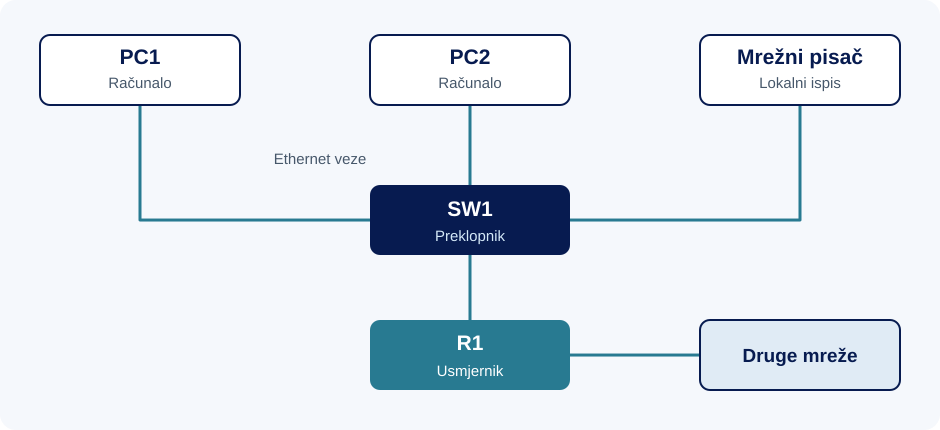
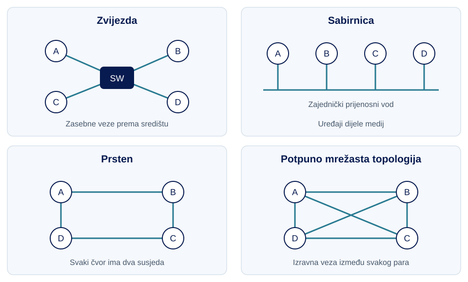
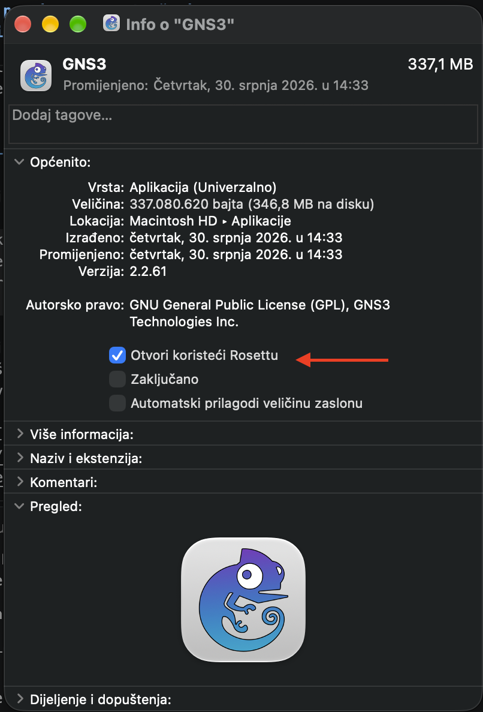
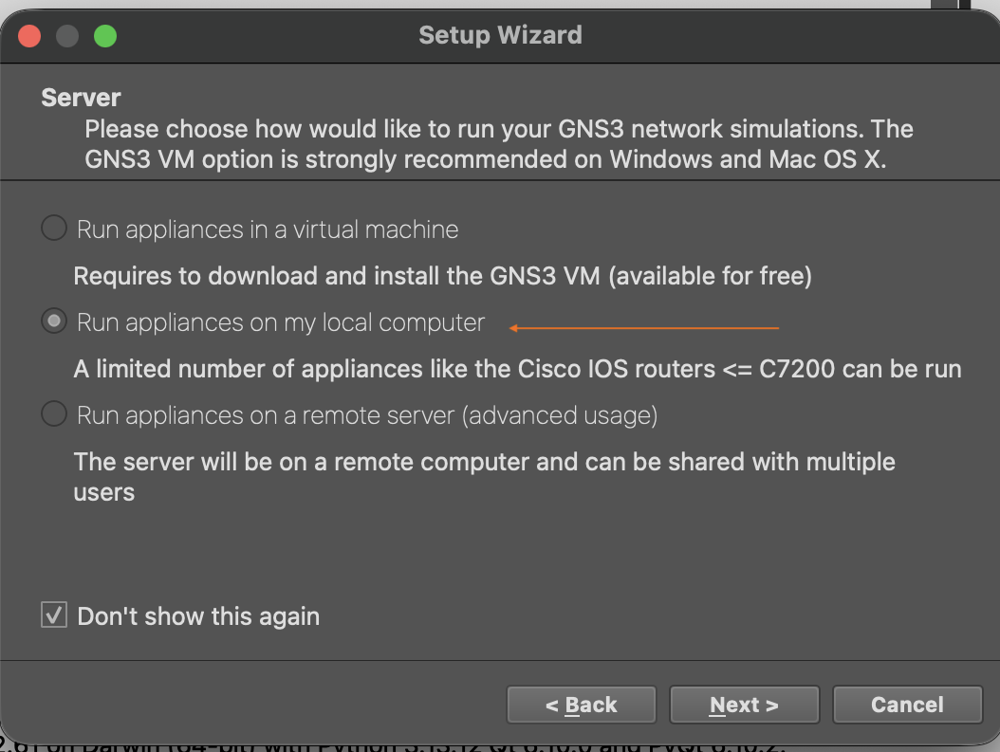
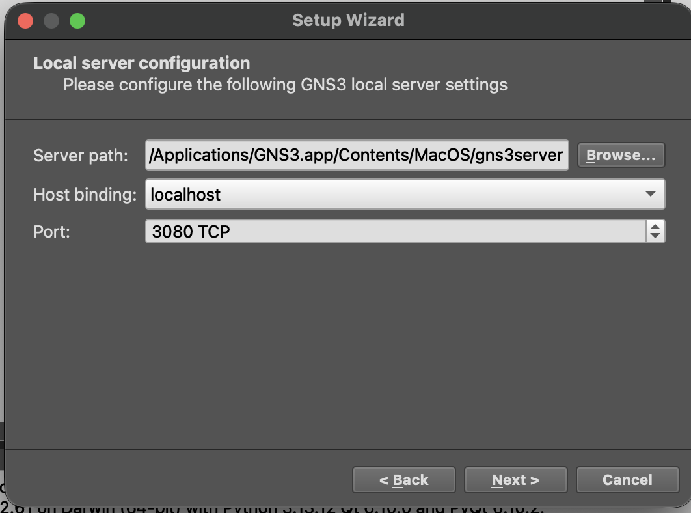
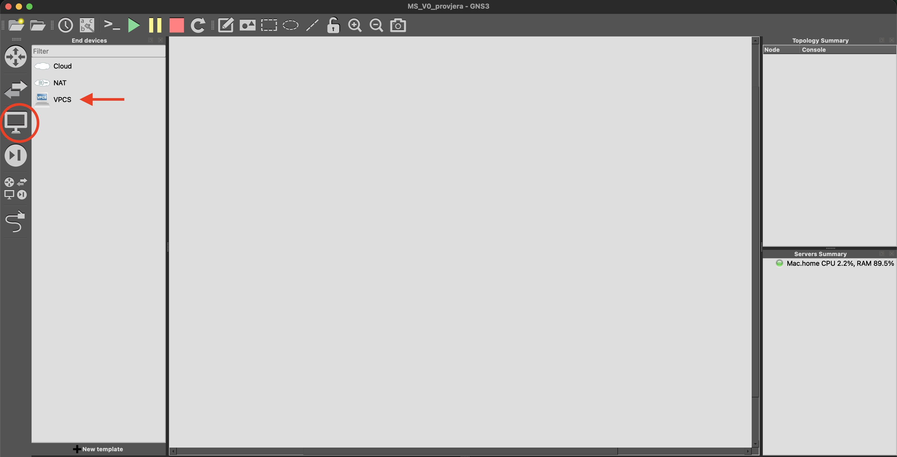
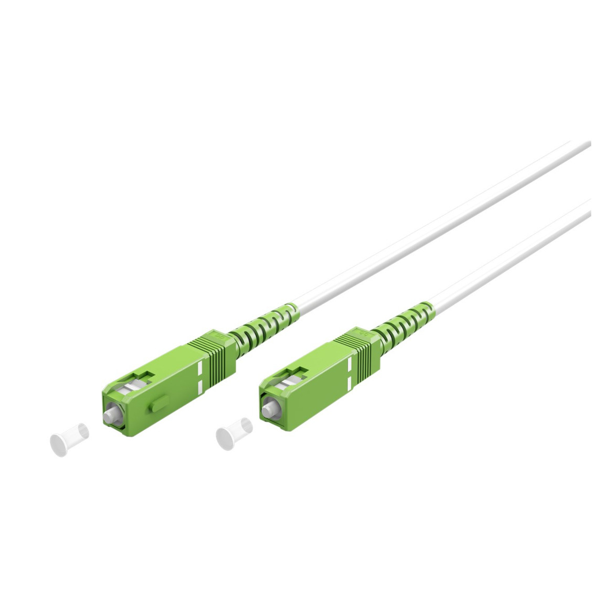

<style>
.quarto-title-block { display: none; }
.cover-page {
  width: min(1100px, 100%);
  min-height: min(1120px, calc(100vh - 3rem));
  margin: 0 auto 4rem;
  overflow: hidden;
  display: flex;
  flex-direction: column;
  background: #fff;
}
.cover-banner { display: block; width: 100%; height: auto; }
.cover-content {
  flex: 1;
  display: flex;
  flex-direction: column;
  align-items: center;
  padding: clamp(2rem, 6vw, 4.5rem);
  text-align: center;
}
.cover-logo { width: min(520px, 85%); height: auto; margin-bottom: auto; }
.cover-title { margin: 3rem 0 .5rem; color: #071b50; font-size: clamp(3rem, 8vw, 5rem); font-weight: 700; line-height: 1; }
.cover-subtitle { margin: 0; color: #287a91; font-size: clamp(1.5rem, 4vw, 2.25rem); font-weight: 600; line-height: 1.25; }
.cover-people {
  width: min(560px, 100%);
  margin-top: auto;
  padding-top: 2rem;
  border-top: 2px solid #66c7ee;
  text-align: left;
}
.cover-people p { margin: .35rem 0; }
#TOC a { color: inherit; text-decoration: none; }
#TOC > ul > li > a { font-weight: 600; }
#TOC li { margin-bottom: .3rem; }
#TOC a:hover { text-decoration: underline; }
body { line-height: 1.65; }
h1 { margin-top: 2.5rem; }
figure { margin: 1.5rem 0; }
details { margin: 1rem 0 1.5rem; padding: .6rem .9rem; border: 1px solid #d8dfe5; border-radius: .3rem; }
summary { cursor: pointer; font-weight: 600; }
details[open] > summary { margin-bottom: .75rem; }
summary:focus-visible { outline: 2px solid #287a91; outline-offset: 4px; }
@media screen and (min-width: 768px) {
  #quarto-content.page-layout-full #quarto-document-content {
    grid-column: screen-start / screen-end !important;
    width: min(1100px, calc(100vw - 3rem)) !important;
    max-width: 1100px !important;
    margin-inline: auto !important;
  }
}
@media print {
  @page { size: A4; margin: 18mm; }
  body { font-size: 10.5pt; line-height: 1.45; }
  #quarto-content { display: block !important; }
  main { width: 100% !important; max-width: none !important; }
  .cover-page {
    width: 100%;
    max-width: none;
    height: 245mm;
    min-height: 0;
    margin: 0;
    break-inside: avoid;
    page-break-inside: avoid;
    break-after: page;
    page-break-after: always;
  }
  .cover-content { padding: 14mm 12mm 10mm; }
  .cover-logo { width: 125mm; }
  .cover-title { break-before: auto !important; margin-top: 18mm; font-size: 34pt; }
  .cover-subtitle { font-size: 20pt; }
  h1 { break-before: page; margin-top: 0; }
  h2, h3 { break-after: avoid; }
  pre, figure, tr, .callout { break-inside: avoid; }
  p { orphans: 3; widows: 3; }
  .code-copy-button, .anchorjs-link { display: none !important; }
  a { color: inherit; text-decoration: none; }
}
</style>

<div class="cover-page">

<div class="cover-content">

<div class="cover-title">Uvodna vježba</div>
<div class="cover-subtitle">Osnove računalnih mreža
i prijenosa podataka</div>
<div class="cover-people">
<p><strong>Predavanja:</strong> doc. dr. sc. Sandi Baressi Šegota</p>
<p><strong>Vježbe:</strong> Elvis Starić mag. inf.</p>
</div>
</div>
</div>

<script>
document.addEventListener("DOMContentLoaded", () => {
  const naslovnica = document.querySelector(".cover-page");
  const sadrzaj = document.getElementById("TOC");
  if (naslovnica && sadrzaj) sadrzaj.before(naslovnica);
});
</script>

Kada otvorimo web-stranicu, pošaljemo poruku ili dohvatimo datoteku s drugog računala, koristimo sustav koji povezuje uređaje i omogućuje prijenos podataka između njih. Korisniku je često dovoljan jedan klik, ali iza njega sudjeluju programi, mrežne veze i uređaji koji zajednički omogućuju komunikaciju. Razumijevanje njihova rada važno je i pri razvoju aplikacija i pri održavanju sustava na kojima se te aplikacije izvršavaju.

To postaje posebno vidljivo kada nešto ne radi kako očekujemo. Sporo učitavanje stranice može biti povezano s mrežnim prijenosom ili radom samog poslužitelja. Nedostupna datoteka može biti posljedica prekinute veze, pogrešnih postavki ili nedostupne usluge. Osim omogućavanja prijenosa, treba voditi računa i o zaštiti podataka te o tome tko smije pristupiti određenim resursima. Za rješavanje takvih problema potrebno je razumjeti cijeli put komunikacije.

Kolegij **Mrežni sustavi** povezuje način prijenosa podataka, organizaciju mreža, rad mrežnih usluga i zaštitu komunikacije. Na vježbama ćemo te teme primjenjivati kroz izgradnju i konfiguraciju mreža, promatranje prometa i otklanjanje pogrešaka. Rezultat provjere povezat ćemo s postavkama i ponašanjem uređaja kako bismo mogli objasniti zašto komunikacija uspijeva ili gdje nastaje problem.

Na ovoj vježbi proći ćemo osnovne pojmove potrebne za čitanje mrežne sheme, instalirati GNS3 i provjeriti pokretanje virtualnog računala. Zatim ćemo isti projekt proširiti drugim računalom i preklopnikom, dodijeliti zadane adrese i provjeriti komunikaciju. Na toj mreži promatrat ćemo kako dodano kašnjenje i gubici mijenjaju rezultate provjere. Računskim primjerima povezivat ćemo količinu podataka, brzinu veze i vrijeme prijenosa, a usporedit ćemo i medije te načine dijeljenja prijenosnog kapaciteta. Za računske zadatke pripremite kalkulator. Na kraju skripte nalaze se zadaci za samostalnu vježbu i njihova rješenja.

# Osnovni pojmovi računalnih mreža

## Računalna mreža i mrežna usluga

U učionici se nalazi nekoliko računala i mrežni pisač. Student želi ispisati dokument koji je pohranjen na njegovu računalu. Kako bi to mogao napraviti, računalo mora poslati podatke pisaču, a pisač ih mora primiti i obraditi. Povezivanje uređaja omogućuje takvu razmjenu.

Povezana računala i pisač zajedno čine **računalnu mrežu**. Ona omogućuje prijenos podataka među uređajima. Istu mrežu možemo koristiti za različite poslove: ispis, dohvat datoteke s drugog računala ili pristup web-sadržaju.

Ispis koji pisač omogućuje drugim uređajima primjer je **mrežne usluge**. Mreža omogućuje prijenos dokumenta, a usluga određuje što odredište s njim radi. Uređaj zato može biti povezan s mrežom, a da njegova usluga trenutačno nije dostupna. Primjerice, pisač može primiti dokument, ali čekati papir prije ispisa.

::: {.callout-tip title="Računalna mreža i mrežna usluga"}
**Računalna mreža** je sustav međusobno povezanih uređaja koji razmjenjuju podatke prema dogovorenim pravilima.

**Mrežna usluga** je funkcija koju program ili uređaj pruža drugim sudionicima preko mreže, primjerice dijeljenje datoteka, ispis ili dohvat web-sadržaja.
:::

Promotrimo sada studenta koji želi otvoriti stranicu fakulteta. Na svojem računalu pokreće web-preglednik i odabire stranicu. Preglednik treba dohvatiti sadržaj s računala na kojem je stranica dostupna. Na tom računalu radi program koji prima zahtjeve za web-sadržajem i odgovara na njih.

U toj razmjeni **preglednik je klijent**, a **program koji daje pristup web-sadržaju je poslužitelj**. Njihove uloge možemo pratiti kroz jednostavan slijed:

::: {.callout-caution title="Primjer razmjene zahtjeva i odgovora"}
| Korak | Što se događa? |
|---|---|
| 1. Zahtjev | Preglednik traži određeni sadržaj od poslužiteljskog programa |
| 2. Obrada | Poslužiteljski program prima zahtjev i provjerava može li ga ispuniti |
| 3. Odgovor | Poslužitelj šalje traženi sadržaj ili obavijest o problemu, primjerice da sadržaj nije pronađen |
| 4. Prikaz | Preglednik prima odgovor i prikazuje sadržaj ili poruku korisniku |
:::

Student pokreće radnju, ali mrežni zahtjev šalje njegov program - preglednik. Poslužiteljski program spreman je primati zahtjeve i može pružati istu uslugu većem broju klijenata. Primjerice, više studenata može svojim preglednicima pristupati istom web-poslužitelju.

::: {.callout-tip title="Klijent i poslužitelj"}
**Klijent** je uređaj ili program koji koristi uslugu poslužitelja. Šalje zahtjev za podacima ili izvršavanjem određene radnje te prima odgovor. Primjerice, pri otvaranju web-stranice klijentska strana traži njezin sadržaj.

**Poslužitelj** je uređaj ili program koji pruža uslugu klijentima. Prima njihove zahtjeve, obrađuje ih i šalje odgovore, primjerice traženu web-stranicu, datoteku ili obavijest o pogrešci. Istu uslugu može pružati većem broju klijenata.

:::

Isto računalo može preglednikom koristiti web-uslugu kao klijent, a drugim programom pružati zajedničku mapu kao poslužitelj. Uloge ovise o usluzi, a komunikacija se može odvijati i unutar lokalne mreže.

## Veza, mrežno sučelje i protokol

Za prijenos podataka uređaji trebaju komunikacijsku vezu. Uređaj se na nju priključuje preko **mrežnog sučelja**, a podaci se prenose signalima preko određenog **prijenosnog medija**.

Mrežna sučelja mogu biti Ethernet, Wi-Fi ili virtualna. Razlikuju se prema načinu na koji ostvaruju mrežnu komunikaciju.

Ethernet sučelje omogućuje priključivanje na Ethernet mrežu, najčešće kabelom. 

Wi-Fi sučelje omogućuje bežičnu komunikaciju radijskim signalima. Laptop može imati oba sučelja, ali jedno od njih može biti isključeno ili nepovezano. Prisutnost sučelja u postavkama zato ne znači da se ono trenutačno koristi.

Virtualno sučelje ostvareno je programski. Susrest ćemo ga pri radu s virtualnim uređajima: ne mora imati zaseban priključak na kućištu računala, iako za prijenos izvan fizičkog računala u konačnici koristi fizičku mrežnu vezu.

::: {.callout-tip title="Mrežno sučelje i prijenosni medij"}
**Mrežno sučelje** je fizička ili virtualna komponenta uređaja preko koje se šalju i primaju mrežni podaci.

**Prijenosni medij** je fizičko sredstvo kojim se signal prenosi, primjerice bakreni kabel, optičko vlakno ili prostor kojim se šire radijski valovi.
:::

Veza omogućuje prijenos, a **protokol** određuje pravila razmjene podataka. U primjeru ispisa računalo i pisač trebaju se uskladiti o tome kako izgleda zahtjev za ispis, kako se označava dokument i kako se javlja rezultat.

Primjerice, poruka „dokument je zaprimljen” potvrđuje primitak dokumenta, dok „ispis je dovršen” označava završetak posla. Ako pisač čeka papir, može poslati prvu poruku, a drugu tek nakon ispisa. Sudionici moraju jednako tumačiti značenje poruka. HTTP je primjer protokola za razmjenu web-sadržaja, njegove zahtjeve i odgovore obradit ćemo u vježbi o mrežnim uslugama.

::: {.callout-tip title="Mrežni protokol"}
**Mrežni protokol** skup je pravila koja određuju oblik i značenje poruka te način njihove razmjene između sudionika komunikacije.
:::

## Krajnji i posrednički uređaji

U primjeru ispisa računalo šalje dokument, a pisač je njegovo krajnje odredište. Ta dva sudionika promatramo kao **krajnje uređaje**. Između njih se mogu nalaziti **posrednički uređaji**, koji prosljeđuju podatke na putu od računala do pisača.

 - **Preklopnik** (*switch*) povezuje uređaje u lokalnoj Ethernet mreži. Ako računalo i pisač pripadaju istoj lokalnoj mreži i priključeni su na preklopnik, podaci između njih prolaze preko njega. Preklopnik obavlja lokalno prosljeđivanje (ne izvršava posao ispisa).

 - **Usmjernik** (*router*) povezuje različite IP mreže i prosljeđuje podatkovne pakete prema odredišnoj mreži. Koristi se, primjerice, za prijelaz iz mreže učionice prema drugim mrežama. IP je protokol koji omogućuje adresiranje i prijenos podataka između mreža (detalje o adresiranju na vježbi 2).

 - **Bežična pristupna točka** (*access point*) omogućuje Wi-Fi uređajima pristup mreži. U uobičajenoj izvedbi povezuje bežične uređaje sa žičanim dijelom lokalne mreže.

::: {.callout-tip title="Uloge mrežnih uređaja"}
**Krajnji uređaj** je izvor ili odredište podataka promatrane komunikacije. Primjeri su računalo, telefon, mrežni pisač i poslužiteljsko računalo.

**Posrednički uređaj** prima i prosljeđuje promet između drugih sudionika komunikacije. Primjeri su preklopnik, usmjernik i bežična pristupna točka.
:::

::: {.callout-caution title="Kućni ruter - više funkcija u jednom uređaju"}
Kućni uređaj koji zovemo „ruter” često u istom kućištu objedinjuje usmjernik, preklopnik i pristupnu točku.
:::

Poslužiteljsko računalo pripada krajnjim uređajima kada pruža uslugu, primjerice šalje web-stranicu. Njegovu ulogu razlikujemo od uloge uređaja koji samo prosljeđuje podatke na putu do njega.

## Lokalna mreža, Internet i topologija

Računala i pisač u učionici možemo povezati unutar iste zgrade. Takvu mrežu ograničenog područja nazivamo **lokalnom mrežom**, odnosno **LAN-om** (*Local Area Network*). Ona može uključivati i računala spojena kabelom i uređaje povezane preko Wi-Fi veze.

Ako iz učionice želimo pristupiti udaljenom poslužitelju, podatke treba prenijeti preko drugih mreža. **Internet** povezuje mreže različitih ustanova, pružatelja pristupa i drugih organizacija u globalni sustav. Lokalni ispis ne treba taj udaljeni put, pa može raditi i kada je veza prema Internetu prekinuta.

Preko Interneta koristimo različite usluge. **Web** nam omogućuje dohvat sadržaja pomoću preglednika i web-poslužitelja. Web-poslužitelj može se nalaziti i u lokalnoj mreži, pa web-stranica ne mora biti javno dostupna na Internetu.

::: {.callout-tip title="Lokalna mreža, Internet i web"}
**Lokalna mreža (LAN)** povezuje uređaje unutar ograničenog područja, primjerice učionice, ureda ili zgrade.

**Internet** je globalni sustav međusobno povezanih računalnih mreža.

**Web** je mrežna usluga koja omogućuje pristup i razmjenu sadržaja putem web-poslužitelja
:::

Pogledajmo pojednostavljenu shemu učionice. U ovom primjeru računala i pisač pripadaju istoj lokalnoj IP mreži.

{fig-alt="Računala PC1 i PC2 te mrežni pisač zasebnim su Ethernet vezama povezani s preklopnikom SW1. SW1 je povezan s usmjernikom R1, koji ima vezu prema drugim mrežama."}

Linije prikazuju veze između uređaja. Za ispis s `PC1` put je `PC1 → SW1 → pisač`. Za pristup odredištu u drugoj mreži početak puta je `PC1 → SW1 → R1`. Veza prema drugim mrežama nije potrebna za opisani lokalni ispis.

Na shemi svaki uređaj promatramo kao **čvor**, a linije pokazuju njegove veze s drugim uređajima. Četiri uređaja možemo spojiti preko središnjeg uređaja, priključiti na zajednički vod ili povezati izravnim vezama. Takve načine povezivanja nazivamo **mrežnim topologijama**. Promjenom veza mijenjaju se mogući putevi podataka i posljedice prekida pojedine veze.

::: {.callout-tip title="Mrežna topologija"}
**Mrežna topologija** opisuje način međusobnog povezivanja mrežnih čvorova i njihovih veza. 

**Čvor** je uređaj ili točka povezivanja u mrežnom prikazu.
:::

- **Zvijezda:** svaki je uređaj zasebnom vezom povezan sa središnjim uređajem, primjerice preklopnikom. Komunikacija između priključenih uređaja prolazi kroz središte.
- **Sabirnica:** više uređaja priključeno je na zajednički prijenosni vod. Dijele isti medij, pa treba odrediti kada koji uređaj smije slati podatke. Primjer su starije izvedbe Etherneta s koaksijalnim kabelom.
- **Prsten:** čvorovi su povezani u zatvoreni slijed i svaki ima dva susjeda. Prijenos prema udaljenijem čvoru prolazi preko međučvorova. Ponašanje pri prekidu ovisi o tehnologiji i postojanju zaštitnih mehanizama.
- **Mrežasta topologija** (*mesh*): čvorovi imaju više međusobnih veza. U potpuno mrežastoj topologiji svaki je par čvorova izravno povezan, dok u djelomično mrežastoj postoje samo neke od tih veza. Dodatne veze mogu omogućiti alternativne putove, uz odgovarajuće protokole i konfiguraciju.

{fig-alt="Zvijezda ima četiri krajnja uređaja A–D spojena s preklopnikom SW. Sabirnica četiri uređaja na zajedničkom vodu. Prsten četiri čvora u zatvorenom slijedu. Potpuno mrežasta topologija četiri čvora i šest veza između svih parova."}

Na skicama kružići predstavljaju čvorove, a linije njihove veze. Dijagonalne linije u skici potpuno mrežaste topologije sijeku se u sredini, ali na tom mjestu nema dodatnog čvora. Prikazujemo osnovne oblike, veće mreže često ih kombiniraju. Detaljniju usporedbu napravit ćemo uz Ethernet i lokalne mreže.

## Primjer: čitanje puta komunikacije

Za ispis s PC1 najprije pronađemo izvor, zatim vezu do SW1 i vezu od SW1 do pisača. Dobivamo put `PC1 → SW1 → pisač`. Za svaki kvar provjeravamo nalazi li se na tom putu:

1. Prekine se veza PC2–SW1. Put dokumenta iz PC1 ne koristi tu vezu, pa lokalni ispis može nastaviti raditi.
2. Isključi se SW1. Put dokumenta prolazi kroz SW1, pa se lokalni ispis prekida.
3. Isključi se R1. Za ovaj lokalni ispis nije potreban R1, pa ispis može raditi ako računalo, preklopnik i pisač rade.

Isti postupak primijenite na put prema drugim mrežama: nacrtajte ga i tek zatim procijenite posljedice kvara. Položaj ikone na crtežu ne određuje put podataka.

## Zadaci

::: {.callout-note title="Zadatak"}
Koristeći shemu učionice odgovorite na pitanja:

1. Koji su uređaji krajnji, a koji posrednički? Koja je uloga `SW1`, a koja `R1`?
2. Napišite put dokumenta od `PC2` do lokalnog pisača. Prolazi li dokument kroz `R1`?
3. Koja komunikacija ostaje moguća ako se prekine kabel između `PC1` i `SW1`? Što se mijenja ako se isključi `SW1`?
4. Laptop je na ovu mrežu povezan bakrenim Ethernet kabelom, a njegov je Wi-Fi isključen. Koje sučelje koristi i koji je prijenosni medij?
:::

<details>
<summary>Prikaži rješenje i objašnjenje</summary>

1. `PC1`, `PC2` i pisač krajnji su uređaji. `SW1` i `R1` posrednički su uređaji. `SW1` omogućuje lokalno prosljeđivanje, a `R1` prijelaz prema drugim IP mrežama.
2. Put je `PC2 → SW1 → pisač`. U zadanoj mreži dokument ne mora proći usmjernikom jer su računalo i pisač u istoj lokalnoj IP mreži.
3. Nakon prekida kabela `PC1` može nastaviti komunikacija između `PC2` i pisača te njihov pristup drugim mrežama preko `SW1` i `R1`, ako je ostatak puta ispravan. Nakon isključivanja `SW1` prekidaju se svi putevi preko njega.
4. Koristi Ethernet sučelje, a medij je bakreni kabel. Wi-Fi sučelje može biti prikazano u postavkama iako se ne koristi.

</details>

::: {.callout-note title="Zadatak"}
Na shemi učionice označite smjer **zahtjeva za ispis** od PC1 do pisača i smjer **odgovora** prema PC1. Zatim pretpostavite da pisač odgovara „nema papira”.

1. Koji sudionik koristi uslugu, a koji je pruža? Koji uređaj samo prosljeđuje podatke?
2. Što taj odgovor potvrđuje o komunikaciji? Znači li da je dokument ispisan?
3. Odredite koji je dio puta zajednički zahtjevu i odgovoru.
:::

<details>
<summary>Prikaži rješenje</summary>

1. PC1 koristi uslugu ispisa, pisač je pruža, a SW1 prosljeđuje podatke. U ovoj razmjeni PC1 ima ulogu klijenta, a pisač poslužitelja.
2. Odgovor potvrđuje da je zahtjev stigao do pisača i da se odgovor vratio do PC1. Ne potvrđuje dovršen ispis: usluga javlja nedostatak papira.
3. Zahtjev prolazi `PC1 → SW1 → pisač`, a odgovor `pisač → SW1 → PC1`. Koriste iste dvije veze, u suprotnim smjerovima.

</details>

::: {.callout-note title="Zadatak"}
Nacrtajte četiri računala A–D u zvijezdi oko preklopnika. Zatim nacrtajte ista četiri računala u potpuno mrežastoj topologiji.

1. Koliko je veza potrebno u prvom, a koliko u drugom prikazu? Brojite vezu između para uređaja samo jednom.
2. U zvijezdi označite put A–C i vezu čiji prekid odvaja samo B.
3. U mrežastom prikazu prekrižite izravnu vezu A–C i nacrtajte jedan drugi mogući put. Je li postojanje nacrtanog puta samo po sebi dovoljno da promet doista tako prolazi?
:::

<details>
<summary>Prikaži rješenje</summary>

1. Zvijezda s četiri računala i središnjim preklopnikom ima četiri veze. Potpuno mrežasti prikaz četiriju računala ima šest: A–B, A–C, A–D, B–C, B–D i C–D.
2. Put je `A → preklopnik → C`. Prekid veze B–preklopnik odvaja B od središnjeg uređaja.
3. Mogući nacrtani put je `A → B → C`. Za stvarno prosljeđivanje međučvorovi trebaju podržavati i imati pravilno postavljene odgovarajuće funkcije. Skica pokazuje mogućnost povezivanja, a ne potvrdu ispravne konfiguracije.

</details>

# Slojeviti modeli mrežne komunikacije

## Svrha podjele na slojeve

Pri dohvatu web-stranice program mora oblikovati zahtjev, mreža mora omogućiti dolazak do odredišta, a mrežno sučelje mora prenijeti podatke preko veze. To su različiti dijelovi istog postupka. Preglednik ne treba sam određivati kako električnim signalom prenijeti svaki bit, kao što preklopnik ne treba razumjeti sadržaj stranice koju korisnik otvara.

Zbog toga komunikacijske funkcije organiziramo u **slojeve**. Svaki sloj obavlja dio posla, koristi funkcije sloja ispod sebe i omogućuje rad sloju iznad sebe. Tako program može koristiti postojeće mrežne funkcije i kada se način povezivanja promijeni, primjerice s Ethernet kabela na Wi-Fi.

Takav opis podjele komunikacijskih funkcija nazivamo **slojevitim modelom**.

::: {.callout-tip title="Sloj i slojeviti model"}
**Sloj** je skup povezanih funkcija mrežne komunikacije koje imaju određenu ulogu u prijenosu podataka.

**Slojeviti model** opisuje podjelu tih funkcija i njihove međusobne odnose.
:::

Na predavanjima i u ovim vježbama kao glavni prikaz koristimo **petoslojni internetski model**. Usporedit ćemo ga i s OSI modelom, koji iste komunikacijske funkcije raspoređuje u sedam slojeva. Slojevi nisu zasebni uređaji koje trebamo dodati u mrežu. Jedno računalo ostvaruje funkcije više slojeva svojim hardverom, operacijskim sustavom i programima. Topologija nam pokazuje **što je povezano s čime**, a model slojeva **koji se komunikacijski poslovi obavljaju**.

## Petoslojni internetski model

Pri otvaranju stranice najprije nas zanima zahtjev preglednika, zatim njegova dostava drugom programu, put do odredišne mreže, prijenos preko pojedine lokalne veze i konačno signal koji nosi bitove. Petoslojni model razdvaja upravo tih pet poslova. Tablicu prikazujemo s aplikacijskim slojem na vrhu i fizičkim na dnu.

::: {.callout-caution title="Internetski model - pet slojeva"}
| Sloj | Osnovna uloga | Primjer |
|---|---|---|
| 5. Aplikacijski | Pravila mrežne usluge i razmjena poruka između aplikacija | HTTP, DNS, SMTP |
| 4. Transportni | Komunikacija između aplikacijskih procesa na krajnjim uređajima | TCP, UDP |
| 3. Mrežni | IP adresiranje i prijenos paketa između mreža | IP, usmjernik |
| 2. Podatkovne veze | Prijenos okvira preko pojedine veze između susjednih uređaja | Ethernet, Wi-Fi |
| 1. Fizički | Prijenos bitova signalima kroz medij | Električni, optički i radijski signal |
:::

**Aplikacijski sloj** opisuje pravila mrežne usluge. HTTP, primjerice, određuje oblik zahtjeva preglednika i odgovora poslužitelja. Crtanje prozora preglednika ili promjena boje gumba ostale su funkcije programa i same po sebi nisu mrežna komunikacija.

**Transportni sloj** povezuje prijenos s komunikacijom programa na krajnjim uređajima. TCP omogućuje pouzdan prijenos i očuvanje redoslijeda podataka, dok UDP ne pruža istu potvrdu isporuke. Njihov rad razradit ćemo u vježbi o transportnim protokolima.

**Mrežni sloj** omogućuje adresiranje i usmjeravanje, uključujući prijelaz između mreža. IP je primjer protokola tog sloja, a njegova prijenosna jedinica naziva se **paket**. Kada računalo pristupa odredištu u drugoj mreži, usmjernik obrađuje odredišnu IP adresu i bira put prema toj mreži. Okvir i IP paket zato nisu dva naziva za istu jedinicu: okvir na lokalnoj vezi može nositi IP paket.

**Sloj podatkovne veze** organizira prijenos preko lokalne veze. Podatke grupira u jedinice koje nazivamo **okvirima**. Ethernet okvir sadrži preneseni sadržaj i informacije potrebne za lokalni prijenos. Preklopnik prosljeđuje takve okvire između svojih priključaka. Razlika u odnosu na fizički sloj jest da sada promatramo organizirane jedinice podataka, a ne samo prijenos signala.

**Fizički sloj** bavi se prijenosom bitova preko medija. Bit ima vrijednost 0 ili 1, a na stvarnoj se vezi te vrijednosti predstavljaju signalima. Ovisno o tehnologiji koriste se električki, optički ili radijski signali. Kabel, primjerice, omogućuje fizički prijenos, ali ne određuje koju je web-stranicu korisnik zatražio.

## Usporedba s OSI i četveroslojnim TCP/IP prikazom

**OSI** (*Open Systems Interconnection*) referentni model opisuje sedam slojeva. Donja četiri imaju odgovarajuće funkcije kao donja četiri sloja internetskog modela. Razlika je u gornjem dijelu: OSI zasebno prikazuje aplikacijski, prezentacijski i sesijski sloj, dok ih internetski model okuplja u aplikacijskom sloju.

::: {.callout-caution title="OSI model i odnos prema internetskom modelu"}
| OSI sloj | Osnovna uloga | Sloj petoslojnog internetskog modela |
|---|---|---|
| 7. Aplikacijski | Pravila mrežnih usluga | Aplikacijski |
| 6. Prezentacijski | Oblik i prikaz podataka, kodiranje ili kompresija | Aplikacijski |
| 5. Sesijski | Uspostavljanje, upravljanje i završavanje komunikacijskih sesija | Aplikacijski |
| 4. Transportni | Komunikacija između aplikacijskih procesa | Transportni |
| 3. Mrežni | Logičko adresiranje i usmjeravanje između mreža | Mrežni |
| 2. Podatkovne veze | Organizacija prijenosa okvira preko pojedine veze | Podatkovne veze |
| 1. Fizički | Prijenos bitova signalima kroz medij | Fizički |
:::

**Sesijski sloj** opisuje uspostavljanje, upravljanje i završetak povezanog dijaloga, odnosno **sesije**. Primjer je dogovor o redoslijedu sudjelovanja i završetku razgovora. Prijenos podataka tog razgovora omogućuju niži slojevi.

**Prezentacijski sloj** odnosi se na zapis i predstavljanje podataka. Za ispravan prikaz teksta sudionici trebaju usklađeno kodiranje znakova, a za komprimirani sadržaj dogovoreni način vraćanja u izvorni oblik. Prenijeti iste bitove nije dovoljno ako ih sudionici različito tumače.

OSI model pomaže razlikovati odgovornosti. Ne zahtijeva da u operacijskom sustavu za svaki sloj pronađemo zaseban program. Funkcije njegovih gornjih slojeva u stvarnim aplikacijama često se ostvaruju zajedno.

**TCP/IP** naziv je skupa protokola na kojem se temelji internetska komunikacija. Obuhvaća i druge protokole osim TCP-a i IP-a, primjerice UDP. U literaturi se koristi i **četveroslojni TCP/IP prikaz**, u kojem su fizički sloj i sloj podatkovne veze objedinjeni u sloj pristupa mreži. To je drukčije grupiranje funkcija. Za zadatke i daljnje vježbe koristimo pet slojeva kao na predavanjima, osim kada se izričito traži usporedba modela.

## Primjer: dohvat web-stranice

Vratimo se računalu koje dohvaća stranicu s poslužitelja u drugoj mreži. Za primjer pretpostavimo da komunikacija koristi TCP. Na računalu koje šalje zahtjev možemo pratiti sljedeće funkcije:

1. **Aplikacijska komunikacija:** preglednik oblikuje HTTP zahtjev za željenim sadržajem.
2. **Transport:** TCP omogućuje prijenos podataka te komunikacije do druge strane.
3. **Mrežni prijenos:** IP koristi adrese potrebne za prijenos prema odredištu, a usmjernici biraju putove između mreža.
4. **Sloj podatkovne veze:** podaci se za pojedinu Ethernet vezu organiziraju u okvire.
5. **Fizički sloj:** bitovi okvira predstavljaju se signalima koji se prenose kroz kabel.

Pri slanju se funkcije koriste od viših prema nižim slojevima. Na odredištu se primljeni sadržaj obrađuje prema višim slojevima kako bi web-poslužitelj mogao protumačiti zahtjev. Njegov odgovor zatim prolazi odgovarajući postupak u povratnom smjeru.

Na tom putu sadržaju zahtjeva dodaju se upravljački podaci. TCP dodaje svoje zaglavlje, IP dodaje podatke potrebne za mrežni prijenos, a Ethernet priprema okvir za lokalnu vezu. Viša jedinica podataka tako postaje sadržaj jedinice nižeg sloja: HTTP poruka prenosi se unutar TCP segmenta, segment unutar IP paketa, a paket unutar Ethernet okvira. To nazivamo **enkapsulacijom**. Ne radi se o četiri neovisne kopije zahtjeva, nego o dodavanju informacija potrebnih za različite dijelove njegova prijenosa. Na odredištu se sadržaj predaje prema višim slojevima uz obradu tih informacija. Taj obrnuti postupak nazivamo **dekapsulacijom**.

::: {.callout-tip title="Enkapsulacija"}
**Enkapsulacija** je postupak u kojem sloj preuzima podatke višeg sloja i dodaje informacije potrebne za vlastiti dio komunikacije, primjerice zaglavlje. Tako nastaju jedinice podataka koje se prenose prema nižim slojevima.
:::

Zasad pratimo odnos poruke, segmenta, paketa i okvira. Njihova konkretna polja promatrat ćemo u vježbama o Ethernetu, IP-u, transportu i aplikacijama.

U ovom primjeru ispravan kabel omogućuje jedan dio puta. Sam po sebi ne potvrđuje da postoji mrežni put do udaljenog poslužitelja, da je njegov program pokrenut ili da tražena stranica postoji. Podjela na slojeve pomaže odabrati što trebamo provjeriti.

## Zadaci

::: {.callout-note title="Zadatak"}
Pridružite svakom opisu sloj petoslojnog internetskog modela:

1. Optičkim vlaknom prenosi se svjetlosni signal.
2. Preklopnik prosljeđuje okvire između priključenih uređaja u lokalnoj mreži.
3. Usmjernik odabire put prema odredišnoj mreži.
4. Web-poslužitelj obrađuje zahtjev za stranicom.
5. TCP omogućuje prijenos podataka između programa.

Kako se u navedenom modelu razlikuju fizički sloj i sloj podatkovne veze? 
:::

<details>
<summary>Prikaži rješenje i objašnjenje</summary>

1. Fizički sloj.
2. Sloj podatkovne veze.
3. Mrežni sloj.
4. Aplikacijski sloj.
5. Transportni sloj.

Fizički sloj prenosi bitove signalima, a sloj podatkovne veze organizira ih u okvire i uređuje prijenos preko pojedine veze. U petoslojnom modelu promatramo ih zasebno.

</details>

::: {.callout-note title="Zadatak"}
Pri slanju HTTP zahtjeva koristimo TCP i Ethernet. Na papiru rasporedite oznake **HTTP poruka**, **TCP segment**, **IP paket** i **Ethernet okvir** tako da se vidi koja je jedinica sadržaj druge. Uz svaku napišite sloj petoslojnog modela.

Zatim nacrtajte redoslijed obrade na primatelju. Objasnite zašto „HTTP poruka”, „IP paket” i „Ethernet okvir” nisu tri zamjenjiva naziva za istu jedinicu.
:::

<details>
<summary>Prikaži rješenje</summary>

Pri slanju: `HTTP poruka → TCP segment → IP paket → Ethernet okvir → signali`. Segment nosi poruku, paket nosi segment, a okvir nosi paket. Pripadaju aplikacijskom, transportnom, mrežnom i sloju podatkovne veze, signali pripadaju fizičkom sloju.

Na primatelju obrada ide prema višim slojevima: iz okvira se obrađuje IP paket, iz njega TCP segment, a zatim aplikacijska poruka. Jedinice imaju različite uloge i upravljačke informacije, iako prenose isti korisnički sadržaj.

</details>

::: {.callout-note title="Zadatak"}
Za svaki slučaj odaberite prvo smisleno mjesto provjere i obrazložite izbor:

1. Ethernet kabel nije priključen, a Wi-Fi je isključen.
2. Računalo ima pogrešno zadanu odredišnu IP adresu.
3. Web-poslužitelj je primio zahtjev i vratio poruku da tražena stranica ne postoji.

Treba li u trećem slučaju odmah mijenjati kabel? Objasnite što dobiveni odgovor govori o putu komunikacije.
:::

<details>
<summary>Prikaži rješenje</summary>

1. Najprije provjeravamo fizičko povezivanje i aktivno sučelje. Bez raspoložive veze nema puta za ovu komunikaciju.
2. Provjeravamo mrežnu adresu odredišta. IP adresiranje pripada mrežnom sloju.
3. Provjeravamo putanju ili dostupnost traženog sadržaja u web-usluzi, što pripada aplikacijskom sloju. Odgovor potvrđuje da je zahtjev stigao do poslužitelja i da se odgovor vratio. Sam taj slučaj ne upućuje na kvar kabela.

Ovo su početne provjere prema zadanim opisima, a ne tvrdnja da se svaki stvarni kvar može pripisati samo jednom sloju.

</details>

# Instalacija i provjera GNS3 okruženja

## GNS3, projekt i virtualni uređaj

GNS3 omogućuje izgradnju i pokretanje mrežnih topologija na računalu. U radni prostor dodajemo uređaje, povezujemo ih i pratimo njihovo ponašanje. Ovisno o vrsti čvora GNS3 koristi simulator ili pokreće stvarni operacijski sustav uređaja.

Rad u GNS3-u počinje izradom **projekta**, u kojem čuvamo prikaz mreže i podatke potrebne za njegovo ponovno otvaranje. Kada u projekt dodamo virtualno računalo, ono se prikazuje kao **čvor**. Za unos naredbi na tom računalu otvaramo njegovu **konzolu**: u njoj možemo, primjerice, zatražiti prikaz njegovih mrežnih postavki.

::: {.callout-tip title="Projekt, čvor i konzola"}
**Projekt** okuplja topologiju i pripadajuće datoteke laboratorijskog rada.

**Čvor** predstavlja uređaj u projektu, primjerice virtualno računalo ili preklopnik.

**Konzola** omogućuje rad s odabranim uređajem unosom naredbi.
:::

Za provjeru instalacije koristit ćemo **VPCS** (*Virtual PC Simulator*), jednostavan simulator računala s osnovnim mrežnim naredbama. Nije potpuno Windows ili Linux računalo: služi za provjere mrežne komunikacije, a ne za pokretanje preglednika ili drugih korisničkih programa. Za njegovo dodavanje nije potrebna zasebna slika operacijskog sustava usmjernika.

GNS3 ima grafičko sučelje u kojem uređujemo projekt i **poslužitelj** koji pokreće čvorove. Lokalni poslužitelj radi na istom računalu kao grafičko sučelje. Moguće je koristiti i poslužitelj na drugom računalu ili u posebnom virtualnom stroju, GNS3 VM-u. Za početnu provjeru VPCS-a koristimo lokalni poslužitelj.

## Preuzimanje i instalacija

### Windows

1. Otvorite [službenu stranicu GNS3-a](https://www.gns3.com/) i registrirajte besplatan korisnički račun. Ako već imate račun, prijavite se.
2. Nakon prijave preuzmite instalacijski paket za **Windows**.
3. Pokrenite preuzeti instalacijski program. Ako sustav zatraži ovlasti za instalaciju, potvrdite ih.
4. U odabiru komponenti zadržite GNS3, lokalni poslužitelj i VPCS. Uključite i ponuđeni program za otvaranje konzole uređaja.
5. Dovršite instalaciju. Ako se otvori dodatni instalacijski prozor za odabranu komponentu, dovršite i njega.
6. Pokrenite GNS3 iz izbornika Start.

**Detaljne upute dostupne su na** [službenim uputama za Windows](https://docs.gns3.com/docs/getting-started/installation/windows).

### macOS

Prije instalacije otvorite **Appleov izbornik → About This Mac / O ovom Macu**. Oznaka **Chip / Čip**, primjerice Apple M1, M2 ili M3, označava Apple Silicon računalo. Ako je naveden Intelov procesor, Rosetta vam nije potrebna.

1. Otvorite [službenu stranicu GNS3-a](https://www.gns3.com/) i registrirajte besplatan korisnički račun. Ako već imate račun, prijavite se.
2. Nakon prijave preuzmite instalacijski paket za **macOS**.
3. Otvorite preuzetu `.dmg` datoteku i povucite GNS3 u mapu **Applications / Aplikacije**.
4. Na Apple Silicon računalu instalirajte Rosettu i postavite GNS3 da se otvara koristeći Rosettu prema uputama u nastavku.
5. Pokrenite GNS3 iz mape Aplikacije. Ako sustav traži potvrdu za pokretanje preuzete aplikacije, odobrite pokretanje kroz prikazani dijalog ili postavke **Privacy & Security / Privatnost i sigurnost** za tu aplikaciju.
6. Pri prvom pokretanju pojavit će se upit kojim **uBridge** traži **root ovlasti** za rad s mrežnim sučeljima. Odaberite **Yes** kako biste odobrili potrebne ovlasti. Ako macOS zatim zatraži administratorsku lozinku, unesite je i potvrdite.

   {width=600 fig-align="center"}

7. Dovršite početno postavljanje ponuđenih komponenti.

**Rosetta na Apple Silicon računalu**

Rosetta omogućuje pokretanje aplikacija izrađenih za Intelove Macove na Macovima s Apple Silicon procesorom. Radi u pozadini nakon instalacije. Ako pri pokretanju GNS3-a macOS ponudi instalaciju Rosette, odaberite **Install / Instaliraj** i slijedite upute.

Ako se taj dijalog ne pojavi, Rosettu možete instalirati kroz Terminal uz pomoć naredbe:

```bash
softwareupdate --install-rosetta
```

Nakon završetka instalacije postavite GNS3 da se otvara koristeći Rosettu:

1. Zatvorite GNS3 ako je pokrenut.
2. U Finderu otvorite mapu **Applications / Aplikacije**.
3. Desnom tipkom kliknite aplikaciju **GNS3** i odaberite **Get Info / Učitaj informacije**.
4. Označite **Open using Rosetta / Otvori koristeći Rosettu**, kao na slici.
5. Zatvorite prozor s informacijama i ponovno pokrenite GNS3.

{width=450 fig-align="center"}

Na prikazanom je primjeru GNS3 označen kao univerzalna aplikacija, a navedena opcija odabire pokretanje njezina Intelova dijela. Ako koristite isključivo Intelovo izdanje, ta opcija može izostati jer se ono na Apple Silicon računalu automatski pokreće kroz Rosettu.

Za ovu naredbu koristi se obični macOS Terminal, nije potrebno instalirati poseban terminal niti uključivati opciju **Open using Rosetta** za Terminal. Naredbu unosimo na vlastitom Macu, a ne u konzoli VPCS-a.

Rosetta omogućuje izvođenje Intelovih macOS aplikacija, ali time nije automatski riješena kompatibilnost svih virtualnih uređaja ili GNS3 VM-a. Ovdje provjeravamo lokalno pokretanje VPCS-a.

**Detaljne upute dostupne su na** [službenim uputama za macOS](https://docs.gns3.com/docs/getting-started/installation/mac).

### Linux

GNS3 se na Linuxu instalira prema distribuciji. U [službenim uputama za Linux](https://docs.gns3.com/docs/getting-started/installation/linux) odaberite odjeljak za svoju distribuciju i slijedite postupak za **grafičko sučelje i poslužitelj**. Provjerite da je instaliran i **VPCS**.

Naredbe za Ubuntu ne prepisujte na distribuciju koja koristi drugi sustav paketa. Ako instalacija traži promjenu korisničkih ovlasti za pomoćne komponente, slijedite upute i ponovno se prijavite kada je to navedeno. Nakon instalacije pokrenite GNS3 iz izbornika aplikacija ili naredbom `gns3` u terminalu.

## Odabir lokalnog poslužitelja

Pri prvom pokretanju može se otvoriti čarobnjak za postavljanje, **Setup Wizard**. Ako se nije otvorio, potražite **Help → Setup Wizard**.

1. Za lokalno izvođenje odaberite **Run appliances on my local computer**, kao na slici, i kliknite **Next**.

   {width=650 fig-align="center"}

2. Provjerite ponuđenu putanju do GNS3 poslužitelja, **Server path**. Na standardnoj instalaciji zadržite automatski pronađenu putanju. Slika prikazuje primjer na macOS-u, na Windowsima putanja će biti drukčija.
3. U polju **Host binding** odaberite `localhost` i zadržite ponuđeni port. `localhost` je naziv koji označava vlastito računalo. Ovime određujemo kako se GNS3 povezuje s lokalnim poslužiteljem, a ne adresu virtualnog uređaja.

   {width=650 fig-align="center"}

4. Kliknite **Next**, dovršite čarobnjak (u ostalim koracima ne mjenjamo ništa) i provjerite da nema poruke o neuspješnom povezivanju s poslužiteljem.

## Pokretanje prvog čvora

Otvoren program još ne potvrđuje da se uređaji mogu pokretati. Zato ćemo napraviti projekt s jednim VPCS čvorom i otvoriti njegovu konzolu.

1. Odaberite **File → New blank project**.
2. Projekt nazovite `MS_V0_Mreza`.
3. Na lijevoj alatnoj traci kliknite ikonu računala za prikaz krajnjih uređaja (**End devices**). U popisu pronađite **VPCS** i povucite ga na radnu površinu.

   {width=900 fig-align="center" fig-alt="Na lijevoj alatnoj traci zaokružena je ikona računala za skupinu End devices, a strelica pokazuje VPCS u popisu uređaja."}

4. Ako se traži odabir poslužitelja, odaberite prethodno pripremljeni poslužitelj.
5. Čvor preimenujte u `PC1` ako već nema taj naziv.
6. Desnom tipkom otvorite izbornik čvora i odaberite **Start**, a zatim **Console**.
7. U konzolu upišite:

```text
show ip
```

Naredba prikazuje mrežne postavke VPCS uređaja. U novom čvoru IP adresa može biti prikazana kao `0.0.0.0`, što ovdje znači da još nije postavljena. U ovom koraku provjeravamo može li se uređaj pokrenuti i prihvaća li naredbu, pa mu još ne dodjeljujemo adresu.

Naziv `PC1` označava čvor u projektu. Njegovo preimenovanje samo po sebi ne mijenja mrežne postavke. Također, konzola tog čvora odvojena je od terminala vašeg fizičkog računala: `show ip` upisujemo u VPCS konzolu.

{width=900 fig-align="center" fig-alt="Prikaz terminala."}

::: {.callout-caution title="Pregled naredbi i radnji"}
| Radnja | Gdje se izvodi? | Namjena |
|---|---|---|
| `File → New blank project` | Grafičko sučelje GNS3-a | Izrada novog projekta |
| `Start` | Izbornik čvora | Pokretanje odabranog uređaja |
| `Console` | Izbornik čvora | Otvaranje konzole uređaja |
| `show ip` | VPCS konzola | Prikaz mrežnih postavki čvora |
| `save` | Konzola svakog VPCS-a | Spremanje trenutačne konfiguracije za sljedeće pokretanje |
| `Stop` | Izbornik čvora | Zaustavljanje odabranog uređaja |
:::

## Ako se čvor ili konzola ne pokreću

Najprije utvrdite u kojem se koraku pojavljuje problem. Ako GNS3 ne može pristupiti poslužitelju, problem prethodi izvršavanju VPCS-a. Ako se čvor pokrene, ali se ne otvara konzola, treba provjeriti program kojim GNS3 otvara terminal.

::: {.callout-caution title="Provjera pokretanja i konzole"}
| Opažanje | Što prvo provjeriti? |
|---|---|
| GNS3 javlja da poslužitelj nije dostupan | Postavke poslužitelja i je li instalirana poslužiteljska komponenta |
| VPCS nije u popisu uređaja ili se ne pokreće | Instalaciju VPCS-a i njegovu putanju u postavkama |
| Čvor radi, ali se konzola ne otvara | Odabrani konzolni program u GNS3 postavkama |
| `show ip` nije prepoznat | Je li naredba unesena u VPCS konzolu |
:::

Zabilježite točnu poruku pogreške prije promjene postavki. Ako problem ne možete riješiti navedenom provjerom, slobodno se javite mutem Google Chat-a ili e-maila.

## Spremanje konfiguracije i izvoz projekta

Kada završite zadatak i želite ga predati, najprije spremite konfiguraciju svakog uređaja. Postavke koje ste unijeli tijekom rada nisu nužno spremljene za sljedeće pokretanje uređaja.

Na **svakom VPCS-u zasebno**, dok je još pokrenut, otvorite konzolu i izvršite:

```bash
save
```

Naredba sprema trenutačnu konfiguraciju u datoteku `startup.vpc`. To je početna (*startup*) konfiguracija koju VPCS učitava pri sljedećem pokretanju. Ako projekt sadrži više VPCS uređaja, naredbu morate izvršiti na svakome od njih.

::: {.callout-warning title="Spremanje konfiguracije uređaja"}
Spremanje ili izvoz GNS3 projekta ne zamjenjuje spremanje konfiguracije unutar uređaja. Prije zaustavljanja VPCS-a izvršite `save` kako se unesene postavke ne bi izgubile.

Konfiguraciju će trebati spremati i na drugim uređajima koje ćemo koristiti. Naredba nije ista za sve uređaje, odgovarajuću naredbu navest ćemo kada budemo radili s tim uređajem.
:::

Nakon spremanja konfiguracija izvezite projekt za predaju:

1. Zaustavite sve uređaje u projektu.
2. U GNS3-u odaberite **File → Export portable project**.
3. Odaberite naziv i mjesto spremanja izvezene datoteke te dovršite izvoz.
4. Za predaju pošaljite dobivenu datoteku **`.gns3project`**.

::: {.callout-important title="Predaja projekta"}
**Nemojte ručno ZIP-irati cijelu mapu projekta i slati taj ZIP.** Predaje se datoteka nastala izvozom projekta kroz GNS3, koja sadrži topologiju i pripadajuće datoteke projekta, uključujući spremljene konfiguracije VPCS uređaja.
:::

## Zadaci

::: {.callout-note title="Zadatak"}
U projektu `MS_V0_Mreza` provjerite rad prvog čvora:

1. Pokrenite PC1 i otvorite njegovu konzolu. Izvršite `show ip` i pronađite polja IP adrese i maske. U ovom koraku još ne zadajemo adresu.
2. Zaustavite PC1 opcijom **Stop**, zatim ga ponovno pokrenite opcijom **Start** i otvorite konzolu. Provjerite prihvaća li `show ip`.
3. Objasnite razliku između otvorenog GNS3 prozora, pokrenutog čvora i otvorene konzole. Koji ste od tih koraka potvrdili unosom naredbe?
:::

<details>
<summary>Prikaži provjeru izvedenog rada</summary>

U novom VPCS-u adresa može biti `0.0.0.0` jer nije postavljena. Nakon ponovnog pokretanja konzola treba prihvaćati naredbu. GNS3 prozor služi uređivanju projekta, **Start** pokreće čvor, a **Console** otvara pristup tom čvoru. Uspješan `show ip` potvrđuje da smo došli do konzole pokrenutog VPCS-a. Još ne potvrđuje komunikaciju s drugim uređajem.

</details>

::: {.callout-note title="Zadatak"}
Spremite početni rad i napravite izvoz projekta prema prethodnim uputama. Pronađite dobivenu datoteku i provjerite njezin nastavak. Zatim ponovno pokrenite PC1 u izvornom projektu kako biste mogli nastaviti rad.

Što spremate naredbom `save`, a što dobivate izvozom projekta? Biste li za predaju poslali mapu iz koje ste otvorili projekt ili izvezenu datoteku?
:::

<details>
<summary>Prikaži rješenje</summary>

`save` se izvršava unutar VPCS-a i sprema njegovu početnu konfiguraciju. Izvozom kroz GNS3 dobivamo datoteku `.gns3project` s topologijom i pripadajućim datotekama projekta. Za predaju se koristi ta izvezena datoteka. Poslije izvoza izvorni projekt ostaje dostupan. PC1 ponovno pokrećemo preko **Start**.

</details>

# Količina podataka i jedinice

Prije računanja vremena prijenosa trebamo uskladiti količinu podataka i brzinu veze. Zato ćemo najprije pretvarati bajtove u bitove i razlikovati decimalne od binarnih jedinica. Vrijeme slanja računat ćemo iz zadanih podataka, kasniji `ping` u GNS3-u mjerit će vrijeme do odgovora, a ne propusnost veze.

## Bit i bajt

Mrežna veza prenosi podatke koji se mogu zapisati kao niz nula i jedinica. Jedna takva vrijednost predstavlja **bit**. Primjerice, niz `10110010` sadrži osam bitova. Kada osam bitova promatramo zajedno, govorimo o jednom **bajtu**.

Veličinu datoteke obično navodimo u bajtovima, a brzinu mrežne veze u bitovima u sekundi. Zato prije računanja trebamo provjeriti jedinice. Datoteka veličine 10 MB i veza brzine 10 Mbit/s koriste istu decimalnu oznaku „mega”, ali različite osnovne jedinice.

::: {.callout-tip title="Bit i bajt"}
**Bit** je jedinica količine podataka koja može imati vrijednost 0 ili 1.

**Bajt** (*byte*, oznaka **B**) sadrži osam bitova: **1 B = 8 bit**.
:::

Pri pretvorbi iz bajtova u bitove množimo s osam. Pri pretvorbi iz bitova u bajtove dijelimo s osam. Primjerice, `1500 B × 8 = 12 000 bit`, dok `80 000 bit ÷ 8 = 10 000 B`.

## Što se zapravo prenosi?

Dokument na računalu zauzima određeni broj bajtova. Pri prijenosu uz njegov sadržaj obično putuju i dodatni podaci koji uređajima omogućuju prepoznati pošiljatelja, odredište i način obrade. Zbog toga količina podataka prenesena preko veze može biti veća od veličine same datoteke.

Primjerice, program za preuzimanje može brojiti samo sadržaj datoteke, dok se preko veze prenose i dodatni podaci. Zato veličina datoteke i ukupna prenesena količina nisu nužno jednake. U računskim zadacima navest ćemo koju količinu koristimo i što zanemarujemo. Konkretna zaglavlja promatrat ćemo u vježbama o Ethernetu, IP-u, transportu i aplikacijama.

## Decimalne i binarne oznake

Za velike količine podataka koristimo prefikse. U ovoj skripti **kB, MB i GB imaju decimalno značenje**, odnosno koriste potencije broja 1000. Ako se koristi potencija broja 1024, pišemo **KiB, MiB i GiB**. Razlikovanje tih zapisa važno je kada veličinu datoteke preuzimamo iz programa koji koristi binarne jedinice.

Jedinicama **kB, MB i GB** najčešće iskazujemo veličine datoteka i kapacitete uređaja za pohranu, **KiB, MiB i GiB** koristimo kada te količine ili kapacitet memorije izražavamo binarnim jedinicama, a **kbit/s, Mbit/s i Gbit/s** za brzinu prijenosa podataka kroz mrežu.

::: {.callout-caution title="Pregled jedinica"}
| Oznaka | Značenje | Vrijednost |
|---|---|---:|
| kB | kilobajt | 1000 B |
| MB | megabajt | 1 000 000 B |
| GB | gigabajt | 1 000 000 000 B |
| KiB | kibibajt | 1024 B |
| MiB | mebibajt | 1 048 576 B |
| GiB | gibibajt | 1 073 741 824 B |
| kbit/s | kilobit u sekundi | 1000 bit/s |
| Mbit/s | megabit u sekundi | 1 000 000 bit/s |
| Gbit/s | gigabit u sekundi | 1 000 000 000 bit/s |
:::

Veza od 80 Mbit/s u teoriji prenosi `80 ÷ 8 = 10 MB/s`. To je pretvorba jedinice, a ne obećanje da će aplikacija u svakoj sekundi primiti baš toliko korisnih podataka. Dio prijenosa pripada upravljačkim podacima, a brzina može biti ograničena drugim dijelovima sustava.

::: {.callout-warning title="Veliko i malo slovo nisu zamjenjivi"}
**MB/s** označava megabajte u sekundi, a **Mbit/s** megabite u sekundi. Za računanje u ovoj skripti koristimo zapis `bit`, kako se malo slovo `b` ne bi zamijenilo s velikim `B`.

Nemojte pretpostaviti da je `1 MB = 1024 × 1024 B`, ta vrijednost pripada jedinici **MiB**.
:::

## Pretvorba podataka za zadani prijenos

Datoteka ima 25 MB. Koliko bitova treba prenijeti i koja bi brzina u MB/s odgovarala vezi od 100 Mbit/s?

1. Veličinu pretvorimo u bajtove: `25 × 1 000 000 = 25 000 000 B`.
2. Bajtove pretvorimo u bitove: `25 000 000 × 8 = 200 000 000 bit`.
3. Brzinu veze pretvorimo u MB/s: `100 ÷ 8 = 12,5 MB/s`.

Ista količina podataka može se zapisati kao 25 MB ili 200 Mbit. Promijenili smo jedinicu, dok je količina ostala ista.

U tablici su prikazane dovršene pretvorbe. Za decimalne megabajte množimo s 1 000 000, a za mebibajte s 1 048 576 kako bismo dobili bajtove. Dobiveni broj bajtova zatim množimo s osam za pretvorbu u bitove.

::: {.callout-caution title="Pokazne pretvorbe količine podataka"}
| Zadana količina | Količina u B | Količina u bitovima |
|---|---:|---:|
| 25 MB | 25 000 000 | 200 000 000 |
| 12 MB | 12 000 000 | 96 000 000 |
| 12 MiB | 12 582 912 | 100 663 296 |
:::


## Zadaci

::: {.callout-note title="Zadatak"}
1. Pretvorite 16 MB u bitove i 16 MiB u bajtove. Jesu li to jednake količine podataka?
2. Kolikoj brzini u MB/s odgovara 320 Mbit/s?
3. Program prikazuje prijenos od 9 MB/s na vezi od 100 Mbit/s. Pretvorite prikazanu brzinu u Mbit/s. Premašuje li ona brzinu veze?
:::

<details>
<summary>Prikaži rješenje</summary>

1. `16 MB = 16 000 000 B = 128 000 000 bit`. `16 MiB = 16 × 1 048 576 = 16 777 216 B`.
2. `320 ÷ 8 = 40 MB/s`.
3. `9 × 8 = 72 Mbit/s`. Prikazana brzina manja je od 100 Mbit/s.

</details>

::: {.callout-note title="Zadatak"}
1. Datoteka ima 750 kB. Zapišite njezinu veličinu u bajtovima i bitovima. Zatim izračunajte koliko bi bajtova imala datoteka od 750 KiB.
2. Dvije veze označene su brzinama **80 Mbit/s** i **12 MB/s**. Pretvorite obje brzine u Mbit/s i odredite koja je veća. Kolika je razlika?
3. U izvještaju piše: „Datoteka od 6 MB ima 6 000 000 bitova.” Pronađite pogrešku i ispravite zapis.
:::

<details>
<summary>Prikaži postupak i rezultate</summary>

1. `750 kB = 750 000 B = 6 000 000 bit`. Za binarnu oznaku dobivamo `750 KiB = 750 × 1024 = 768 000 B`.
2. Prva veza ima 80 Mbit/s. Druga ima `12 × 8 = 96 Mbit/s`, pa je veća za 16 Mbit/s. U bajtovima u sekundi razlika je 2 MB/s.
3. Zamijenjeni su bajtovi i bitovi. `6 MB = 6 000 000 B = 48 000 000 bit`.

</details>

# Povezivanje i provjera mreže u GNS3-u

## Projekt i uređaji

Napravit ćemo malu mrežu u kojoj PC1 šalje provjerne poruke računalu PC2, a PC2 odgovara. Taj isti projekt koristit ćemo u nastavku: prvo ćemo provjeriti radi li komunikacija, a zatim na jednoj vezi odgađati ili odbacivati dio prometa.

Koristimo **dva VPCS čvora** i GNS3-ov ugrađeni **Ethernet switch**. Preklopnik povezuje računala u lokalnoj mreži. U ovoj vježbi koristimo njegove početne postavke. Način njegova prosljeđivanja i Ethernet okvire detaljnije ćemo obraditi u vježbi 1 o Ethernetu i lokalnim mrežama.

1. Nastavite rad u projektu `MS_V0_Mreza`, u kojem ste pri provjeri instalacije pokrenuli PC1. Ako ste projekt zatvorili, otvorite ga kroz **File → Open project**.
2. U skupini **End devices** pronađite **VPCS** i dodajte drugo računalo uz postojeći PC1.
3. Preimenujte čvorove u **PC1** i **PC2** preko njihova kontekstnog izbornika, opcijom **Change hostname**, ako je potrebno.
4. U skupini **Switches**, ili pretragom svih uređaja, pronađite ugrađeni **Ethernet switch**. Povucite ga između računala i nazovite **SW1**.
5. Ako program traži poslužitelj, za sve čvorove odaberite isti lokalni poslužitelj koji ste provjerili pri instalaciji GNS3-a.

Ugrađeni Ethernet switch dostupan je bez uvoza operacijskog sustava usmjernika ili preklopnika. Nemojte u ovom koraku birati predložak poput IOSvL2 koji traži zasebnu sliku. Ako ne vidite ugrađeni uređaj, otvorite popis svih uređaja i pretražite naziv `Ethernet switch`.

{fig-alt="PC1 s adresom 192.168.10.1/24 spojen je sa SW1, koji je spojen s PC2 s adresom 192.168.10.2/24. Filtri se postavljaju samo na vezu SW1–PC2."}

## Povezivanje sučelja

Povlačenje uređaja na radnu površinu još ne stvara veze. Svaku vezu trebamo spojiti na mrežno sučelje računala i na jedan priključak preklopnika. Priključak ovdje znači mjesto na koje spajamo virtualni kabel.

1. Odaberite alat **Add a link**, označen ikonom kabela.
2. Kliknite PC1 i odaberite njegovo sučelje **Ethernet0**.
3. Kliknite SW1 i odaberite prvi slobodni priključak, primjerice **Ethernet0**.
4. Ponovno odaberite dodavanje veze. Spojite **Ethernet0** na PC2 s drugim slobodnim priključkom SW1, primjerice **Ethernet1**.
5. Izađite iz načina dodavanja veza ponovnim klikom na ikonu kabela ili tipkom Escape.
6. Pokrenite čvorove zelenim gumbom **Start/Resume all devices**. Otvorite konzole PC1 i PC2.

Provjerite da su na shemi dvije veze: PC1–SW1 i SW1–PC2. Računala ne spajamo na isti priključak SW1. Ugrađeni preklopnik nema konzolu za konfiguriranje poput VPCS-a, za ovaj rad njegove priključke ostavljamo na početnim postavkama.

## Zadane mrežne adrese

Za slanje poruke računalu treba odredišna adresa. Dodijelit ćemo dvije **IPv4 adrese**: PC1 dobiva `192.168.10.1`, a PC2 `192.168.10.2`. Adrese se moraju razlikovati kako bismo mogli odrediti kojem računalu šaljemo poruku.

Uz obje adrese koristimo oznaku **`/24`**. Ona označava duljinu mrežnog dijela adrese i odgovara maski `255.255.255.0`. Za ove zadane adrese to znači da su računala u istoj IP mreži: početni dio `192.168.10` zajednički im je, a posljednji broj razlikuje računala. To pravilo čitanja po trima brojevima vrijedi za ovdje zadanu masku, ostale maske i izračune obradit ćemo u vježbi o adresiranju.

::: {.callout-caution title="Postavke laboratorija"}
| Čvor | Sučelje | IPv4 adresa | Maska | Zadani pristupnik |
|---|---|---|---|---|
| PC1 | Ethernet0 | 192.168.10.1 | /24, odnosno 255.255.255.0 | Ne postavljamo |
| PC2 | Ethernet0 | 192.168.10.2 | /24, odnosno 255.255.255.0 | Ne postavljamo |
:::

Zadani pristupnik služi komunikaciji prema drugim mrežama. U ovoj topologiji oba su računala u istoj mreži, pa nam za njihov razgovor nije potreban. Ove postavke unosimo samo u virtualne čvorove, u njihove VPCS konzole.

U konzoli **PC1** izvršite:

```bash
ip 192.168.10.1/24
```
a zatim 
```bash
show ip
```

U konzoli **PC2** izvršite:

```bash
ip 192.168.10.2/24
```
a zatim
```bash
show ip
```

U ispisu `show ip` usporedite adresu i masku s tablicom. Adresa `0.0.0.0` u polju pristupnika ovdje je očekivana jer ga nismo postavili. Ako se u polju vlastite IP adrese i dalje prikazuje `0.0.0.0`, ponovno provjerite unos naredbe `ip` u toj konzoli.

Sada u **obje konzole** izvršite `save`. Time postavke svakog VPCS-a spremate u njegovu početnu konfiguraciju.

## Prva provjera komunikacije

Naredba **`ping`** šalje provjernu poruku odredištu i čeka odgovor. U ovoj provjeri koristi poruke protokola **ICMP**, namijenjenog između ostaloga mrežnim provjerama i obavijestima. Za svaki zahtjev očekujemo odgovarajući odgovor. To nam omogućuje provjeriti povratnu komunikaciju i vrijeme potrebno za nju.

U konzoli **PC1** izvršite:

```bash
ping 192.168.10.2 -c 5
```

Adresa označava PC2, a `-c 5` zadaje pet provjera. Zatim u konzoli PC2 provjerite suprotan smjer naredbom 
```bash
ping 192.168.10.1 -c 5
```
Uspješan odgovor sadrži adresu odredišta, redni broj `icmp_seq` i vrijeme `time`. 

Primjer izgleda odgovora:

```text
84 bytes from 192.168.10.2 icmp_seq=1 ttl=64 time=0.850 ms
```

- `192.168.10.2` pokazuje s kojeg je odredišta stigao odgovor.
- `icmp_seq=1` označava prvu provjeru u nizu.
- `time=0.850 ms` označava vrijeme od slanja zahtjeva do primitka odgovora.
- `ttl` je podatak vezan uz ograničavanje životnog vijeka IP paketa (u ovoj ga vježbi ne mijenjamo).

Vrijednost `time` u prikazanom odgovoru mjeri cijeli povratni put: PC1 šalje zahtjev, PC2 ga prima i šalje odgovor, a PC1 zaustavlja mjerenje kada taj odgovor stigne. To vrijeme nazivamo **RTT** (*round-trip time*). U primjeru RTT iznosi 0,850 ms. Ono uključuje odlazak zahtjeva do PC2 i povratak odgovora, a ne samo putovanje poruke u jednom smjeru.

Odgovor ne mora uvijek stići. Primjerice, ako prekinemo vezu dok se provjere izvršavaju, PC1 može poslati zahtjev i ostati čekati odgovor. Naredba `ping` ne čeka neograničeno: nakon isteka predviđenog vremena prijavljuje **timeout**, odnosno istek vremena čekanja. To se može dogoditi i ako je zahtjev ili odgovor izgubljen ili ako odgovor stigne prekasno. Zato timeout bilježimo kao neuspješnu provjeru, a ne kao odgovor s vremenom 0 ms.

::: {.callout-tip title="RTT i izostanak odgovora"}
**RTT** (*round-trip time*) je vrijeme od slanja provjernog zahtjeva do primitka pripadajućeg odgovora. Obuhvaća put do odredišta i natrag te obradu na tom putu.

**Timeout** znači da odgovor nije stigao unutar vremena čekanja. Sam po sebi ne govori je li izgubljen zahtjev, odgovor ili je došlo do prevelikog kašnjenja.
:::

RTT nije vrijeme samo jednog smjera, a kratko RTT vrijeme ne govori koliko brzo možemo prenijeti veliku datoteku. Uspješan `ping` također ne potvrđuje rad svake mrežne usluge, ovdje provjerava upravo ovu razmjenu ICMP poruka.

## Primjer: dodavanje trećeg računala

Mrežu ćemo proširiti računalom **PC3**, bez promjene postavki PC1 i PC2. Novi uređaj treba vlastitu vezu i adresu:

1. Dodajte još jedan VPCS i nazovite ga **PC3**. Spojite njegovo sučelje **Ethernet0** na slobodni priključak SW1, primjerice **Ethernet2**.
2. Pokrenite PC3, otvorite konzolu i izvršite `ip 192.168.10.3/24`, zatim `show ip`.
3. Iz PC3 izvršite `ping 192.168.10.1 -c 5` i `ping 192.168.10.2 -c 5`.
4. Iz PC1 provjerite PC3 naredbom `ping 192.168.10.3 -c 5`. Na PC3 izvršite `save`.

Tri računala sada imaju različite adrese, a koriste istu zadanu masku `/24`. Komunikacija ostaje unutar iste lokalne mreže i ne traži usmjernik. Sama dodana ikona PC3 nije dovoljna: provjerili smo i vezu, konfiguraciju te odgovor drugog računala. PC3 ostavite u projektu. Kasniji zadaci kašnjenja i gubitaka i dalje se izvode između PC1 i PC2.

## Zadaci

::: {.callout-note title="Zadatak"}
Provjerite izrađenu mrežu: PC1 treba imati adresu `192.168.10.1/24`, a PC2 `192.168.10.2/24`. Naredbom `ping` potvrdite komunikaciju u oba smjera i objasnite zašto u konzoli PC1 upisujete adresu PC2. Ako nema odgovora, provjerite pokrenute čvorove, veze i adrese. Na oba VPCS-a spremite konfiguraciju naredbom `save` i ostavite projekt otvoren.
:::

<details>
<summary>Prikaži provjeru izvedenog rada</summary>

Iz PC1 provjera je `ping 192.168.10.2 -c 5`, a iz PC2 `ping 192.168.10.1 -c 5`. Adresa iza naredbe određuje od kojeg računala tražimo odgovor. Provjera vlastite adrese ne bi potvrdila prolazak poruka preko SW1 do drugog računala. U ispravnoj mreži očekujemo odgovore u oba smjera. `save` izvršavamo zasebno na PC1 i PC2.

</details>

::: {.callout-note title="Zadatak"}
U ispravnoj mreži namjerno promijenite **samo adresu PC2** naredbom `ip 192.168.10.20/24`. Nemojte još spremati promjenu.

1. Prije pokretanja pinga predvidite rezultat provjera iz PC1 prema `192.168.10.2` i prema `192.168.10.20`.
2. Izvršite obje provjere s `-c 5` te usporedite opažanja s predviđanjem. Naredbom `show ip` na PC2 potvrdite koju adresu trenutačno ima.
3. Vratite PC2 na `192.168.10.2/24`, provjerite komunikaciju i izvršite `save`.

Objasnite zašto izostanak odgovora sa stare adrese nije dovoljan razlog za mijenjanje virtualnog kabela.
:::

<details>
<summary>Prikaži postupak i očekivana opažanja</summary>

PC2 više nema adresu `192.168.10.2`, pa na toj adresi u zadanom projektu ne očekujemo njegov odgovor. Na novoj adresi `192.168.10.20` očekujemo komunikaciju jer su veza i zadana maska ostale jednake. Iz PC1 koristimo `ping 192.168.10.2 -c 5` i `ping 192.168.10.20 -c 5`.

Na PC2 vratimo `ip 192.168.10.2/24`. Nakon uspješne provjere iz PC1 izvršimo `save` na PC2. Promijenila se adresa odredišta, a ne njegov kabel.

</details>

::: {.callout-note title="Zadatak"}
Prije promjene provjerite da PC1 može komunicirati s PC2 i PC3. Zatim zaustavite **samo PC2** preko **Stop**.

1. Predvidite hoće li iz PC1 uspjeti provjera PC2 i provjera PC3.
2. Izvedite obje provjere. Koji rezultat pokazuje da ostatak LAN-a i dalje može raditi?
3. Ponovno pokrenite PC2, otvorite njegovu konzolu i provjerite adresu. Potvrdite povratak komunikacije iz PC1.
:::

<details>
<summary>Prikaži očekivana opažanja</summary>

Zaustavljeni PC2 ne odgovara, ali provjera `ping 192.168.10.3 -c 5` iz PC1 može uspjeti jer PC1, SW1 i PC3 ostaju dostupni. Kvar jednog krajnjeg uređaja u ovoj zvijezdi ne prekida put između drugih dvaju računala.

Nakon **Start** na PC2 naredbom `show ip` provjerimo učitanu adresu. Ako je prethodno spremljena, očekujemo `192.168.10.2/24`, a iz PC1 ponovno provjeravamo `ping 192.168.10.2 -c 5`.

</details>

::: {.callout-note title="Zadatak"}
Na PC1, PC2 i PC3 provjerite adrese i izvršite `save`. Zaustavite sva tri VPCS-a, ponovno ih pokrenite i provjerite adrese bez ponovnog unošenja naredbe `ip`. Iz PC3 potvrdite komunikaciju s PC1 i PC2.

Što biste prvo provjerili kada bi se nakon pokretanja na jednom VPCS-u umjesto zadane adrese prikazalo `0.0.0.0`?
:::

<details>
<summary>Prikaži provjeru spremljenog rada</summary>

Na PC1 očekujemo `192.168.10.1/24`, na PC2 `192.168.10.2/24`, a na PC3 `192.168.10.3/24`. Iz PC3 koristimo `ping 192.168.10.1 -c 5` i `ping 192.168.10.2 -c 5`.

Adresa `0.0.0.0` upućuje da čvor nema zadanu adresu. Najprije provjeravamo jesmo li konfigurirali i spremili upravo taj VPCS te jesmo li otvorili pravi projekt i čvor. Zatim ispravno zadamo adresu i izvršimo `save`. Ponovno unošenje adrese prije provjere sakrilo bi problem sa spremanjem.

</details>

# Vrijeme prijenosa i kašnjenje

## Vrijeme slanja podataka na vezu

Zamislimo da šaljemo datoteku preko veze koja svake sekunde može prihvatiti određeni broj bitova. Slanje traje dok posljednji bit datoteke ne bude poslan na vezu. Što je datoteka veća, vrijeme je dulje, što je brzina veze veća, vrijeme je kraće.

To vrijeme nazivamo **vremenom slanja**, odnosno transmisijskim kašnjenjem. Računamo ga iz količine podataka i brzine veze:

**t_sl = L / R**

`L` je količina podataka u bitovima, `R` brzina u bit/s, a rezultat dobivamo u sekundama. Ako su brojnik i nazivnik izraženi u Mbit i Mbit/s, decimalni faktor se poništava i rezultat je također u sekundama.

::: {.callout-tip title="Brzina i vrijeme slanja"}
**Brzina prijenosa** izražava koliko se bitova može prenijeti u jedinici vremena, primjerice u bit/s.

**Vrijeme slanja** vrijeme je potrebno da pošiljatelj sve bitove zadane količine podataka pošalje na vezu pri zadanoj brzini.
:::

Za datoteku od 25 MB i vezu od 100 Mbit/s dobivamo `t_sl = 200 Mbit / 100 Mbit/s = 2 s`. Na vezi od 1 Gbit/s ista bi količina pri idealnim uvjetima bila poslana za `200 / 1000 = 0,2 s`.

Ovdje pretpostavljamo stalnu brzinu, isključivo korištenje veze i prijenos bez dodatnih podataka ili ponavljanja. Za stvarni dohvat datoteke rezultat je idealna procjena: potrebno je uračunati i ostale dijelove komunikacije.

## Vrijeme širenja signala

Prvi bit ne stiže na drugi kraj veze u trenutku kada je poslan. Signal se širi konačnom brzinom i treba prijeći udaljenost između uređaja. Vrijeme tog putovanja nazivamo **vremenom širenja**, odnosno propagacijskim kašnjenjem.

**t_š = d / v**

`d` je duljina puta koji signal prelazi kroz medij, izražena u metrima. `v` je brzina kojom se signal širi kroz taj medij, izražena u m/s. **Vrijednost `v` bit će zadana u zadatku za medij koji promatramo.** Ona opisuje koliko metara signal prijeđe u sekundi, brzina prijenosa podataka u bit/s zasebna je veličina.

::: {.callout-tip title="Vrijeme širenja"}
**Vrijeme širenja** vrijeme je potrebno da signal prijeđe zadani put od pošiljatelja do primatelja. Ovisi o udaljenosti i brzini širenja signala kroz medij.
:::

Za put dug 100 km najprije pretvorimo udaljenost: `100 km = 100 000 m`. Zatim računamo `100 000 / 200 000 000 = 0,0005 s = 0,5 ms`.

Veća brzina veze skraćuje vrijeme slanja iste količine podataka. Ako udaljenost i medij ostaju jednaki, ona ne skraćuje vrijeme širenja signala. Uočite i različite jedinice: **Mbit/s** opisuje broj bitova u sekundi, a **m/s** put koji signal prijeđe u sekundi.

## Pretvorba vremenskih jedinica

U računanju trajanja kratkih prijenosa često dobivamo djeliće sekunde. Umjesto mnogo nula koristimo milisekunde i mikrosekunde:

::: {.callout-caution title="Vremenske jedinice"}
| Jedinica | Odnos prema sekundi | Primjer |
|---|---|---|
| Milisekunda, ms | 1 ms = 0,001 s | 0,025 s = 25 ms |
| Mikrosekunda, µs | 1 µs = 0,000001 s | 0,000025 s = 25 µs |
:::

Jedna milisekunda sadrži 1000 mikrosekundi. Ako dijeljenjem bitova s bitovima u sekundi dobijete `0,00008`, rezultat je u sekundama: `0,00008 s = 0,08 ms = 80 µs`. Zapisivanje jedinice uz svaki međurezultat sprječava pogrešku od tisuću puta.

**Pokazni primjer:** 1000 B šaljemo pri 100 Mbit/s. Količina je 8000 bitova, pa slanje traje `8000 / 100 000 000 = 0,00008 s`. Prvi bit kreće na početku intervala, a posljednji nakon 80 µs. To još ne govori koliko je udaljen primatelj niti kada je njegov odgovor stigao natrag.

## Kada stiže posljednji bit?

Na jednoj vezi slanje i širenje odvijaju se istodobno. Dok pošiljatelj šalje kasnije bitove, ranije poslani bitovi već putuju prema primatelju. Posljednji bit kreće nakon isteka vremena slanja, a zatim mu treba još vrijeme širenja do odredišta.

U pojednostavljenom primjeru bez obrade i čekanja vrijedi:

**t_uk = t_sl + t_š**

{fig-alt="Pošiljatelj šalje prvi bit u nultom trenutku, a posljednji nakon vremena slanja. Prvi bit stiže nakon vremena širenja, a posljednji nakon zbroja vremena slanja i širenja."}

**Pokazni primjer:** blok od 1500 B šaljemo vezom od 10 Mbit/s preko 100 km medija. Zadana brzina širenja signala je 200 000 000 m/s. Zanemarujemo obradu i čekanje.

1. Pretvorimo količinu: `1500 B × 8 = 12 000 bit`.
2. Izračunamo slanje: `12 000 / 10 000 000 = 0,0012 s = 1,2 ms`.
3. Pretvorimo put i izračunamo širenje: `100 km = 100 000 m`, zatim `100 000 / 200 000 000 = 0,0005 s = 0,5 ms`.
4. Zbrojimo vremena: `1,2 + 0,5 = 1,7 ms`. To je trenutak dolaska posljednjeg bita, mjeren od početka slanja.
5. Usporedimo s vezom od 100 Mbit/s: slanje se skraćuje na 0,12 ms, širenje ostaje 0,5 ms, pa novi zbroj iznosi **0,62 ms**. Veća brzina prijenosa ne mijenja zadanu brzinu širenja kroz medij.

## Obrada, čekanje i propusnost

Prethodni zbroj opisuje jedan prijenos preko jedne veze. U stvarnoj mreži uređaj još treba obraditi primljene podatke i odlučiti kamo ih poslati. Primjerice, usmjernik provjerava zaglavlje paketa i bira izlaznu vezu. Ako je ta veza zauzeta slanjem drugog paketa, novoprimljeni paket čeka u redu. Zato na predavanjima razlikujemo **četiri izvora kašnjenja**: obradu, čekanje, slanje i širenje.

::: {.callout-tip title="Obrada i čekanje"}
**Kašnjenje obrade** je vrijeme potrebno uređaju za obradu podataka i odluku o njihovu daljnjem prijenosu.

**Kašnjenje u redu čekanja** je vrijeme tijekom kojeg paket čeka da dođe na red za slanje preko izlazne veze. Ovisi o prometu i zauzetosti te veze.
:::

Za jedan čvor ukupno kašnjenje možemo zapisati kao: 

**t_čvor = t_obrada + t_čekanje + t_sl + t_š**. 

U ranijem računu obradu i čekanje zanemarujemo. U predavanjima se ista vremena označavaju s `d_proc`, `d_queue`, `d_trans` i `d_prop`, a brzina širenja sa `s` umjesto ovdje korištenog `v`.

Na putu kroz više veza važna je i njihova brzina. Ako podaci prolaze preko veza od 100, 40 i 80 Mbit/s, veza od 40 Mbit/s ne može proslijediti više od 40 Mbit u sekundi. Ona ograničava cijeli tok čak i kada ostale veze mogu slati brže. Takvo ograničenje nazivamo **uskim grlom**, a brzinu kojom podaci stvarno stižu primatelju **propusnošću** (*throughput*).

::: {.callout-tip title="Propusnost i usko grlo"}
**Propusnost** (*throughput*) je brzina kojom podaci stvarno stižu primatelju.

**Usko grlo** je dio puta koji ograničava ostvarenu propusnost. U idealnom modelu s više veza, bez drugog prometa i dodatnih ograničenja, propusnost je jednaka najmanjoj brzini na putu: **R_put = min(R₁, R₂, …, Rₙ)**.
:::

**Pokazni primjer:** podatke šaljemo putem `100 → 40 → 80 Mbit/s`.

1. Pronađemo najmanju brzinu: `R_put = min(100, 40, 80) = 40 Mbit/s`.
2. Datoteku od 30 MB pretvorimo u 240 Mbit. Procjena prijenosa je `240 / 40 = 6 s`.
3. Ako samo prvu vezu ubrzamo na 1 Gbit/s, minimum je i dalje 40 Mbit/s, pa se procjena ne mijenja.
4. Ako umjesto toga drugu vezu ubrzamo na 80 Mbit/s, novi minimum je 80 Mbit/s, pa je procjena `240 / 80 = 3 s`.

To je idealna procjena kontinuiranog prijenosa, bez drugog prometa, zaglavlja, ponavljanja i početnih kašnjenja. Račun dolaska jednog paketa kroz više veza obrađujemo u sljedećem poglavlju.

U zasebnom stvarnom mjerenju možemo, primjerice, preuzeti 24 MB sadržaja za 6 s. Tada smo ostvarili `24 / 6 = 4 MB/s`, odnosno 32 Mbit/s **korisnog prijenosa**. Za tu veličinu brojimo samo uspješno primljeni sadržaj datoteke. Pri ukupnom mrežnom prijenosu putuju i zaglavlja, a poneki se podaci mogu slati ponovno.

::: {.callout-tip title="Brzina korisnog prijenosa"}
**Brzina korisnog prijenosa** (*goodput*) je omjer uspješno prenesene količine korisnih podataka i vremena potrebnog za taj prijenos. U računanju ne ubrajamo zaglavlja ni ponovljene kopije podataka.
:::

Nazivna brzina sučelja, propusnost i brzina korisnog prijenosa zato ne moraju biti jednake. Jednako tako, kratko vrijeme do odgovora ne jamči veliku propusnost: `ping` mjeri RTT, a ne prijenos velike količine podataka.

::: {.callout-warning title="Pazite što se u zadatku traži"}
Vrijeme slanja cijele datoteke, vrijeme širenja signala i kašnjenje do odgovora različite su veličine. Formula `L / R` sama ne daje vrijeme čekanja odgovora s udaljenog poslužitelja.

U zadacima navodimo što zanemarujemo. Rezultat idealnog modela nemojte prikazivati kao zajamčeno trajanje stvarnog preuzimanja.
:::

## GNS3: mjerenje učinka kašnjenja

Otvorite projekt `MS_V0_Mreza` i u PC1 izvršite `ping 192.168.10.2 -c 5`. Očitajte nekoliko vrijednosti `time` kako biste vidjeli približan RTT prije promjene.

GNS3 omogućuje postavljanje **filtra na vezu**: pravila kojim se promet namjerno odgađa ili odbacuje. Primijenit ćemo ga samo na **SW1–PC2** kako bismo znali gdje smo promijenili uvjete.

1. Desnom tipkom kliknite liniju između SW1 i PC2 i odaberite **Packet filters**.
2. Otvorite karticu **Delay**. Postavite **Latency** na **50 ms**, a **Jitter** na **0 ms**.
3. Kliknite **Apply** i zatim **OK**. Ostale filtre ostavite isključenima.
4. Prije ponovne provjere predvidite povećanje RTT-a: koliko puta zahtjev i odgovor prelaze filtriranu vezu?
5. U PC1 ponovno izvršite `ping 192.168.10.2 -c 5` i usporedite vrijednosti `time` s predviđanjem i početnim stanjem.

Zahtjev prelazi vezu SW1–PC2 na putu prema PC2, a odgovor prelazi istu vezu natrag. Dodanih 50 ms zato očekivano povećava RTT za približno **100 ms**. Ako je RTT prije promjene bio oko 1 ms, nakon promjene očekujemo oko 101 ms. Izvođenje simulatora i opterećenje računala mogu uzrokovati odstupanja.

Ako je povećanje znatno veće, provjerite jeste li filtar postavili i na drugu vezu te jesu li aktivni drugi filtri. Nakon provjere vratite **Latency** i **Jitter** na 0, primijenite promjenu i kratkim `ping`-om potvrdite povratak uobičajenog RTT-a.

## Zadaci

::: {.callout-note title="Zadatak"}
1. Datoteku od 60 MB šaljemo preko veze od 40 Mbit/s. Izračunajte idealno vrijeme slanja.
2. Blok od 2000 B šaljemo vezom od 8 Mbit/s preko puta dugog 40 km. Brzina širenja kroz zadani medij je 200 000 000 m/s. Izračunajte vrijeme slanja, vrijeme širenja i trenutak dolaska posljednjeg bita. Zanemarite obradu i čekanje. Zatim udvostručite brzinu veze: koje se vrijeme mijenja i koliki je novi zbroj?
3. Prema izvedenom GNS3 zadatku objasnite zašto je 50 ms dodanog kašnjenja povećalo RTT za približno 100 ms. Mjeri se ovdije brzina prijenosa velike datoteke?
4. Podaci prolaze preko veza od 100, 16 i 80 Mbit/s. Odredite usko grlo i idealnu propusnost. Procijenite vrijeme prijenosa 8 MB pri toj propusnosti, zanemarujući dodatne podatke i početna kašnjenja.
:::

<details>
<summary>Prikaži postupak i rezultate</summary>

1. `60 MB × 8 = 480 Mbit`. Vrijeme slanja je `480 / 40 = 12 s`.
2. `2000 B = 16 000 bit`. Slanje traje `16 000 / 8 000 000 = 0,002 s = 2 ms`. Širenje traje `40 000 / 200 000 000 = 0,0002 s = 0,2 ms`. Posljednji bit stiže nakon **2,2 ms**. Pri 16 Mbit/s slanje traje 1 ms, širenje ostaje 0,2 ms, a zbroj je **1,2 ms**.
3. Zahtjev i odgovor prolaze filtriranu vezu, svaki u svojem smjeru, pa se kašnjenje dodaje dvaput. `ping` mjeri vrijeme do odgovora, a ne brzinu prijenosa datoteke.
4. Usko grlo je veza od 16 Mbit/s. `min(100, 16, 80) = 16 Mbit/s`. Za `8 MB × 8 = 64 Mbit` procjena iznosi `64 / 16 = 4 s`.

</details>

::: {.callout-note title="Zadatak"}
Blok od 1000 B šaljemo vezom od 8 Mbit/s preko 60 km medija u kojem je brzina širenja signala 200 000 000 m/s. Zanemarujemo obradu i čekanje.

1. Izračunajte vrijeme slanja, vrijeme širenja i dolazak posljednjeg bita.
2. Zasebno razmotrite dvije promjene: brzina veze povećana je na 16 Mbit/s ili je put skraćen na 20 km. Koje se vrijeme mijenja u svakom slučaju?
3. Izračunajte oba nova ukupna vremena i odredite koja promjena više skraćuje prijenos ovoga bloka.
:::

<details>
<summary>Prikaži postupak i rezultate</summary>

1. `1000 B = 8000 bit`. Slanje traje `8000 / 8 000 000 = 1 ms`, a širenje `60 000 / 200 000 000 = 0,3 ms`. Ukupno je **1,3 ms**.
2. Pri 16 Mbit/s slanje se skraćuje na 0,5 ms, a širenje ostaje 0,3 ms. Na putu od 20 km širenje se skraćuje na 0,1 ms, a slanje ostaje 1 ms.
3. Prva promjena daje **0,8 ms**, a druga **1,1 ms**. Za ovaj blok više pomaže veća brzina veze. Zaključak ovisi o zadanoj veličini, brzinama i udaljenostima.

</details>

::: {.callout-note title="Zadatak"}
U GNS3 projektu isključite gubitke i jitter te provjerite početni RTT između PC1 i PC2. Na vezi **PC1–SW1** postavite kašnjenje **10 ms**, a na vezi **SW1–PC2** kašnjenje **30 ms**.

1. Nacrtajte odlazak zahtjeva i povratak odgovora. Uz svaki prolazak filtrirane veze napišite dodano kašnjenje.
2. Predvidite povećanje RTT-a prije pokretanja pinga. Zatim iz PC1 pošaljite pet provjera prema PC2 i usporedite nekoliko očitanja s predviđanjem.
3. Uklonite kašnjenje samo s prve veze i ponovite provjeru. Na kraju vratite kašnjenje na 0 na obje veze i potvrdite osnovnu komunikaciju.

:::

<details>
<summary>Prikaži predviđanje i provjeru</summary>

Odlazak zahtjeva dobiva `10 + 30 = 40 ms`, a povratak odgovora također 40 ms. Očekivano povećanje RTT-a je približno **80 ms** u odnosu na početno stanje. Nakon uklanjanja prvog filtra ostaje `2 × 30 = 60 ms` povećanja.

Ako je početni RTT oko 1 ms, očekujemo približno 81 ms, zatim 61 ms. Stvarna očitanja mogu odstupati zbog izvođenja simulatora. Na kraju oba filtra vraćamo na 0, takva očitanja ne predstavljaju mjerenje brzine veze u Mbit/s.

</details>

# Komutacija paketa i dijeljenje prijenosnog kapaciteta

## Prijenos u paketima

Mrežni sadržaj, primjerice datoteka, obično se ne šalje kao jedna neprekinuta cjelina koju svaki uređaj najprije mora primiti u cijelosti. Dijeli se na manje dijelove, koji se u mrežnom sloju prenose u **paketima**. Paket sadrži podatke i zaglavlje potrebno za mrežni prijenos. Usmjernik iz zaglavlja određuje kamo paket dalje proslijediti.

Kod **komutacije paketa** izlazne veze koriste se prema pristiglom prometu. Paket jednog računala može slijediti paket drugog računala preko iste veze. Ne rezerviramo svakom računalu stalan dio kapaciteta samo zato što je povezano. Odluka o izlazu donosi se za pakete, prema pravilima i tablicama koje ćemo razraditi u vježbi o IP-u i usmjeravanju.

::: {.callout-tip title="Komutacija paketa"}
**Komutacija paketa** je način prijenosa u kojem se podaci šalju u paketima, a mrežni uređaji prosljeđuju pakete preko zajedničkih veza prema njihovim odredištima i raspoloživosti izlaza.
:::

U GNS3 provjerama `ping` zahtjev i odgovor također putuju u IP paketima. Na Ethernet vezama ti su paketi sadržaj okvira. Za sada pratimo dolazak i vrijeme odgovora. Konkretna zaglavlja i prosljeđivanje okvira analizirat ćemo u kasnijim vježbama.

## Spremi-i-proslijedi

Promotrimo pojednostavljeni put `PC1 → R1 → PC2`. U modelu **spremi-i-proslijedi** (*store-and-forward*) usmjernik R1 najprije prima cijeli paket, a tek onda ga šalje preko sljedeće veze. Zato se vrijeme slanja računa za **svaku vezu na putu**, a ne samo za prvu.

::: {.callout-tip title="Spremi-i-proslijedi"}
**Spremi-i-proslijedi** postupak je u kojem uređaj najprije primi cijelu jedinicu podataka, a zatim je prosljeđuje preko odabrane izlazne veze.
:::

**Primjer:** paket od 1500 B ide preko dvije veza. Prva ima brzinu 10 Mbit/s i vrijeme širenja 0,2 ms, a druga 100 Mbit/s i vrijeme širenja 0,3 ms. Paket zadržava istu zadanu veličinu, a obradu, čekanje i dodatne podatke na vezama zanemarujemo.

1. Paket ima `1500 × 8 = 12 000 bit`.
2. Na prvoj vezi slanje traje `12 000 / 10 000 000 = 1,2 ms`. Cijeli paket stiže u R1 nakon `1,2 + 0,2 = 1,4 ms`.
3. Tek tada R1 počinje slanje na drugu vezu. Ono traje `12 000 / 100 000 000 = 0,12 ms`.
4. Posljednji bit stiže u PC2 nakon `1,4 + 0,12 + 0,3 = 1,82 ms` od početka slanja u PC1.

U ovom modelu zbrajamo slanje i širenje preko obiju veza: **t_put = L/R₁ + t_š₁ + L/R₂ + t_š₂**. Kada su brzine svih `n` veza jednake, ukupno vrijeme slanja jednog paketa kroz njih iznosi `n × L/R` (vremena širenja dodajemo zasebno). Ovo vrijedi za jedan paket i opisane pretpostavke, a ne za cijelu datoteku čiji se paketi mogu istodobno nalaziti na različitim vezama.

## Čekanje i gubitak paketa

Ako na istu izlaznu vezu stigne više paketa nego što ih uređaj može odmah poslati, oni čekaju. Na primjer, u R1 u isto vrijeme dolaze paketi iz više računala, a izlaz može slati samo jedan po jedan. Veće čekanje povećava kašnjenje čak i kada udaljenost i brzina širenja signala ostaju jednaki.

Red ima ograničen prostor. Ako novi paket stigne kada više nema mjesta, uređaj ga može odbaciti. To je jedan uzrok gubitka zbog zagušenja.

**Pokazni primjer:** tri paketa P1, P2 i P3, svaki od 1000 B, u trenutku `t = 0` spremna su za slanje istim izlazom od 8 Mbit/s. Šalju se tim redoslijedom, jedan po jedan. Obradu i širenje zanemarujemo, a za sve pakete ima mjesta.

1. Slanje svakog paketa traje `8000 / 8 000 000 = 1 ms`.
2. P1 odmah koristi izlaz: šalje se od 0 do 1 ms i ne čeka.
3. P2 čeka završetak P1: čeka 1 ms, a šalje se od 1 do 2 ms.
4. P3 čeka P1 i P2: čeka 2 ms, a šalje se od 2 do 3 ms.

```text
Vrijeme:  0 ms        1 ms        2 ms        3 ms
Izlaz:    |    P1     |    P2     |    P3     |
```

Vrijeme slanja sva tri paketa jednako je, ali vrijeme čekanja nije. Red ne ubrzava izlaz, omogućuje paketima da pričekaju svoj red.

## Komutacija kanala i multipleksiranje

Kod **komutacije kanala** mreža prije prijenosa uspostavlja put između sudionika i na svakoj vezi tog puta rezervira određeni dio prijenosnog kapaciteta. Taj dio ostaje dodijeljen istoj komunikaciji dok ona traje. Rezervirati kapacitet znači unaprijed osigurati koliko podataka ta komunikacija može prenositi u jedinici vremena, umjesto da se raspoloživi kapacitet dodjeljuje tek kada podaci stignu u uređaj.

**Primjer razgovora u klasičnoj telefonskoj mreži:**

1. Osoba A naziva osobu B. Mreža provjerava put i potreban slobodni kapacitet.
2. Nakon uspostave veze govor koristi rezervirani dio kapaciteta. Kada sudionici nakratko zašute, rezervacija ostaje njihova.
3. Nakon završetka poziva rezervacija se oslobađa i može je koristiti nova komunikacija.

To ne znači da svaki razgovor mora imati vlastiti zaseban kabel između sudionika. Istu fizičku vezu može koristiti više razgovora, a svakome se dodjeljuje njegov dio kapaciteta. Podjela se može ostvariti ponavljajućim vremenskim poljima ili zasebnim frekvencijskim pojasevima, što ćemo u nastavku prikazati kao TDM i FDM.

Prednost takve organizacije jest da uspostavljena komunikacija ima osiguran rezervirani kapacitet. Nedostatak je što taj kapacitet ostaje zauzet i kada sudionici trenutačno nemaju podatke za slanje. Ako na nekoj vezi potrebnog puta nema dovoljno slobodnog kapaciteta, nova se komunikacija ne može uspostaviti tim putem dok se kapacitet ne oslobodi ili ne pronađe drugi raspoloživ put. Kod komutacije paketa nema takve trajne rezervacije za svaki tok: pristigli paketi dijele izlaznu vezu, pa pri većem prometu mogu čekati u redu.

::: {.callout-tip title="Komutacija kanala"}
**Komutacija kanala** je način prijenosa u kojem mreža prije razmjene podataka uspostavlja put između sudionika i rezervira dio prijenosnog kapaciteta na svakoj vezi tog puta. Rezervirani kapacitet ostaje dodijeljen toj komunikaciji tijekom njezina trajanja, uključujući stanke u slanju, a oslobađa se nakon završetka komunikacije.
:::

Kod **vremenskog multipleksiranja (TDM)** svaki sudionik dobiva vremensko polje. Tri sudionika mogu slati prema rasporedu `A | B | C`, koji se ponavlja. Ako su polja jednaka, svaki koristi jednu trećinu vremena. Kod fiksnog rasporeda prazno polje ne dodjeljuje se automatski drugom sudioniku. Kod **frekvencijskog multipleksiranja (FDM)** tokovi mogu slati istodobno, svaki u zasebnom frekvencijskom pojasu.

::: {.callout-tip title="Multipleksiranje"}
**Multipleksiranje** je zajednički prijenos više tokova istim prijenosnim putem, uz pravilo koje omogućuje njihovo razdvajanje na prijamu. **TDM** ih razdvaja u vremenu, a **FDM** prema frekvencijskim pojasevima.
:::

{fig-alt="TDM prikazuje ponavljanje vremenskih polja A B C. FDM prikazuje tri odvojena frekvencijska pojasa dostupna istodobno."}

**Pokazni primjer:** kanal od 12 Mbit/s ravnomjerno dijelimo na tri sudionika u fiksnom TDM rasporedu. Svaki dobiva `12 / 3 = 4 Mbit/s`. Za slanje 8 Mbit jednog sudionika treba `8 / 4 = 2 s`. Zanemarujemo dodatne podatke i početno čekanje vlastitog polja. Ako B i C trenutačno ne šalju, A ne dobiva automatski njihova rezervirana polja.

Kod **statističkog multipleksiranja** kapacitet se koristi prema potrebi, bez trajnog jednakog udjela za svakog sudionika. Ako samo A ima pakete za slanje i nema drugih ograničenja, može koristiti raspoloživi kapacitet veze. Kada se aktiviraju i ostali, njihovi paketi dijele isti izlaz i mogu čekati. To ne jamči da će svaki sudionik dobiti točno trećinu brzine. Rezultat ovisi o prometu i načinu raspoređivanja paketa. Na tom se načelu temelji dijeljenje veza u Internetu.

::: {.callout-tip title="Statističko multipleksiranje"}
**Statističko multipleksiranje** dijeljenje je kapaciteta prema trenutačno pristiglom prometu, umjesto trajne rezervacije jednakih vremenskih polja ili pojaseva za sve sudionike.
:::

## Zadaci

::: {.callout-note title="Zadatak"}
1. Paket od 1000 B prolazi kroz tri veze, svaka brzine 20 Mbit/s i s vremenom širenja 0,1 ms. Svaki posrednički uređaj prima cijeli paket prije prosljeđivanja. Izračunajte dolazak posljednjeg bita na odredište, zanemarujući obradu, čekanje i dodatne podatke.
2. Četiri sudionika ravnomjerno dijele kanal od 20 Mbit/s u fiksnom TDM rasporedu. Koliki udio dobiva svaki i koliko traje idealno slanje 8 Mbit jednog sudionika? Zanemarite dodatne podatke i početno čekanje. Može li taj sudionik automatski koristiti svih 20 Mbit/s ako ostali nemaju podatke?
3. U čemu bi se posljednji odgovor razlikovao kada bi se veza dijelila statističkim multipleksiranjem, bez drugih ograničenja?
:::

<details>
<summary>Prikaži rješenje</summary>

1. Paket ima 8000 bitova. Na svakoj vezi slanje traje `8000 / 20 000 000 = 0,4 ms`, a širenje 0,1 ms. Ukupno je `3 × (0,4 + 0,1) = 1,5 ms`.
2. Svaki dobiva `20 / 4 = 5 Mbit/s`, pa slanje traje `8 / 5 = 1,6 s`. U fiksnom TDM rasporedu ostala se polja ne dodjeljuju automatski aktivnom sudioniku.
3. Ako ostali nemaju pakete i nema drugih ograničenja, aktivni sudionik može koristiti raspoloživi kapacitet od 20 Mbit/s. Kapacitet nije trajno podijeljen na četiri jednaka rezervirana udjela.

</details>

::: {.callout-note title="Zadatak"}
Na izlazu od 4 Mbit/s u trenutku `t = 0` spremni su P1, P2 i P3, svaki veličine 1000 B. Šalju se redom P1, P2, P3, jedan po jedan. Zanemarite obradu i širenje.

1. Izračunajte trajanje slanja jednog paketa i nacrtajte zauzetost izlaza od početka P1 do završetka P3.
2. Za svaki paket odredite koliko čeka i kada završava njegovo slanje.
3. Dok se P1 šalje, red ima mjesta za samo **jedan paket na čekanju**, ne računajući P1. P2 stiže prvi u red, a odmah zatim P3. Koji će se paket odbaciti ako nema drugog izlaza ni ponovnog slanja?
:::

<details>
<summary>Prikaži rješenje</summary>

1. `1000 B = 8000 bit`, pa slanje traje `8000 / 4 000 000 = 2 ms`. P1 koristi izlaz od 0 do 2 ms, P2 od 2 do 4 ms, a P3 od 4 do 6 ms, ako za oba čekajuća paketa ima mjesta.
2. P1 čeka 0 ms i završava nakon 2 ms. P2 čeka 2 ms i završava nakon 4 ms. P3 čeka 4 ms i završava nakon 6 ms.
3. U izmijenjenom slučaju P1 je na izlazu, a P2 zauzima jedino mjesto u redu. P3 se odbacuje. Ovo je drukčiji slučaj od prethodnog računa s dovoljno mjesta za sve pakete.

</details>

::: {.callout-note title="Zadatak"}
Četiri sudionika A–D dijele kanal od **24 Mbit/s** u fiksnom TDM rasporedu jednakih polja.

1. Nacrtajte prvih osam polja i odredite brzinu dodijeljenu A. Izračunajte idealno vrijeme slanja 3 MB sadržaja sudionika A.
2. B i D više nemaju podatke, ali raspored ostaje isti. Označite prazna polja na crtežu. Mijenja li se brzina dodijeljena A?
3. U zasebnom sustavu koristimo statističko multipleksiranje. Samo A ima pakete i može koristiti svih 24 Mbit/s. Izračunajte idealno vrijeme slanja iste količine.

Zanemarite dodatne podatke i početno čekanje polja. Usporedite rezultate i objasnite zbog čega se razlikuju.
:::

<details>
<summary>Prikaži raspored i izračun</summary>

1. Raspored je `A | B | C | D | A | B | C | D`. A dobiva `24 / 4 = 6 Mbit/s`. Za `3 MB × 8 = 24 Mbit` slanje traje `24 / 6 = 4 s`.
2. Raspored postaje `A | prazno | C | prazno | A | prazno | C | prazno`. A i dalje ima 6 Mbit/s, njegova rezervacija nije automatski povećana.
3. U zadanom statističkom sustavu A koristi 24 Mbit/s, pa slanje traje `24 / 24 = 1 s`. Kapacitet se ovdje koristi prema pristiglom prometu. To ne znači da bi A uvijek dobivao cijeli kanal i kada bi se aktivirali drugi sudionici.

</details>

# Prijenosni mediji

Signal između uređaja treba prijeći fizički put. Primjerice, stalno računalo možemo povezati s preklopnikom kabelom, a laptop s pristupnom točkom bežično. U prvom slučaju signal putuje kroz kabel, a u drugom kroz prostor. Ono kroz što se signal širi nazivamo **prijenosnim medijem**. Iste podatke možemo prenijeti različitim medijima ako uređaji imaju odgovarajuća sučelja.

::: {.callout-tip title="Prijenosni medij"}
**Prijenosni medij** je fizičko sredstvo ili prostor kroz koji se signal širi između uređaja. Bakreni vodiči prenose električne signale, optičko vlakno vodi svjetlost, a bežični prijenos koristi elektromagnetske valove kroz prostor.
:::

**Bakreni kabel** je čest izbor za povezivanje računala unutar zgrade. U uobičajenom Ethernet kabelu vodiči su raspoređeni u međusobno uvijene parove, pa govorimo o **upletenoj parici**. Uvijanje pomaže smanjiti utjecaj smetnji, ali prijenos i dalje ovisi o duljini, kvaliteti kabela i spojeva te svojstvima sučelja. Pri povezivanju zato provjeravamo podržavaju li kabel i oba uređaja traženu brzinu na zadanoj udaljenosti.

{width=450px fig-alt="Otvoreni bakreni kabel s četiri para izoliranih vodiča, uvijenih unutar svakog para."}

**Optičko vlakno** prenosi podatke svjetlosnim signalima. Korisno je za povezivanje udaljenijih dijelova mreže, primjerice dviju zgrada, te u okruženjima s jakim elektromagnetskim smetnjama koje ne ometaju svjetlosni prijenos kroz vlakno. Na krajevima trebaju biti odgovarajuća optička sučelja ili moduli. Podržana udaljenost i brzina ovise o kombinaciji vlakna i opreme, pa sama oznaka „optika” nije dovoljna za odabir.

{width=450px fig-alt="Optički kabel s dva zelena konektora i uklonjenim zaštitnim kapicama."}

**Bežični prijenos** omogućuje povezivanje bez kabela do svakog uređaja. U Wi-Fi mreži laptopi i telefoni mogu se kretati unutar područja pokrivanja pristupne točke. Na rad utječu udaljenost, zidovi, smetnje i drugi korisnici koji dijele raspoloživi kanal. Prisutnost signala zato ne jamči dovoljnu brzinu za sve korisnike, a najveća navedena brzina nije brzina koju svaki od njih istodobno ostvaruje.

## Primjer: odabir veze između zgrada

Treba povezati mreže u dvjema zgradama. Između njih postoji put za kabel, uređaji su nepokretni, a uz dio puta nalazi se oprema koja stvara jake elektromagnetske smetnje.

1. Zapišemo zahtjeve: povezivanje dviju zgrada, raspoloživ kabelski put, stalni položaj uređaja i smetnje.
2. Usporedimo medije. Pokretljivost nije potrebna, pa nije glavni razlog za bežičnu vezu. Smetnje su važan razlog za razmatranje optike.
3. Odaberemo optičko povezivanje i provjerimo imaju li uređaji na oba kraja odgovarajuća sučelja ili module.
4. Prije konačnog izbora opreme provjerimo stvarnu duljinu puta i traženu brzinu. Sam naziv „optički kabel” ne određuje podržanu udaljenost i brzinu.

Za svaki sljedeći slučaj primijenite isti postupak: prvo zahtjevi, zatim odabir i obrazloženje. U GNS3-u crtamo veze između uređaja. Ta skica sama ne predstavlja utjecaja stvarnog bakrenog ili optičkog medija.

## Zadaci

::: {.callout-note title="Zadatak"}
Za svaki slučaj odaberite **bakreni kabel, optičko vlakno ili bežični prijenos**. Navedite glavni razlog izbora i jednu stvar koju treba provjeriti prije postavljanja:

1. Stalna računala u učionici treba priključiti na obližnji preklopnik. Postoji ispravna bakrena instalacija koja podržava traženu brzinu.
2. Zaposlenici nose laptope između prostorija i trebaju pristup mreži dok se kreću.
3. Dvije zgrade treba povezati kabelskim putem uz jake elektromagnetske smetnje.
4. U staroj zgradi nije dopušteno provlačiti nove kabele do studentskih stolova, a postojeće bežično pokrivanje još nije provjereno.

U četvrtom slučaju objasnite zašto je „postoji Wi-Fi signal” nepotpuna provjera. Ne traži se odabir konkretnog modela opreme.
:::

<details>
<summary>Prikaži moguće odabire</summary>

1. **Bakar:** uređaji su stalni, preklopnik je blizu i raspoloživa je odgovarajuća instalacija. Treba provjeriti spojeve i sučelja uređaja.
2. **Bežični prijenos:** glavni zahtjev je pokretljivost. Treba provjeriti pokrivanje u prostorijama, utjecaj zidova i opterećenje kanala.
3. **Optika:** pogodna je za vezu između zgrada i otporna na navedene elektromagnetske smetnje. Treba provjeriti udaljenost, vlakno i sučelja na oba kraja.
4. **Bežični prijenos** moguć je izbor prema ograničenju postavljanja kabela, ali izvedivost treba potvrditi provjerom pokrivanja i rada s očekivanim brojem korisnika. Prisutnost signala ne jamči traženu brzinu niti dovoljan kapacitet za sve studente.

</details>

# Gubici u komunikaciji

## Gubitak poruke i neuspješna provjera

Pošiljatelj može poslati deset poruka, a primatelj dobiti samo osam. Dvije nedostaju, pa je udio gubitaka `2 / 10 × 100 = 20 %`. Ako svaka poruka ima 1000 B, primljeno je 8000 B, a nedostaje 2000 B. Uzrok može biti pogreška prijenosa, odbacivanje u uređaju ili prekid puta. Sam broj izgubljenih poruka ne otkriva uzrok.

::: {.callout-tip title="Gubitak i udio gubitaka"}
**Gubitak poruke** znači da poslanu poruku primatelj nije uspješno primio u promatranoj razmjeni.

**Udio izgubljenih poruka** omjer je broja izgubljenih i ukupnog broja poslanih poruka, izražen u postotcima: **izgubljeno / poslano × 100 %**.
:::

Kod `ping`-a promatramo cijelu provjeru: zahtjev treba stići do PC2, a odgovor natrag do PC1 unutar vremena čekanja. Ako od 20 provjera dobijemo 17 odgovora, tri nisu uspjele, odnosno `3 / 20 × 100 = 15 %`. To nije izravno mjerenje gubitaka u jednom smjeru, jer je mogao izostati zahtjev ili odgovor.

## GNS3: namjerno izazivanje gubitaka

U zadatku s kašnjenjem poruke su stizale kasnije, ali su ipak stizale. Sada ćemo na istoj vezi odbacivati dio prometa. Filtar služi opažanju posljedica gubitka, ne simulira zagušenje punjenjem reda čekanja niti pogreške električkog signala. Koristite projekt `MS_V0_Mreza` i prije promjene kratkim `ping`-om provjerite da komunikacija radi bez aktivnih filtara.

1. Na vezi **SW1–PC2** otvorite **Packet filters → Packet loss**.
2. Postavite gubitak na **10 %**, kliknite **Apply** i zatim **OK**. Kašnjenje i ostale filtre ostavite isključenima.
3. U PC1 izvršite `ping 192.168.10.2 -c 20` i pričekajte završetak.
4. Prebrojite uspješne odgovore. Broj neuspješnih provjera dobivate oduzimanjem tog broja od 20. Izračunajte njihov postotak.
5. Vratite gubitak na **0 %**, primijenite promjenu i naredbom `ping 192.168.10.2 -c 5` potvrdite povratak komunikacije.

Vrijednost 10 % zadaje vjerojatnost slučajnog odbacivanja pri prolasku kroz filtar. Ne znači da će od 20 provjera točno dvije biti neuspješne. Osim slučajnosti, filtar djeluje na zahtjev i odgovor u oba smjera, pa postotak neuspješnih provjera ne mora odgovarati upisanoj vrijednosti.

Ako VPCS prekine niz prije svih 20 provjera, nemojte ga računati kao završen niz od 20. Isključite filtar, provjerite veze i adrese te uspostavite osnovnu komunikaciju prije ponovnog pokušaja.

## Zadaci

::: {.callout-note title="Zadatak"}
1. Za izvedeni zadatak navedite broj uspješnih odgovora i izračunajte postotak neuspješnih provjera. Objasnite po čemu se opažanje razlikuje od zadatka s kašnjenjem.
2. U zasebnom primjeru pošaljemo deset blokova po 1000 B, a primatelj dobije osam. Koliki je udio izgubljenih blokova i koliko je bajtova primljeno? Možemo li iz tih podataka zaključiti da je uzrok loš kabel?
:::

<details>
<summary>Prikaži rješenje</summary>

1. Rezultat ovisi o slučajnom odbacivanju. Primjerice, 16 odgovora znači četiri neuspjeha, odnosno `4 / 20 × 100 = 20 %`. To je primjer, a ne rezultat koji treba dobiti. Kašnjenje se u prethodnom zadatku pokazalo većim RTT-om, dok se gubici pokazuju izostankom dijela odgovora.
2. Izgubljena su dva od deset blokova, odnosno **20 %**. Primljeno je `8 × 1000 = 8000 B`. Podaci ne otkrivaju uzrok gubitaka, pa ne možemo zaključiti da je kabel neispravan.

</details>

::: {.callout-note title="Zadatak"}
Uz gubitak od 10 % na vezi SW1–PC2 izvedite **dva zasebna niza od po 20 ping provjera** iz PC1. Kašnjenje i jitter ostavite na 0. Za svaki dovršeni niz zapišite broj odgovora i zasebno izračunajte udio neuspješnih provjera.

1. Moraju li oba niza dati jednak broj neuspjeha? Obrazložite odgovor.
2. U pripremljenom primjeru prvi niz ima 19, a drugi 15 odgovora. Izračunajte postotke neuspjeha u svakom nizu.
3. Možemo li samo iz tih dvaju rezultata zaključiti da je između nizova promijenjena postavka filtra?

Nakon što završite sa zadatkom vratite gubitak na 0 i provjerite komunikaciju.
:::

<details>
<summary>Prikaži postupak i tumačenje</summary>

1. Nizovi ne moraju dati jednak rezultat jer se promet odbacuje slučajno. Stvarne brojeve očitavamo iz vlastitih dovršenih nizova.
2. Za 19 odgovora neuspjela je jedna od 20 provjera: `1 / 20 × 100 = 5 %`. Za 15 odgovora neuspjelo je pet: `5 / 20 × 100 = 25 %`.
3. Ne možemo. Različiti kratki nizovi mogu dati različite rezultate uz isti postavljeni filtar. Broj neuspjelih provjera nije izravno očitanje njegove postavke.

</details>

::: {.callout-note title="Zadatak"}
Kratkom provjerom utvrdite da PC1 i PC2 komuniciraju bez filtara. Na vezi SW1–PC2 uključite **Latency 25 ms**, **Jitter 0 ms** i **Packet loss 10 %**. Drugu vezu ostavite bez filtara.

1. Predvidite povećanje RTT-a za one provjere koje dobiju odgovor. Hoće li svi zahtjevi nužno dobiti odgovor?
2. Iz PC1 pošaljite 20 provjera prema PC2. Očitajte nekoliko vremena primljenih odgovora i izračunajte udio neuspješnih provjera za dovršeni niz.
3. Objasnite zašto izostanak odgovora ne zapisujemo kao RTT od 0 ms.
4. Vratite kašnjenje i gubitak na 0, potvrdite komunikaciju i spremite konfiguracije svih VPCS-a.
:::

<details>
<summary>Prikaži očekivana opažanja</summary>

1. Zahtjev i odgovor prolaze filtriranu vezu, pa očekujemo približno **50 ms** veći RTT od početnog stanja za uspješne provjere. Zbog gubitaka dio provjera može ostati bez odgovora.
2. Koristimo `ping 192.168.10.2 -c 20`. Ako, primjerice, primimo 18 odgovora, udio neuspjeha iznosi `(20 − 18) / 20 × 100 = 10 %`. To je primjer, a ne obvezan rezultat.
3. Za izostali odgovor nije izmjeren završen povratni put. Zapis 0 ms pogrešno bi značio da je odgovor stigao odmah.
4. Na filtriranoj vezi uklonimo obje promjene, kratkom provjerom potvrdimo komunikaciju i na PC1, PC2 i PC3 izvršimo `save`.

</details>

Prije završetka provjerite da su filtri isključeni i da komunikacija radi. Na svim VPCS računalima u projektu izvršite `save`. Ako projekt šaljete, zaustavite uređaje i koristite **File → Export portable project**. Upute za spremanje i izvoz nalaze se u potpoglavlju „Spremanje konfiguracije i izvoz projekta”.

# Pregled formula {.unnumbered}

U tablici su objedinjene formule korištene u ovoj vježbi. Prije uvrštavanja uskladite jedinice: ako koristite bitove i bit/s, vrijeme dobivate u sekundama.

::: {.callout-caution title="Formule i pretvorbe"}

| Namjena | Formula ili odnos | Oznake i uvjeti |
|---|---|---|
| Bajtovi i bitovi | `L_bit = 8 × L_B`| `L_B` je količina u bajtovima, a `L_bit` u bitovima. |
| Brzina u bajtovima i bitovima | `R_bit/s = 8 × R_B/s`, `R_B/s = R_bit/s / 8` | Uz isti decimalni prefiks vrijedi i `R_Mbit/s = 8 × R_MB/s` |
| Vrijeme slanja i potrebna brzina | `t_sl = L / R`, `R = L / t_sl` | `L` je količina u bitovima, `R` stalna brzina u bit/s, rezultat je u s. Za TDM koristimo brzinu dodijeljenu promatranom sudioniku. |
| Vrijeme širenja | `t_š = d / v` | `d` je put u m, a `v` zadana brzina širenja kroz promatrani medij u m/s, rezultat je u s. |
| Dolazak posljednjeg bita jednog bloka | `t_uk = t_sl + t_š` | Vrijeme od početka slanja na jednoj vezi, bez obrade i čekanja. |
| Četiri izvora kašnjenja u čvoru | `t_čvor = t_obrada + t_čekanje + t_sl + t_š` | Obrada i čekanje nisu uključeni u prethodni pojednostavljeni zbroj. |
| Jedan paket preko dviju veza | `t_put = L/R₁ + t_š₁ + L/R₂ + t_š₂` | Spremi-i-proslijedi, ista zadana veličina paketa, bez obrade, čekanja i dodatnih podataka. |
| Slanje jednog paketa preko n jednakih veza | `t_sl,put = n × L/R` | Spremi-i-proslijedi, vremena širenja treba dodati zasebno. |
| Idealna propusnost puta | `R_put = min(R₁, R₂, …, Rₙ)` | Bez drugog prometa i dodatnih ograničenja. Najmanja brzina predstavlja usko grlo. |
| Ostvarena brzina korisnog prijenosa | `R_korisno = L_korisno / t` | Uspješno prenesena korisna količina podijeljena proteklim vremenom. Bitovi i sekunde daju bit/s, bajtovi i sekunde daju B/s. |
| Brzina sudionika u TDM-u | `R_i = R / n` | `R` je brzina kanala, a `n` broj sudionika koji dobivaju jednaka vremenska polja. Zanemarujemo dodatne podatke. |
| Broj izgubljenih poruka ili blokova | `N_izgubljeno = N_poslano − N_primljeno` | Brojimo iste vrste jedinica, u zadanom modelu nema ponovnog slanja ni duplikata. |
| Udio gubitaka | `gubitak = (N_izgubljeno / N_poslano) × 100 %` | Odnosi se na promatrani prijenos od pošiljatelja prema primatelju. |
| Primljena i nedostajuća količina | `L_primljeno = N_primljeno × L_blok`, `L_nedostaje = N_izgubljeno × L_blok` | Svi blokovi imaju jednaku veličinu `L_blok`. Ako je ona u B, količine su također u B. |
| Udio neuspješnih ping provjera | `udio = ((N_provjera − N_odgovora) / N_provjera) × 100 %` | Brojimo poslane zahtjeve i primljene odgovore u promatranom nizu. |
:::

# Samostalni zadaci

Zadaci služe isključivo za dodatnu vježbu. **Nisu obavezni i ne boduju se.** Odgovore zapišite uz broj zadatka i prikažite postupak računanja ili obrazloženje. Sheme nacrtajte na papiru ili u alatu za crtanje. Za praktične GNS3 zadatke koristite projekt `MS_V0_Mreza`. Rješenja se nalaze u sljedećem poglavlju.

## Zadatak 1

U uredu su tri računala, mrežni pisač, preklopnik i usmjernik. Računala i pisač pripadaju istoj lokalnoj IP mreži i zasebnim su kabelima povezani s preklopnikom. Preklopnik je povezan s usmjernikom koji omogućuje pristup drugim mrežama.

Na papiru ili u alatu za crtanje nacrtajte shemu, označite krajnje i posredničke uređaje te napišite put dokumenta od jednog računala do pisača. Zatim označite početak puta prema web-poslužitelju u drugoj mreži. Objasnite ulogu preklopnika i usmjernika u tim prijenosima.

## Zadatak 2

Laptop je s mrežom povezan preko Wi-Fi veze, a njegovo je Ethernet sučelje prikazano u postavkama kao nepovezano.

Odredite aktivno sučelje i prijenosni medij. Objasnite zašto to što je Ethernet sučelje navedeno u postavkama ne znači da se koristi. Ako laptop priključimo bakrenim Ethernet kabelom, koja se vrsta signala koristi za prijenos preko tog medija?

## Zadatak 3

Koristite shemu koju ste nacrtali u zadatku 1. Za svaki slučaj odredite može li prvo računalo ispisivati na lokalni pisač i može li pristupiti poslužitelju u drugoj mreži:

1. Prekinut je kabel samo drugog računala.
2. Isključen je jedini preklopnik.
3. Isključen je usmjernik, a lokalni uređaji i preklopnik rade.

Pretpostavite da lokalni ispis ne ovisi o vanjskim uslugama i da ne postoji alternativni put prema drugoj mreži. Svaki odgovor kratko obrazložite.

## Zadatak 4

Sljedećim opisima pridružite sloj petoslojnog internetskog modela. Za usporedbu navedite i odgovarajući OSI sloj:

1. Podaci se preko bakrenog kabela prenose električkim signalima.
2. Preklopnik prosljeđuje Ethernet okvir.
3. IP paket usmjerava se prema odredišnoj mreži.
4. TCP povezuje prijenos podataka s određenom komunikacijom programa.
5. Tekst se prikazuje prema dogovorenom kodiranju.
6. HTTP određuje oblik zahtjeva za web-sadržajem.

Objasnite zašto aplikacijski sloj OSI modela ne obuhvaća sve što korisnički program radi.

## Zadatak 5

Student u pregledniku otvara stranicu fakulteta. Preglednik šalje zahtjev za sadržajem stranice, a web-poslužitelj vraća traženi sadržaj. Istodobno istu stranicu otvara još nekoliko studenata.

1. Tko u opisanoj razmjeni ima ulogu klijenta, a tko poslužitelja?
2. Koja se mrežna usluga koristi i što su u ovom primjeru zahtjev i odgovor?
3. Može li isti poslužitelj pružati uslugu većem broju klijenata?
4. Objasnite razliku između weba i Interneta na ovom primjeru.

## Zadatak 6

Dva su računala povezana mrežom. Program na prvom računalu šalje zahtjev za datotekom, ali program na drugome ne prepoznaje oblik tog zahtjeva i ne zna što treba vratiti.

1. Zašto sama mrežna povezanost nije dovoljna za uspješnu razmjenu datoteke?
2. Što je protokol i o kojim se pravilima sudionici trebaju usuglasiti? Navedite barem dva primjera pravila.
3. Kojem sloju internetskog modela pripadaju pravila zahtjeva i odgovora za tu mrežnu uslugu?

## Zadatak 7

Datoteka ima 18 MB, a veza brzinu 24 Mbit/s. Izračunajte idealno vrijeme slanja. Dali bi slanje datoteke od 18 MiB trajalo jednako dugo? Provjerite tvrdnju pretvorbom u bitove i drugim izračunom. Zanemarite sve osim vremena slanja.

## Zadatak 8

Blok od 1250 B šalje se preko veze od 20 Mbit/s. Put je dug 300 km, a za promatrani medij zadana je brzina širenja 200 000 000 m/s. Izračunajte vrijeme slanja, vrijeme širenja i vrijeme od početka slanja do dolaska posljednjeg bita. Obradu i čekanje zanemarite. Hoće li povećanje brzine veze na 100 Mbit/s skratiti ukupno vrijeme za pet puta ?

## Zadatak 9

Za blok od 1500 B na vezi od 100 Mbit/s napravljen je izračun `t_sl = 1500 / 100 000 000 = 0,000015 s`. Pronađite pogrešku i napišite ispravan postupak. Rezultat izrazite u sekundama, milisekundama i mikrosekundama

## Zadatak 10

Tri sudionika ravnomjerno dijele kanal od 18 Mbit/s u fiksnom TDM rasporedu jednakih polja. Koliki udio dobiva svaki i koliko traje idealno slanje 9 MB jednog sudionika? Zatim raspored promijenimo tako da četiri sudionika dobivaju po jedno jednako polje. Ako četvrti sudionik trenutačno ne šalje, vraća li se vrijeme automatski na prvotni rezultat? Zanemarite dodatne podatke i početno čekanje polja.


## Zadatak 11

Pošiljatelj šalje 25 blokova po 800 B. Primatelj dobije sve osim blokova 4, 12 i 19, bez ponovnog slanja. Izračunajte udio izgubljenih blokova, primljenu količinu i količinu koja nedostaje. S obzirom da je primatelj je dobio blok 25, znači li to da je dobio cijeli sadržaj?

## Zadatak 12

U projektu `MS_V0_Mreza` na vezi SW1–PC2 redom postavite dodatno kašnjenje 0 ms, 20 ms i 60 ms. Jitter i gubitak ostavite na 0, a na drugoj vezi filtre isključite. Za svako stanje iz PC1 pošaljite pet provjera prema PC2 i očitajte nekoliko RTT vrijednosti. Predvidite povećanje prema početnom stanju i usporedite ga s opažanjima. Objasnite zašto RTT nije jednak samo vrijednosti upisanoj u polje Latency. Na kraju vratite kašnjenje na 0.

## Zadatak 13

U istom projektu isključite kašnjenje i uključite gubitak od 5 % samo na vezi SW1–PC2. Iz PC1 prema PC2 pošaljite 20 provjera i izračunajte udio neuspješnih provjera. S obzirom da je 5 % od 20 jednako 1, dali to znači da će se dogoditi točno jedan neuspjeh? Objasnite bez računanja teorijske vjerojatnosti. Vratite gubitak na 0, potvrdite komunikaciju i spremite konfiguracije na oba VPCS-a.

## Zadatak 14

Datoteka od 48 MB uspješno je preuzeta za 12 s preko veze čija je nazivna brzina 100 Mbit/s. Izračunajte ostvarenu brzinu korisnog prijenosa u MB/s i Mbit/s.

## Zadatak 15

Veza A ima brzinu 10 Mbit/s i vrijeme širenja 1 ms, a veza B brzinu 100 Mbit/s i vrijeme širenja 5 ms. Za obje veze izračunajte vrijeme od početka slanja do dolaska posljednjeg bita bloka od 1000 B. Ponovite izračun za 1 MB podataka. Koja je veza povoljnija za malu, a koja za veću količinu u ovom modelu? Zanemarite zaglavlja, obradu i čekanje te promatrajte prijenos u jednom smjeru.

## Zadatak 16

Datoteku od 24 MB treba u idealnom modelu poslati za najviše 6 s. Kolika je najmanja potrebna brzina veze u Mbit/s? Provjerite mogu li taj zahtjev zadovoljiti veze od 20 Mbit/s i 40 Mbit/s. Zanemarite sve osim vremena slanja.

## Zadatak 17

Paket od 2000 B šalje se preko dvije veze. Prva ima brzinu 8 Mbit/s i vrijeme širenja 0,4 ms, a druga 40 Mbit/s i vrijeme širenja 0,6 ms. Posrednički uređaj mora primiti cijeli paket prije slanja. Izračunajte kada cijeli paket stiže u posrednički uređaj i kada stiže na krajnje odredište. Obradu, čekanje i dodatne podatke zanemarite.

## Zadatak 18

Put čine veze od 100, 25 i 60 Mbit/s. Odredite idealnu propusnost i procijenite vrijeme prijenosa 15 MB pri toj propusnosti. Zatim usporedite dvije promjene: prva veza povećana je na 1 Gbit/s ili je druga povećana na 50 Mbit/s. Koja promjena skraćuje procijenjeni prijenos i koliko? Zanemarite dodatne podatke, drugi promet i početna kašnjenja.

## Zadatak 19

U prvom sustavu tri toka naizmjenično koriste svoja unaprijed rezervirana vremenska polja. U drugom šalju istodobno, svaki u zasebnom frekvencijskom pojasu. Odredite vrstu multipleksiranja u oba slučaja. U trećem sustavu izlaznu vezu koriste pristigli paketi, a prazna veza nije rezervirana za sudionike koji nemaju podatke. Kako se zove to dijeljenje i znači li ono da svaki od tri sudionika uvijek dobiva točno trećinu kapaciteta?

## Zadatak 20

U projektu PC1–SW1–PC2 oba su VPCS-a pokrenuta, veze spojene i filtri isključeni. Naredba `show ip` prikazuje `192.168.10.1/24` na PC1 i `192.168.10.3/24` na PC2. Na PC1 se izvrši `ping 192.168.10.2 -c 5`, ali se ne dobije odgovor. Zatim se uspješno provjeri adresa `192.168.10.1` i proglasi vezu do PC2 ispravnom. Objasnite obje pogreške u zaključivanju. U GNS3-u postavite PC2 na adresu iz zadatka i provjerite komunikaciju prema njegovoj stvarnoj adresi, a zatim vratite PC2 na adresu iz skripte i spremite konfiguraciju.

# Rješenja samostalnih zadataka

## Rješenje zadatka 1

<details>
<summary>Prikaži moguću shemu i objašnjenje</summary>

```text
PC1 ─┐
PC2 ─┼── SW1 ── R1 ── Druge mreže
PC3 ─┤
Pisač┘
```

Svaki krajnji uređaj ima zasebnu vezu prema `SW1`. Računala i pisač krajnji su uređaji, a `SW1` i `R1` posrednički. Lokalni dio ima topologiju zvijezde.

Put ispisa s prvog računala je `PC1 → SW1 → pisač`. Put prema poslužitelju u drugoj mreži počinje s `PC1 → SW1 → R1`, a zatim se nastavlja prema odredištu. Preklopnik prosljeđuje lokalne okvire, dok usmjernik omogućuje prijelaz prema drugim IP mrežama.

</details>

## Rješenje zadatka 2

<details>
<summary>Prikaži odgovor</summary>

Aktivno je Wi-Fi sučelje, a prijenos se ostvaruje radijskim signalima kroz prostor. Ethernet sučelje postoji na računalu, ali je trenutačno nepovezano i ne koristi se za opisanu vezu.

Preko bakrenog Ethernet kabela podaci se prenose električkim signalima. Promjenom veze mijenjaju se korišteno sučelje i medij, dok računalo i dalje može koristiti iste mrežne usluge.

</details>

## Rješenje zadatka 3

<details>
<summary>Prikaži posljedice pojedinih kvarova</summary>

| Slučaj | Lokalni ispis s PC1 | Pristup drugoj mreži s PC1 | Obrazloženje |
|---|---|---|---|
| Prekinut kabel PC2 | Može raditi | Može raditi | Putevi PC1 ne prolaze kabelom PC2 |
| Isključen SW1 | Ne radi | Ne radi | Oba potrebna puta prolaze kroz SW1 |
| Isključen R1 | Može raditi | Ne radi | Lokalni put ostaje dostupan, ali put prema drugoj mreži prolazi kroz R1 |

Zaključci vrijede za zadanu shemu i pretpostavke. Promatramo koji je uređaj ili veza potreban za određeni put, kvar jednog dijela ne prekida automatski svu komunikaciju.

</details>

## Rješenje zadatka 4

<details>
<summary>Prikaži povezivanje opisa i slojeva</summary>

| Opis | Internetski sloj | OSI sloj |
|---|---|---|
| Električki signal preko kabela | Fizički | Fizički |
| Prosljeđivanje Ethernet okvira | Podatkovne veze | Podatkovne veze |
| Usmjeravanje IP paketa | Mrežni | Mrežni |
| TCP komunikacija programa | Transportni | Transportni |
| Kodiranje teksta | Aplikacijski | Prezentacijski |
| Pravila HTTP zahtjeva | Aplikacijski | Aplikacijski |

Aplikacijski sloj opisuje mrežne funkcije usluge. Crtanje prozora, promjena boje gumba ili lokalno uređivanje dokumenta dio su korisničkog programa, ali sami po sebi nisu mrežna komunikacija aplikacijskog sloja.

</details>

## Rješenje zadatka 5

<details>
<summary>Prikaži odgovor</summary>

1. Preglednik ima ulogu klijenta jer šalje zahtjev i koristi uslugu. Web-poslužitelj pruža uslugu: prima zahtjev i vraća odgovor.
2. Koristi se usluga dohvata web-sadržaja. Zahtjev traži sadržaj određene stranice, a odgovor poslužitelja donosi traženi sadržaj ili obavijest o pogrešci.
3. Može. Isti web-poslužitelj može obrađivati zahtjeve više klijenata, primjerice preglednika različitih studenata.
4. Internet je mreža međusobno povezanih mreža preko koje se odvija komunikacija. Web je jedna od usluga dostupnih preko Interneta, u ovom primjeru omogućuje dohvat stranice fakulteta.

</details>

## Rješenje zadatka 6

<details>
<summary>Prikaži odgovor</summary>

1. Mrežna povezanost omogućuje prijenos podataka, ali programi trebaju razumjeti značenje primljenih poruka. Ako primatelj ne prepoznaje zahtjev, ne može na njega odgovoriti na očekivani način.
2. Protokol je skup pravila komunikacije. Sudionici se trebaju usuglasiti, primjerice, o obliku zahtjeva, načinu navođenja tražene datoteke, obliku odgovora i poruci kojom se javlja da datoteka ne postoji.
3. Pravila zahtjeva i odgovora za mrežnu uslugu pripadaju aplikacijskom sloju. Niži slojevi sudjeluju u prijenosu tih poruka.

</details>

## Rješenje zadatka 7

<details>
<summary>Prikaži rješenje</summary>

`18 MB = 18 000 000 B = 144 000 000 bit`, pa je vrijeme slanja `144 000 000 / 24 000 000 = 6 s`.

`18 MiB = 18 × 1 048 576 = 18 874 368 B = 150 994 944 bit`, pa slanje traje `150 994 944 / 24 000 000 = 6,291456 s`, približno **6,29 s**. Slanje ne bi trajalo jednako dugo. Datoteka od 18 MiB sadrži više bitova od datoteke od 18 MB, pa pri istoj brzini njezino slanje traje dulje.

</details>

## Rješenje zadatka 8

<details>
<summary>Prikaži rješenje</summary>

`1250 B = 10 000 bit`. Slanje traje `10 000 / 20 000 000 = 0,0005 s = 0,5 ms`. Širenje traje `300 000 / 200 000 000 = 0,0015 s = 1,5 ms`. Posljednji bit stiže nakon **2 ms** od početka slanja.

Pri 100 Mbit/s slanje traje 0,1 ms, a širenje ostaje 1,5 ms. Novi je zbroj **1,6 ms**. Ukupno vrijeme nije pet puta kraće: smanjuje se s 2 ms na 1,6 ms, odnosno za 20 %. Skraćuje se samo vrijeme slanja, dok vrijeme širenja ostaje 1,5 ms.

</details>

## Rješenje zadatka 9

<details>
<summary>Prikaži rješenje</summary>

U brojniku su uvršteni bajtovi, a brzina je izražena u bit/s. Najprije treba pretvoriti `1500 B × 8 = 12 000 bit`.

`t_sl = 12 000 / 100 000 000 = 0,00012 s = 0,12 ms = 120 µs`. Prvi rezultat je osam puta premalen.

</details>

## Rješenje zadatka 10

<details>
<summary>Prikaži rješenje</summary>

Uz tri sudionika svaki dobiva `18 / 3 = 6 Mbit/s`. Količina `9 MB × 8 = 72 Mbit` šalje se za `72 / 6 = 12 s`.

Uz četiri sudionika svaki dobiva `18 / 4 = 4,5 Mbit/s`, pa je vrijeme `72 / 4,5 = 16 s`. Prazno polje četvrtog sudionika u fiksnom rasporedu nije automatski dodijeljeno ostalima, rezultat ostaje 16 s dok se raspored ne promijeni.

</details>

## Rješenje zadatka 11

<details>
<summary>Prikaži rješenje</summary>

Izgubljena su tri od 25 blokova, odnosno `3 / 25 × 100 = 12 %`. Primljena su 22 bloka: `22 × 800 = 17 600 B`. Nedostaje `3 × 800 = 2400 B`.

Dolazak bloka 25 ne potvrđuje primitak svih prethodnih blokova. Cijeli sadržaj nije primljen jer nedostaju blokovi 4, 12 i 19.

</details>

## Rješenje zadatka 12

<details>
<summary>Prikaži rješenje</summary>

Pri kašnjenju 0 ms očekujemo uobičajen RTT. Dodanih 20 ms na jednoj vezi povećava RTT za približno **40 ms**, a 60 ms za približno **120 ms**. Zahtjev i odgovor prolaze filtriranu vezu, svaki u svojem smjeru.

Očitanja iz `ping 192.168.10.2 -c 5` uspoređujemo s tim predviđanjima, uz moguća odstupanja zbog izvođenja simulatora i opterećenja računala. Na kraju vraćamo kašnjenje na 0 i primjenjujemo promjenu.

</details>

## Rješenje zadatka 13

<details>
<summary>Prikaži rješenje</summary>

Koristimo `ping 192.168.10.2 -c 20`. Ako, primjerice, primimo 18 odgovora, neuspješne su dvije provjere, odnosno `2 / 20 × 100 = 10 %` (Ovo je samo primjer).

Ne, to ne znači da će se dogoditi točno jedan neuspjeh. Filtar slučajno odbacuje promet, pa ne određuje točan broj neuspješnih provjera u kratkom nizu. Djeluje na zahtjev i odgovor, zbog čega ni postavljena vrijednost gubitka nije isto što i opaženi udio neuspješnih ping provjera. Nakon provjere gubitak vraćamo na 0, provjeravamo komunikaciju i na oba VPCS-a izvršavamo `save`. Ako niz nije završio svih 20 provjera, prvo otklanjamo problem prema uputi iz poglavlja o gubicima u komunikaciji.

</details>

## Rješenje zadatka 14

<details>
<summary>Prikaži rješenje</summary>

Ostvarena brzina je `48 / 12 = 4 MB/s`, odnosno `4 × 8 = 32 Mbit/s`.

</details>

## Rješenje zadatka 15

<details>
<summary>Prikaži rješenje</summary>

Za 1000 B, odnosno 8000 bitova, na A slanje traje 0,8 ms, pa je zbroj `0,8 + 1 = 1,8 ms`. Na B slanje traje 0,08 ms, pa je zbroj `0,08 + 5 = 5,08 ms`. Za taj mali blok povoljnija je **A**.

Za 1 MB, odnosno 8 000 000 bitova, na A slanje traje 800 ms, pa je ukupno **801 ms**. Na B slanje traje 80 ms, pa je ukupno **85 ms**. Za veću količinu povoljnija je **B**. Manje vrijeme širenja može biti presudno za mali blok, a veća brzina slanja za veliku količinu.

</details>

## Rješenje zadatka 16

<details>
<summary>Prikaži rješenje</summary>

Količina je `24 MB × 8 = 192 Mbit`. Iz odnosa `t_sl = L / R` dobivamo potrebnu brzinu `R = L / t_sl = 192 / 6 = 32 Mbit/s`.

Na vezi od 20 Mbit/s slanje traje `192 / 20 = 9,6 s`, pa ne zadovoljava zahtjev. Na vezi od 40 Mbit/s traje `192 / 40 = 4,8 s`, pa zadovoljava. Najmanja potrebna brzina u zadanom idealnom modelu je **32 Mbit/s**.

</details>

## Rješenje zadatka 17

<details>
<summary>Prikaži rješenje</summary>

Paket ima `2000 × 8 = 16 000 bit`. Slanje na prvoj vezi traje `16 000 / 8 000 000 = 2 ms`, pa cijeli paket stiže u posrednički uređaj nakon **2,4 ms**.

Na drugoj vezi slanje traje `16 000 / 40 000 000 = 0,4 ms`. Na krajnje odredište paket stiže nakon `2,4 + 0,4 + 0,6 = 3,4 ms` od početka prvog slanja.

Slanje na drugoj vezi počinje tek nakon što posrednički uređaj primi cijeli paket, odnosno nakon 2,4 ms od početka prvog slanja.

</details>

## Rješenje zadatka 18

<details>
<summary>Prikaži rješenje</summary>

Početno je `R_put = min(100, 25, 60) = 25 Mbit/s`. Količina `15 MB × 8 = 120 Mbit` daje procjenu `120 / 25 = 4,8 s`.

Povećanjem prve veze na 1 Gbit/s dobivamo `min(1000, 25, 60) = 25 Mbit/s`. Usko grlo ostaje druga veza, pa procjena ostaje **4,8 s**.

Povećanjem druge veze na 50 Mbit/s dobivamo `min(100, 50, 60) = 50 Mbit/s`, pa je procjena `120 / 50 = 2,4 s`. U ovom modelu ta promjena prepolovljuje procijenjeno vrijeme.

</details>

## Rješenje zadatka 19

<details>
<summary>Prikaži rješenje</summary>

Prvi sustav koristi **TDM**, a drugi **FDM**. U trećem se koristi **statističko multipleksiranje**: kapacitet koriste pristigli paketi prema potrebi.

Statističko multipleksiranje ne određuje jednak trajan udio svakom sudioniku. Ako samo jedan ima pakete, može koristiti raspoloživi kapacitet. Pri istodobnom prometu paketi dijele izlaz, mogu čekati i ne moraju ostvarivati jednake brzine.

</details>

## Rješenje zadatka 20

<details>
<summary>Prikaži rješenje</summary>

Prva pogreška jest provjera pogrešne odredišne adrese: PC2 ima **192.168.10.3**, a naredba traži odgovor s **192.168.10.2**. Izostanak odgovora s te adrese ne govori radi li PC2.

Druga pogreška jest zaključak da uspješna provjera adrese **192.168.10.1** potvrđuje vezu do PC2. To je vlastita adresa PC1. Ta provjera ne potvrđuje prolazak poruka preko SW1 do PC2. Za provjeru te veze treba poslati zahtjev na stvarnu adresu PC2.

Za provjeru na PC2 unesemo `ip 192.168.10.3/24` i provjerimo `show ip`. Iz PC1 izvršimo `ping 192.168.10.3 -c 5`. Nakon uspješne provjere na PC2 vratimo `ip 192.168.10.2/24`, a iz PC1 provjerimo `ping 192.168.10.2 -c 5`. Na PC2 izvršimo `save`. Na PC1 također možemo spremiti postojeću konfiguraciju.

</details>

<script>
window.addEventListener("beforeprint", function () {
  document.querySelectorAll("details").forEach(function (element) {
    element.open = true;
  });
});
</script>
