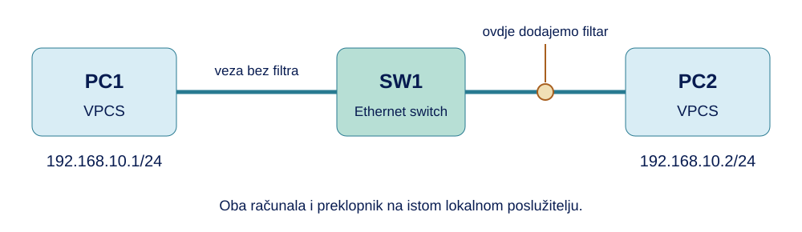
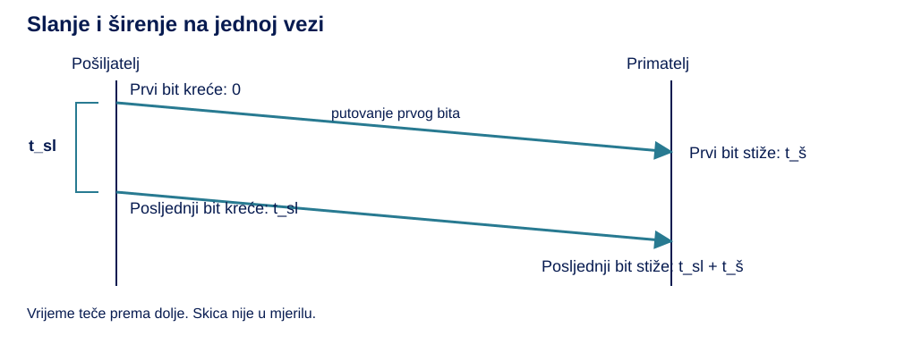
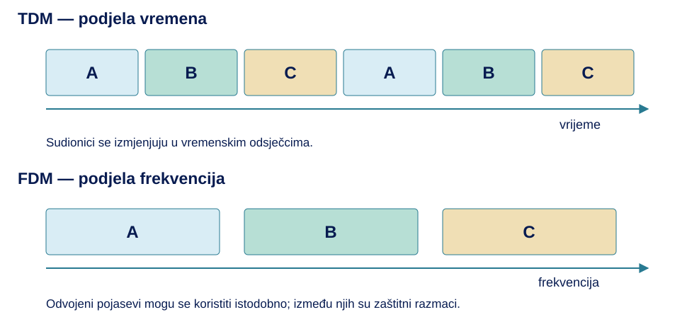

<style>
.quarto-title-block { display: none; }
.cover-page {
  width: min(1100px, 100%);
  min-height: min(1120px, calc(100vh - 3rem));
  margin: 0 auto 4rem;
  overflow: hidden;
  display: flex;
  flex-direction: column;
  background: #fff;
}
.cover-banner { display: block; width: 100%; height: auto; }
.cover-content {
  flex: 1;
  display: flex;
  flex-direction: column;
  align-items: center;
  padding: clamp(2rem, 6vw, 4.5rem);
  text-align: center;
}
.cover-logo { width: min(520px, 85%); height: auto; margin-bottom: auto; }
.cover-title { margin: 3rem 0 .5rem; color: #071b50; font-size: clamp(3rem, 8vw, 5rem); font-weight: 700; line-height: 1; }
.cover-subtitle { margin: 0; color: #287a91; font-size: clamp(1.5rem, 4vw, 2.25rem); font-weight: 600; line-height: 1.25; }
.cover-people {
  width: min(560px, 100%);
  margin-top: auto;
  padding-top: 2rem;
  border-top: 2px solid #66c7ee;
  text-align: left;
}
.cover-people p { margin: .35rem 0; }
#TOC a { color: inherit; text-decoration: none; }
#TOC > ul > li > a { font-weight: 600; }
#TOC li { margin-bottom: .3rem; }
#TOC a:hover { text-decoration: underline; }
body { line-height: 1.65; }
h1 { margin-top: 2.5rem; }
figure { margin: 1.5rem 0; }
details { margin: 1rem 0 1.5rem; padding: .6rem .9rem; border: 1px solid #d8dfe5; border-radius: .3rem; }
summary { cursor: pointer; font-weight: 600; }
details[open] > summary { margin-bottom: .75rem; }
summary:focus-visible { outline: 2px solid #287a91; outline-offset: 4px; }
@media screen and (min-width: 768px) {
  #quarto-content.page-layout-full #quarto-document-content {
    grid-column: screen-start / screen-end !important;
    width: min(1100px, calc(100vw - 3rem)) !important;
    max-width: 1100px !important;
    margin-inline: auto !important;
  }
}
@media print {
  @page { size: A4; margin: 18mm; }
  body { font-size: 10.5pt; line-height: 1.45; }
  #quarto-content { display: block !important; }
  main { width: 100% !important; max-width: none !important; }
  .cover-page {
    width: 100%;
    max-width: none;
    height: 245mm;
    min-height: 0;
    margin: 0;
    break-inside: avoid;
    page-break-inside: avoid;
    break-after: page;
    page-break-after: always;
  }
  .cover-content { padding: 14mm 12mm 10mm; }
  .cover-logo { width: 125mm; }
  .cover-title { break-before: auto !important; margin-top: 18mm; font-size: 34pt; }
  .cover-subtitle { font-size: 20pt; }
  h1 { break-before: page; margin-top: 0; }
  h2, h3 { break-after: avoid; }
  pre, figure, tr, .callout { break-inside: avoid; }
  p { orphans: 3; widows: 3; }
  .code-copy-button, .anchorjs-link { display: none !important; }
  a { color: inherit; text-decoration: none; }
}
</style>

<div class="cover-page">

<div class="cover-content">

<div class="cover-title">Vježba 1</div>
<div class="cover-subtitle">Prijenos podataka 

i analiza mrežne komunikacije</div>
<div class="cover-people">
<p><strong>Predavanja:</strong> doc. dr. sc. Sandi Baressi Šegota</p>
<p><strong>Vježbe:</strong> Elvis Starić mag. inf.</p>
</div>
</div>
</div>

<script>
document.addEventListener("DOMContentLoaded", () => {
  const naslovnica = document.querySelector(".cover-page");
  const sadrzaj = document.getElementById("TOC");
  if (naslovnica && sadrzaj) sadrzaj.before(naslovnica);
});
</script>

U uvodnoj vježbi povezali smo mrežne uređaje, sučelja i protokole s njihovim ulogama. Sada ćemo pratiti prijenos: koliko podataka šaljemo, koliko traje njihovo slanje i putovanje te što ograničava komunikaciju kada podaci prolaze preko više veza.

Razlika između veze od 100 Mbit/s i veze od 1 Gbit/s postaje jasnija kada izračunamo vrijeme prijenosa iste datoteke. Međutim, brža veza ne uklanja svako kašnjenje, a fizička povezanost ne jamči da će svi podaci stići. Te ćemo razlike primijeniti u računskim i GNS3 zadacima. Pratit ćemo i prosljeđivanje paketa te usporediti dijeljenje kanala s dodjelom kapaciteta prema prometu.

U GNS3-u ćemo povezati dva virtualna računala, postaviti im zadane adrese i provjeriti komunikaciju. Zatim ćemo na jednoj vezi dodavati kašnjenje i izazvati gubitke. Usporedbom rezultata razlikovat ćemo spor odgovor od izostanka odgovora. Za računske zadatke pripremite kalkulator.

GNS3 modelira komunikaciju uređaja i omogućuje nametanje odabranih uvjeta prijenosa. Vrijeme slanja i ograničenja propusnosti računat ćemo iz zadanih podataka. Naredba `ping`, koju ćemo koristiti u laboratoriju, mjeri vrijeme do odgovora i ne predstavlja mjerenje propusnosti veze.

# Količina podataka i jedinice

## Bit i bajt

Mrežna veza prenosi podatke koji se mogu zapisati kao niz nula i jedinica. Jedna takva vrijednost predstavlja **bit**. Primjerice, niz `10110010` sadrži osam bitova. Kada osam bitova promatramo zajedno, govorimo o jednom **bajtu**.

Veličinu datoteke obično navodimo u bajtovima, a brzinu mrežne veze u bitovima u sekundi. Zato prije računanja trebamo provjeriti jedinice. Datoteka veličine 10 MB i veza brzine 10 Mbit/s koriste istu decimalnu oznaku „mega”, ali različite osnovne jedinice.

::: {.callout-tip title="Bit i bajt"}
**Bit** je jedinica količine podataka koja može imati vrijednost 0 ili 1.

**Bajt** (*byte*, oznaka **B**) sadrži osam bitova: **1 B = 8 bit**.
:::

Pri pretvorbi iz bajtova u bitove množimo s osam. Pri pretvorbi iz bitova u bajtove dijelimo s osam. Primjerice, `1500 B × 8 = 12 000 bit`, dok `80 000 bit ÷ 8 = 10 000 B`.

## Što se zapravo prenosi?

Dokument na računalu zauzima određeni broj bajtova. Pri prijenosu uz njegov sadržaj obično putuju i dodatni podaci koji uređajima omogućuju prepoznati pošiljatelja, odredište i način obrade. Zbog toga količina podataka prenesena preko veze može biti veća od veličine same datoteke.

Primjerice, program za preuzimanje može brojiti samo sadržaj datoteke, dok se preko veze prenose i dodatni podaci. Zato veličina datoteke i ukupna prenesena količina nisu nužno jednake. U računskim zadacima navest ćemo koju količinu koristimo i što zanemarujemo; konkretna zaglavlja promatrat ćemo u vježbama o aplikacijama, transportu, IP-u i Ethernetu.

## Decimalne i binarne oznake

Za velike količine podataka koristimo prefikse. U ovoj skripti **kB, MB i GB imaju decimalno značenje**, odnosno koriste potencije broja 1000. Ako se koristi potencija broja 1024, pišemo **KiB, MiB i GiB**. Razlikovanje tih zapisa važno je kada veličinu datoteke preuzimamo iz programa koji koristi binarne jedinice.

Jedinicama **kB, MB i GB** najčešće iskazujemo veličine datoteka i kapacitete uređaja za pohranu, **KiB, MiB i GiB** koristimo kada te količine ili kapacitet memorije izražavamo binarnim jedinicama, a **kbit/s, Mbit/s i Gbit/s** za brzinu prijenosa podataka kroz mrežu.

::: {.callout-caution title="Pregled jedinica"}
| Oznaka | Značenje | Vrijednost |
|---|---|---:|
| kB | kilobajt | 1000 B |
| MB | megabajt | 1 000 000 B |
| GB | gigabajt | 1 000 000 000 B |
| KiB | kibibajt | 1024 B |
| MiB | mebibajt | 1 048 576 B |
| GiB | gibibajt | 1 073 741 824 B |
| kbit/s | kilobit u sekundi | 1000 bit/s |
| Mbit/s | megabit u sekundi | 1 000 000 bit/s |
| Gbit/s | gigabit u sekundi | 1 000 000 000 bit/s |
:::

Veza od 80 Mbit/s u teoriji prenosi `80 ÷ 8 = 10 MB/s`. To je pretvorba jedinice, a ne obećanje da će aplikacija u svakoj sekundi primiti baš toliko korisnih podataka. Dio prijenosa pripada upravljačkim podacima, a brzina može biti ograničena drugim dijelovima sustava.

::: {.callout-warning title="Veliko i malo slovo nisu zamjenjivi"}
**MB/s** označava megabajte u sekundi, a **Mbit/s** megabite u sekundi. Za računanje u ovoj skripti koristimo zapis `bit`, kako se malo slovo `b` ne bi zamijenilo s velikim `B`.

Nemojte pretpostaviti da je `1 MB = 1024 × 1024 B`, ta vrijednost pripada jedinici **MiB**.
:::

## Pretvorba podataka za zadani prijenos

Datoteka ima 25 MB. Koliko bitova treba prenijeti i koja bi brzina u MB/s odgovarala vezi od 100 Mbit/s?

1. Veličinu pretvorimo u bajtove: `25 × 1 000 000 = 25 000 000 B`.
2. Bajtove pretvorimo u bitove: `25 000 000 × 8 = 200 000 000 bit`.
3. Brzinu veze pretvorimo u MB/s: `100 ÷ 8 = 12,5 MB/s`.

Ista količina podataka može se zapisati kao 25 MB ili 200 Mbit. Promijenili smo jedinicu, dok je količina ostala ista.

U tablici su prikazane dovršene pretvorbe. Za decimalne megabajte množimo s 1 000 000, a za mebibajte s 1 048 576 kako bismo dobili bajtove. Dobiveni broj bajtova zatim množimo s osam za pretvorbu u bitove.

| Zadana količina | Količina u B | Količina u bitovima |
|---|---:|---:|
| 25 MB | 25 000 000 | 200 000 000 |
| 12 MB | 12 000 000 | 96 000 000 |
| 12 MiB | 12 582 912 | 100 663 296 |


::: {.callout-note title="Zadatak"}
1. Pretvorite 16 MB u bitove i 16 MiB u bajtove. Jesu li to jednake količine podataka?
2. Kolikoj brzini u MB/s odgovara 320 Mbit/s?
3. Program prikazuje prijenos od 9 MB/s na vezi od 100 Mbit/s. Pretvorite prikazanu brzinu u Mbit/s. Premašuje li ona brzinu veze?
:::

<details>
<summary>Prikaži rješenje</summary>

1. `16 MB = 16 000 000 B = 128 000 000 bit`. `16 MiB = 16 × 1 048 576 = 16 777 216 B`.
2. `320 ÷ 8 = 40 MB/s`.
3. `9 × 8 = 72 Mbit/s`. Prikazana brzina manja je od 100 Mbit/s.

</details>

# Povezivanje i provjera mreže u GNS3-u

## Projekt i uređaji

Napravit ćemo malu mrežu u kojoj PC1 šalje provjerne poruke računalu PC2, a PC2 odgovara. Taj isti projekt koristit ćemo u nastavku: prvo ćemo provjeriti radi li komunikacija, a zatim na jednoj vezi odgađati ili odbacivati dio prometa.

Koristimo **dva VPCS čvora** i GNS3-ov ugrađeni **Ethernet switch**. Preklopnik povezuje računala u lokalnoj mreži; u ovoj vježbi koristimo njegove početne postavke. Način njegova prosljeđivanja i Ethernet okvire detaljnije ćemo obraditi u vježbi 5 o lokalnim mrežama.

1. U GNS3-u odaberite **File → New blank project** i napravite projekt `MS_V1_Prijenos`.
2. U skupini **End devices** pronađite **VPCS** i dvaput ga povucite na radnu površinu.
3. Preimenujte čvorove u **PC1** i **PC2** preko njihova kontekstnog izbornika, opcijom **Change hostname**, ako je potrebno.
4. U skupini **Switches**, ili pretragom svih uređaja, pronađite ugrađeni **Ethernet switch**. Povucite ga između računala i nazovite **SW1**.
5. Ako program traži poslužitelj, za sve čvorove odaberite isti lokalni poslužitelj koji ste provjerili u uvodnoj vježbi.

Ugrađeni Ethernet switch dostupan je bez uvoza operacijskog sustava usmjernika ili preklopnika. Nemojte u ovom koraku birati predložak poput IOSvL2 koji traži zasebnu sliku. Ako ne vidite ugrađeni uređaj, otvorite popis svih uređaja i pretražite naziv `Ethernet switch`.

{fig-alt="PC1 s adresom 192.168.10.1/24 spojen je sa SW1, koji je spojen s PC2 s adresom 192.168.10.2/24. Filtri se postavljaju samo na vezu SW1–PC2."}

## Povezivanje sučelja

Povlačenje uređaja na radnu površinu još ne stvara veze. Svaku vezu trebamo spojiti na mrežno sučelje računala i na jedan priključak preklopnika. Priključak ovdje znači mjesto na koje spajamo virtualni kabel.

1. Odaberite alat **Add a link**, označen ikonom kabela.
2. Kliknite PC1 i odaberite njegovo sučelje **Ethernet0**.
3. Kliknite SW1 i odaberite prvi slobodni priključak, primjerice **Ethernet0**.
4. Ponovno odaberite dodavanje veze. Spojite **Ethernet0** na PC2 s drugim slobodnim priključkom SW1, primjerice **Ethernet1**.
5. Izađite iz načina dodavanja veza ponovnim klikom na ikonu kabela ili tipkom Escape.
6. Pokrenite čvorove zelenim gumbom **Start/Resume all devices**. Otvorite konzole PC1 i PC2.

Provjerite da su na shemi dvije veze: PC1–SW1 i SW1–PC2. Računala ne spajamo na isti priključak SW1. Ugrađeni preklopnik nema konzolu za konfiguriranje poput VPCS-a, za ovaj rad njegove priključke ostavljamo na početnim postavkama.

## Zadane mrežne adrese

Za slanje poruke računalu treba odredišna adresa. Dodijelit ćemo dvije **IPv4 adrese**: PC1 dobiva `192.168.10.1`, a PC2 `192.168.10.2`. Adrese se moraju razlikovati kako bismo mogli odrediti kojem računalu šaljemo poruku.

Uz obje adrese koristimo oznaku **`/24`**. Ona označava duljinu mrežnog dijela adrese i odgovara maski `255.255.255.0`. Za ove zadane adrese to znači da su računala u istoj IP mreži: početni dio `192.168.10` zajednički im je, a posljednji broj razlikuje računala. To pravilo čitanja po trima brojevima vrijedi za ovdje zadanu masku, ostale maske i izračune obradit ćemo u vježbi o adresiranju.

::: {.callout-caution title="Postavke laboratorija"}
| Čvor | Sučelje | IPv4 adresa | Maska | Zadani pristupnik |
|---|---|---|---|---|
| PC1 | Ethernet0 | 192.168.10.1 | /24, odnosno 255.255.255.0 | Ne postavljamo |
| PC2 | Ethernet0 | 192.168.10.2 | /24, odnosno 255.255.255.0 | Ne postavljamo |
:::

Zadani pristupnik služi komunikaciji prema drugim mrežama. U ovoj topologiji oba su računala u istoj mreži, pa nam za njihov razgovor nije potreban. Ove postavke unosimo samo u virtualne čvorove, u njihove VPCS konzole.

U konzoli **PC1** izvršite:

```bash
ip 192.168.10.1/24
```
a zatim 
```bash
show ip
```

U konzoli **PC2** izvršite:

```bash
ip 192.168.10.2/24
```
a zatim
```bash
show ip
```

U ispisu `show ip` usporedite adresu i masku s tablicom. Adresa `0.0.0.0` u polju pristupnika ovdje je očekivana jer ga nismo postavili. Ako se u polju vlastite IP adrese i dalje prikazuje `0.0.0.0`, ponovno provjerite unos naredbe `ip` u toj konzoli.

Sada u **obje konzole** izvršite `save`. Time postavke svakog VPCS-a spremate u njegovu početnu konfiguraciju.

## Prva provjera komunikacije

Naredba **`ping`** šalje provjernu poruku odredištu i čeka odgovor. U ovoj provjeri koristi poruke protokola **ICMP**, namijenjenog između ostaloga mrežnim provjerama i obavijestima. Za svaki zahtjev očekujemo odgovarajući odgovor. To nam omogućuje provjeriti povratnu komunikaciju i vrijeme potrebno za nju.

U konzoli **PC1** izvršite:

```bash
ping 192.168.10.2 -c 5
```

Adresa označava PC2, a `-c 5` zadaje pet provjera. Zatim u konzoli PC2 provjerite suprotan smjer naredbom 
```bash
ping 192.168.10.1 -c 5
```
Uspješan odgovor sadrži adresu odredišta, redni broj `icmp_seq` i vrijeme `time`. 

Primjer izgleda odgovora:

```text
84 bytes from 192.168.10.2 icmp_seq=1 ttl=64 time=0.850 ms
```

- `192.168.10.2` pokazuje s kojeg je odredišta stigao odgovor.
- `icmp_seq=1` označava prvu provjeru u nizu.
- `time=0.850 ms` označava vrijeme od slanja zahtjeva do primitka odgovora.
- `ttl` je podatak vezan uz ograničavanje životnog vijeka IP paketa (u ovoj ga vježbi ne mijenjamo).

Vrijednost `time` u prikazanom odgovoru mjeri cijeli povratni put: PC1 šalje zahtjev, PC2 ga prima i šalje odgovor, a PC1 zaustavlja mjerenje kada taj odgovor stigne. To vrijeme nazivamo **RTT** (*round-trip time*). U primjeru RTT iznosi 0,850 ms. Ono uključuje odlazak zahtjeva do PC2 i povratak odgovora, a ne samo putovanje poruke u jednom smjeru.

Odgovor ne mora uvijek stići. Primjerice, ako prekinemo vezu dok se provjere izvršavaju, PC1 može poslati zahtjev i ostati čekati odgovor. Naredba `ping` ne čeka neograničeno: nakon isteka predviđenog vremena prijavljuje **timeout**, odnosno istek vremena čekanja. To se može dogoditi i ako je zahtjev ili odgovor izgubljen ili ako odgovor stigne prekasno. Zato timeout bilježimo kao neuspješnu provjeru, a ne kao odgovor s vremenom 0 ms.

::: {.callout-tip title="RTT i izostanak odgovora"}
**RTT** (*round-trip time*) je vrijeme od slanja provjernog zahtjeva do primitka pripadajućeg odgovora. Obuhvaća put do odredišta i natrag te obradu na tom putu.

**Timeout** znači da odgovor nije stigao unutar vremena čekanja. Sam po sebi ne govori je li izgubljen zahtjev, odgovor ili je došlo do prevelikog kašnjenja.
:::

RTT nije vrijeme samo jednog smjera, a kratko RTT vrijeme ne govori koliko brzo možemo prenijeti veliku datoteku. Uspješan `ping` također ne potvrđuje rad svake mrežne usluge, ovdje provjerava upravo ovu razmjenu ICMP poruka.

::: {.callout-note title="Zadatak"}
Provjerite izrađenu mrežu: PC1 treba imati adresu `192.168.10.1/24`, a PC2 `192.168.10.2/24`. Naredbom `ping` potvrdite komunikaciju u oba smjera i objasnite zašto u konzoli PC1 upisujete adresu PC2. Ako nema odgovora, provjerite pokrenute čvorove, veze i adrese. Na oba VPCS-a spremite konfiguraciju naredbom `save` i ostavite projekt otvoren.
:::

<details>
<summary>Prikaži provjeru izvedenog rada</summary>

Iz PC1 provjera je `ping 192.168.10.2 -c 5`, a iz PC2 `ping 192.168.10.1 -c 5`. Adresa iza naredbe određuje od kojeg računala tražimo odgovor. Provjera vlastite adrese ne bi potvrdila prolazak poruka preko SW1 do drugog računala. U ispravnoj mreži očekujemo odgovore u oba smjera. `save` izvršavamo zasebno na PC1 i PC2.

</details>

# Vrijeme prijenosa i kašnjenje

## Vrijeme slanja podataka na vezu

Zamislimo da šaljemo datoteku preko veze koja svake sekunde može prihvatiti određeni broj bitova. Slanje traje dok posljednji bit datoteke ne bude poslan na vezu. Što je datoteka veća, vrijeme je dulje, što je brzina veze veća, vrijeme je kraće.

To vrijeme nazivamo **vremenom slanja**, odnosno transmisijskim kašnjenjem. Računamo ga iz količine podataka i brzine veze:

**t_sl = L / R**

`L` je količina podataka u bitovima, `R` brzina u bit/s, a rezultat dobivamo u sekundama. Ako su brojnik i nazivnik izraženi u Mbit i Mbit/s, decimalni faktor se poništava i rezultat je također u sekundama.

::: {.callout-tip title="Brzina i vrijeme slanja"}
**Brzina prijenosa** izražava koliko se bitova može prenijeti u jedinici vremena, primjerice u bit/s.

**Vrijeme slanja** vrijeme je potrebno da pošiljatelj sve bitove zadane količine podataka pošalje na vezu pri zadanoj brzini.
:::

Za datoteku od 25 MB i vezu od 100 Mbit/s dobivamo `t_sl = 200 Mbit / 100 Mbit/s = 2 s`. Na vezi od 1 Gbit/s ista bi količina pri idealnim uvjetima bila poslana za `200 / 1000 = 0,2 s`.

Ovdje pretpostavljamo stalnu brzinu, isključivo korištenje veze i prijenos bez dodatnih podataka ili ponavljanja. Za stvarni dohvat datoteke rezultat je idealna procjena: potrebno je uračunati i ostale dijelove komunikacije.

## Vrijeme širenja signala

Prvi bit ne stiže na drugi kraj veze u trenutku kada je poslan. Signal se širi konačnom brzinom i treba prijeći udaljenost između uređaja. Vrijeme tog putovanja nazivamo **vremenom širenja**, odnosno propagacijskim kašnjenjem.

**t_š = d / v**

`d` je duljina puta koji signal prelazi kroz medij, izražena u metrima. `v` je brzina kojom se signal širi kroz taj medij, izražena u m/s. **Vrijednost `v` bit će zadana u zadatku za medij koji promatramo.** Ona opisuje koliko metara signal prijeđe u sekundi, brzina prijenosa podataka u bit/s zasebna je veličina.

::: {.callout-tip title="Vrijeme širenja"}
**Vrijeme širenja** vrijeme je potrebno da signal prijeđe zadani put od pošiljatelja do primatelja. Ovisi o udaljenosti i brzini širenja signala kroz medij.
:::

Za put dug 100 km najprije pretvorimo udaljenost: `100 km = 100 000 m`. Zatim računamo `100 000 / 200 000 000 = 0,0005 s = 0,5 ms`.

Veća brzina veze skraćuje vrijeme slanja iste količine podataka. Ako udaljenost i medij ostaju jednaki, ona ne skraćuje vrijeme širenja signala. Uočite i različite jedinice: **Mbit/s** opisuje broj bitova u sekundi, a **m/s** put koji signal prijeđe u sekundi.

## Pretvorba vremenskih jedinica

U računanju trajanja kratkih prijenosa često dobivamo djeliće sekunde. Umjesto mnogo nula koristimo milisekunde i mikrosekunde:

| Jedinica | Odnos prema sekundi | Primjer |
|---|---|---|
| Milisekunda, ms | 1 ms = 0,001 s | 0,025 s = 25 ms |
| Mikrosekunda, µs | 1 µs = 0,000001 s | 0,000025 s = 25 µs |

Jedna milisekunda sadrži 1000 mikrosekundi. Ako dijeljenjem bitova s bitovima u sekundi dobijete `0,00008`, rezultat je u sekundama: `0,00008 s = 0,08 ms = 80 µs`. Zapisivanje jedinice uz svaki međurezultat sprječava pogrešku od tisuću puta.

**Pokazni primjer:** 1000 B šaljemo pri 100 Mbit/s. Količina je 8000 bitova, pa slanje traje `8000 / 100 000 000 = 0,00008 s`. Prvi bit kreće na početku intervala, a posljednji nakon 80 µs. To još ne govori koliko je udaljen primatelj niti kada je njegov odgovor stigao natrag.

## Kada stiže posljednji bit?

Na jednoj vezi slanje i širenje odvijaju se istodobno. Dok pošiljatelj šalje kasnije bitove, ranije poslani bitovi već putuju prema primatelju. Posljednji bit kreće nakon isteka vremena slanja, a zatim mu treba još vrijeme širenja do odredišta.

U pojednostavljenom primjeru bez obrade i čekanja vrijedi:

**t_uk = t_sl + t_š**

{fig-alt="Pošiljatelj šalje prvi bit u nultom trenutku, a posljednji nakon vremena slanja. Prvi bit stiže nakon vremena širenja, a posljednji nakon zbroja vremena slanja i širenja."}

Za blok od 1500 B na vezi od 10 Mbit/s vrijeme slanja je `12 000 / 10 000 000 = 0,0012 s = 1,2 ms`. Ako signal putuje 100 km pri zadanoj brzini od 200 000 000 m/s, vrijeme širenja iznosi 0,5 ms. Posljednji bit stiže **1,7 ms** nakon početka slanja.

## Obrada, čekanje i propusnost

Prethodni zbroj opisuje jedan prijenos preko jedne veze. U stvarnoj mreži uređaj još treba obraditi primljene podatke i odlučiti kamo ih poslati. Primjerice, usmjernik provjerava zaglavlje paketa i bira izlaznu vezu. Ako je ta veza zauzeta slanjem drugog paketa, novoprimljeni paket čeka u redu. Zato na predavanjima razlikujemo **četiri izvora kašnjenja**: obradu, čekanje, slanje i širenje.

::: {.callout-tip title="Obrada i čekanje"}
**Kašnjenje obrade** je vrijeme potrebno uređaju za obradu podataka i odluku o njihovu daljnjem prijenosu.

**Kašnjenje u redu čekanja** je vrijeme tijekom kojeg paket čeka da dođe na red za slanje preko izlazne veze. Ovisi o prometu i zauzetosti te veze.
:::

Za jedan čvor ukupno kašnjenje možemo zapisati kao: 

**t_čvor = t_obrada + t_čekanje + t_sl + t_š**. 

U ranijem računu pretpostavili smo da su obrada i čekanje zanemarivi. Na predavanjima se za iste veličine koriste oznake `d_proc`, `d_queue`, `d_trans` i `d_prop`, ovdje `t_sl` odgovara `d_trans`, a `t_š` odgovara `d_prop`. Brzina širenja ovdje se označava s `v`, a u materijalu s predavanja sa `s`.

Na putu kroz više veza važna je i njihova brzina. Ako podaci prolaze preko veza od 100, 40 i 80 Mbit/s, veza od 40 Mbit/s ne može proslijediti više od 40 Mbit u sekundi. Ona ograničava cijeli tok čak i kada ostale veze mogu slati brže. Takvo ograničenje nazivamo **uskim grlom**, a brzinu kojom podaci stvarno stižu primatelju **propusnošću** (*throughput*).

::: {.callout-tip title="Propusnost i usko grlo"}
**Propusnost** (*throughput*) je brzina kojom podaci stvarno stižu primatelju.

**Usko grlo** je dio puta koji ograničava ostvarenu propusnost. U idealnom modelu s više veza, bez drugog prometa i dodatnih ograničenja, propusnost je jednaka najmanjoj brzini na putu: **R_put = min(R₁, R₂, …, Rₙ)**.
:::

**Primjer:** za put `100 → 40 → 80 Mbit/s` dobivamo `R_put = min(100, 40, 80) = 40 Mbit/s`. Za 30 MB, odnosno 240 Mbit, idealna procjena prijenosa pri toj brzini je `240 / 40 = 6 s`. Zanemarujemo zaglavlja, ponovno slanje te početna kašnjenja slanja i širenja kroz mrežu. To je procjena za kontinuirani prijenos, a ne račun dolaska jednog paketa preko svih veza.

U zasebnom stvarnom mjerenju možemo, primjerice, preuzeti 24 MB sadržaja za 6 s. Tada smo ostvarili `24 / 6 = 4 MB/s`, odnosno 32 Mbit/s **korisnog prijenosa**. Za tu veličinu brojimo samo uspješno primljeni sadržaj datoteke. Pri ukupnom mrežnom prijenosu putuju i zaglavlja, a poneki se podaci mogu slati ponovno.

::: {.callout-tip title="Brzina korisnog prijenosa"}
**Brzina korisnog prijenosa** (*goodput*) je omjer uspješno prenesene količine korisnih podataka i vremena potrebnog za taj prijenos. u računanju ne ubrajamo zaglavlja ni ponovljene kopije podataka.
:::

Nazivna brzina sučelja, propusnost i brzina korisnog prijenosa zato ne moraju biti jednake. Jednako tako, kratko vrijeme do odgovora ne jamči veliku propusnost: `ping` mjeri RTT, a ne prijenos velike količine podataka.

::: {.callout-warning title="Pazite što se u zadatku traži"}
Vrijeme slanja cijele datoteke, vrijeme širenja signala i kašnjenje do odgovora različite su veličine. Formula `L / R` sama ne daje vrijeme čekanja odgovora s udaljenog poslužitelja.

U zadacima navodimo što zanemarujemo. Rezultat idealnog modela nemojte prikazivati kao zajamčeno trajanje stvarnog preuzimanja.
:::

## GNS3: mjerenje učinka kašnjenja

Otvorite projekt `MS_V1_Prijenos` i u PC1 izvršite `ping 192.168.10.2 -c 5`. Očitajte nekoliko vrijednosti `time` kako biste vidjeli približan RTT prije promjene.

GNS3 omogućuje postavljanje **filtra na vezu**: pravila kojim se promet namjerno odgađa ili odbacuje. Primijenit ćemo ga samo na **SW1–PC2** kako bismo znali gdje smo promijenili uvjete.

1. Desnom tipkom kliknite liniju između SW1 i PC2 i odaberite **Packet filters**.
2. Otvorite karticu **Delay**. Postavite **Latency** na **50 ms**, a **Jitter** na **0 ms**.
3. Kliknite **Apply** i zatim **OK**. Ostale filtre ostavite isključenima.
4. U PC1 ponovno izvršite `ping 192.168.10.2 -c 5` i usporedite vrijednosti `time` s onima prije promjene.

Zahtjev prelazi vezu SW1–PC2 na putu prema PC2, a odgovor prelazi istu vezu natrag. Dodanih 50 ms zato očekivano povećava RTT za približno **100 ms**. Ako je RTT prije promjene bio oko 1 ms, nakon promjene očekujemo oko 101 ms. Izvođenje simulatora i opterećenje računala mogu uzrokovati odstupanja.

Ako je povećanje znatno veće, provjerite jeste li filtar postavili i na drugu vezu te jesu li aktivni drugi filtri. Nakon provjere vratite **Latency** i **Jitter** na 0, primijenite promjenu i kratkim `ping`-om potvrdite povratak uobičajenog RTT-a.

::: {.callout-note title="Zadatak"}
1. Datoteku od 60 MB šaljemo preko veze od 40 Mbit/s. Izračunajte idealno vrijeme slanja.
2. Blok od 2000 B šaljemo vezom od 8 Mbit/s preko puta dugog 40 km. Brzina širenja kroz zadani medij je 200 000 000 m/s. Izračunajte vrijeme slanja, vrijeme širenja i trenutak dolaska posljednjeg bita. Zanemarite obradu i čekanje. Zatim udvostručite brzinu veze: koje se vrijeme mijenja i koliki je novi zbroj?
3. Prema izvedenom GNS3 zadatku objasnite zašto je 50 ms dodanog kašnjenja povećalo RTT za približno 100 ms. Mjeri se ovdije brzina prijenosa velike datoteke?
4. Podaci prolaze preko veza od 100, 16 i 80 Mbit/s. Odredite usko grlo i idealnu propusnost. Procijenite vrijeme prijenosa 8 MB pri toj propusnosti, zanemarujući dodatne podatke i početna kašnjenja.
:::

<details>
<summary>Prikaži postupak i rezultate</summary>

1. `60 MB × 8 = 480 Mbit`. Vrijeme slanja je `480 / 40 = 12 s`.
2. `2000 B = 16 000 bit`. Slanje traje `16 000 / 8 000 000 = 0,002 s = 2 ms`. Širenje traje `40 000 / 200 000 000 = 0,0002 s = 0,2 ms`. Posljednji bit stiže nakon **2,2 ms**. Pri 16 Mbit/s slanje traje 1 ms, širenje ostaje 0,2 ms, a zbroj je **1,2 ms**.
3. Zahtjev i odgovor prolaze filtriranu vezu, svaki u svojem smjeru, pa se kašnjenje dodaje dvaput. `ping` mjeri vrijeme do odgovora, a ne brzinu prijenosa datoteke.
4. Usko grlo je veza od 16 Mbit/s. `min(100, 16, 80) = 16 Mbit/s`. Za `8 MB × 8 = 64 Mbit` procjena iznosi `64 / 16 = 4 s`.

</details>

# Komutacija paketa i dijeljenje prijenosnog kapaciteta

## Prijenos u paketima

Mrežni sadržaj, primjerice datoteka, obično se ne šalje kao jedna neprekinuta cjelina koju svaki uređaj najprije mora primiti u cijelosti. Dijeli se na manje dijelove, koji se u mrežnom sloju prenose u **paketima**. Paket sadrži podatke i zaglavlje potrebno za mrežni prijenos. Usmjernik iz zaglavlja određuje kamo paket dalje proslijediti.

Kod **komutacije paketa** izlazne veze koriste se prema pristiglom prometu. Paket jednog računala može slijediti paket drugog računala preko iste veze. Ne rezerviramo svakom računalu stalan dio kapaciteta samo zato što je povezano. Odluka o izlazu donosi se za pakete, prema pravilima i tablicama koje ćemo razraditi u vježbi o IP-u i usmjeravanju.

::: {.callout-tip title="Komutacija paketa"}
**Komutacija paketa** je način prijenosa u kojem se podaci šalju u paketima, a mrežni uređaji prosljeđuju pakete preko zajedničkih veza prema njihovim odredištima i raspoloživosti izlaza.
:::

U GNS3 provjerama `ping` zahtjev i odgovor također putuju u IP paketima. Na Ethernet vezama ti su paketi sadržaj okvira. Za sada pratimo dolazak i vrijeme odgovora; konkretna zaglavlja i prosljeđivanje okvira analizirat ćemo u kasnijim vježbama.

## Spremi-i-proslijedi

Promotrimo pojednostavljeni put `PC1 → R1 → PC2`. U modelu **spremi-i-proslijedi** (*store-and-forward*) usmjernik R1 najprije prima cijeli paket, a tek onda ga šalje preko sljedeće veze. Zato se vrijeme slanja računa za **svaku vezu na putu**, a ne samo za prvu.

::: {.callout-tip title="Spremi-i-proslijedi"}
**Spremi-i-proslijedi** postupak je u kojem uređaj najprije primi cijelu jedinicu podataka, a zatim je prosljeđuje preko odabrane izlazne veze.
:::

**Primjer:** paket od 1500 B ide preko dvije veza. Prva ima brzinu 10 Mbit/s i vrijeme širenja 0,2 ms, a druga 100 Mbit/s i vrijeme širenja 0,3 ms. Paket zadržava istu zadanu veličinu, a obradu, čekanje i dodatne podatke na vezama zanemarujemo.

1. Paket ima `1500 × 8 = 12 000 bit`.
2. Na prvoj vezi slanje traje `12 000 / 10 000 000 = 1,2 ms`. Cijeli paket stiže u R1 nakon `1,2 + 0,2 = 1,4 ms`.
3. Tek tada R1 počinje slanje na drugu vezu. Ono traje `12 000 / 100 000 000 = 0,12 ms`.
4. Posljednji bit stiže u PC2 nakon `1,4 + 0,12 + 0,3 = 1,82 ms` od početka slanja u PC1.

U ovom modelu zbrajamo slanje i širenje preko obiju veza: **t_put = L/R₁ + t_š₁ + L/R₂ + t_š₂**. Kada su brzine svih `n` veza jednake, ukupno vrijeme slanja jednog paketa kroz njih iznosi `n × L/R` (vremena širenja dodajemo zasebno). Ovo vrijedi za jedan paket i opisane pretpostavke, a ne za cijelu datoteku čiji se paketi mogu istodobno nalaziti na različitim vezama.

## Čekanje i gubitak paketa

Ako na istu izlaznu vezu stigne više paketa nego što ih uređaj može odmah poslati, oni čekaju. Na primjer, u R1 u isto vrijeme dolaze paketi iz više računala, a izlaz može slati samo jedan po jedan. Veće čekanje povećava kašnjenje čak i kada udaljenost i brzina širenja signala ostaju jednaki.

Red ima ograničen prostor. Ako novi paket stigne kada više nema mjesta, uređaj ga može odbaciti. To je jedan uzrok gubitka zbog zagušenja.

## Komutacija kanala i multipleksiranje

Kod **komutacije kanala** mreža prije prijenosa uspostavlja put između sudionika i na svakoj vezi tog puta rezervira određeni dio prijenosnog kapaciteta. Taj dio ostaje dodijeljen istoj komunikaciji dok ona traje. Rezervirati kapacitet znači unaprijed osigurati koliko podataka ta komunikacija može prenositi u jedinici vremena, umjesto da se raspoloživi kapacitet dodjeljuje tek kada podaci stignu u uređaj.

Primjer je razgovor u klasičnoj telefonskoj mreži. Kada osoba A nazove osobu B, mreža najprije provjerava može li uspostaviti put i osigurati potreban kapacitet između njih. Nakon uspostave veze govor se prenosi koristeći rezervirani kapacitet. Kada A i B nakratko zašute, njihova veza i dalje postoji: kapacitet ostaje rezerviran i u toj se stanci ne dodjeljuje automatski drugom razgovoru. Nakon završetka poziva rezervacija se oslobađa, pa taj kapacitet može koristiti nova komunikacija.

To ne znači da svaki razgovor mora imati vlastiti zaseban kabel između sudionika. Istu fizičku vezu može koristiti više razgovora, a svakome se dodjeljuje njegov dio kapaciteta. Podjela se može ostvariti ponavljajućim vremenskim poljima ili zasebnim frekvencijskim pojasevima, što ćemo u nastavku prikazati kao TDM i FDM.

Prednost takve organizacije jest da uspostavljena komunikacija ima osiguran rezervirani kapacitet. Nedostatak je što taj kapacitet ostaje zauzet i kada sudionici trenutačno nemaju podatke za slanje. Ako na nekoj vezi potrebnog puta nema dovoljno slobodnog kapaciteta, nova se komunikacija ne može uspostaviti tim putem dok se kapacitet ne oslobodi ili ne pronađe drugi raspoloživ put. Kod komutacije paketa nema takve trajne rezervacije za svaki tok: pristigli paketi dijele izlaznu vezu, pa pri većem prometu mogu čekati u redu.

::: {.callout-tip title="Komutacija kanala"}
**Komutacija kanala** je način prijenosa u kojem mreža prije razmjene podataka uspostavlja put između sudionika i rezervira dio prijenosnog kapaciteta na svakoj vezi tog puta. Rezervirani kapacitet ostaje dodijeljen toj komunikaciji tijekom njezina trajanja, uključujući stanke u slanju, a oslobađa se nakon završetka komunikacije.
:::

Kod **vremenskog multipleksiranja (TDM)** svaki sudionik dobiva vremensko polje. Tri sudionika mogu slati prema rasporedu `A | B | C`, koji se ponavlja. Ako su polja jednaka, svaki koristi jednu trećinu vremena. Kod fiksnog rasporeda prazno polje ne dodjeljuje se automatski drugom sudioniku. Kod **frekvencijskog multipleksiranja (FDM)** tokovi mogu slati istodobno, svaki u zasebnom frekvencijskom pojasu.

::: {.callout-tip title="Multipleksiranje"}
**Multipleksiranje** je zajednički prijenos više tokova istim prijenosnim putem, uz pravilo koje omogućuje njihovo razdvajanje na prijamu. **TDM** ih razdvaja u vremenu, a **FDM** prema frekvencijskim pojasevima.
:::

{fig-alt="TDM prikazuje ponavljanje vremenskih polja A B C. FDM prikazuje tri odvojena frekvencijska pojasa dostupna istodobno."}

**Pokazni primjer:** kanal od 12 Mbit/s ravnomjerno dijelimo na tri sudionika u fiksnom TDM rasporedu. Svaki dobiva `12 / 3 = 4 Mbit/s`. Za slanje 8 Mbit jednog sudionika treba `8 / 4 = 2 s`. Zanemarujemo dodatne podatke i početno čekanje vlastitog polja. Ako B i C trenutačno ne šalju, A ne dobiva automatski njihova rezervirana polja.

Kod **statističkog multipleksiranja** kapacitet se koristi prema potrebi, bez trajnog jednakog udjela za svakog sudionika. Ako samo A ima pakete za slanje i nema drugih ograničenja, može koristiti raspoloživi kapacitet veze. Kada se aktiviraju i ostali, njihovi paketi dijele isti izlaz i mogu čekati. To ne jamči da će svaki sudionik dobiti točno trećinu brzine; rezultat ovisi o prometu i načinu raspoređivanja paketa. Na tom se načelu temelji dijeljenje veza u Internetu.

::: {.callout-tip title="Statističko multipleksiranje"}
**Statističko multipleksiranje** dijeljenje je kapaciteta prema trenutačno pristiglom prometu, umjesto trajne rezervacije jednakih vremenskih polja ili pojaseva za sve sudionike.
:::

::: {.callout-note title="Zadatak"}
1. Paket od 1000 B prolazi kroz tri veze, svaka brzine 20 Mbit/s i s vremenom širenja 0,1 ms. Svaki posrednički uređaj prima cijeli paket prije prosljeđivanja. Izračunajte dolazak posljednjeg bita na odredište, zanemarujući obradu, čekanje i dodatne podatke.
2. Četiri sudionika ravnomjerno dijele kanal od 20 Mbit/s u fiksnom TDM rasporedu. Koliki udio dobiva svaki i koliko traje idealno slanje 8 Mbit jednog sudionika? Zanemarite dodatne podatke i početno čekanje. Može li taj sudionik automatski koristiti svih 20 Mbit/s ako ostali nemaju podatke?
3. U čemu bi se posljednji odgovor razlikovao kada bi se veza dijelila statističkim multipleksiranjem, bez drugih ograničenja?
:::

<details>
<summary>Prikaži rješenje</summary>

1. Paket ima 8000 bitova. Na svakoj vezi slanje traje `8000 / 20 000 000 = 0,4 ms`, a širenje 0,1 ms. Ukupno je `3 × (0,4 + 0,1) = 1,5 ms`.
2. Svaki dobiva `20 / 4 = 5 Mbit/s`, pa slanje traje `8 / 5 = 1,6 s`. U fiksnom TDM rasporedu ostala se polja ne dodjeljuju automatski aktivnom sudioniku.
3. Ako ostali nemaju pakete i nema drugih ograničenja, aktivni sudionik može koristiti raspoloživi kapacitet od 20 Mbit/s. Kapacitet nije trajno podijeljen na četiri jednaka rezervirana udjela.

</details>

# Prijenosni mediji

Signal između uređaja treba prijeći fizički put. Primjerice, stalno računalo možemo povezati s preklopnikom kabelom, a laptop s pristupnom točkom bežično. U prvom slučaju signal putuje kroz kabel, a u drugom kroz prostor. Ono kroz što se signal širi nazivamo **prijenosnim medijem**. Iste podatke možemo prenijeti različitim medijima ako uređaji imaju odgovarajuća sučelja.

::: {.callout-tip title="Prijenosni medij"}
**Prijenosni medij** je fizičko sredstvo ili prostor kroz koji se signal širi između uređaja. Bakreni vodiči prenose električne signale, optičko vlakno vodi svjetlost, a bežični prijenos koristi elektromagnetske valove kroz prostor.
:::

**Bakreni kabel** je čest izbor za povezivanje računala unutar zgrade. U uobičajenom Ethernet kabelu vodiči su raspoređeni u međusobno uvijene parove, pa govorimo o **upletenoj parici**. Uvijanje pomaže smanjiti utjecaj smetnji, ali prijenos i dalje ovisi o duljini, kvaliteti kabela i spojeva te svojstvima sučelja. Pri povezivanju zato provjeravamo podržavaju li kabel i oba uređaja traženu brzinu na zadanoj udaljenosti.

{width=450px fig-alt="Otvoreni bakreni kabel s četiri para izoliranih vodiča, uvijenih unutar svakog para."}

**Optičko vlakno** prenosi podatke svjetlosnim signalima. Korisno je za povezivanje udaljenijih dijelova mreže, primjerice dviju zgrada, te u okruženjima s jakim elektromagnetskim smetnjama koje ne ometaju svjetlosni prijenos kroz vlakno. Na krajevima trebaju biti odgovarajuća optička sučelja ili moduli. Podržana udaljenost i brzina ovise o kombinaciji vlakna i opreme, pa sama oznaka „optika” nije dovoljna za odabir.

{width=450px fig-alt="Optički kabel s dva zelena konektora i uklonjenim zaštitnim kapicama."}

**Bežični prijenos** omogućuje povezivanje bez kabela do svakog uređaja. U Wi-Fi mreži laptopi i telefoni mogu se kretati unutar područja pokrivanja pristupne točke. Na rad utječu udaljenost, zidovi, smetnje i drugi korisnici koji dijele raspoloživi kanal. Prisutnost signala zato ne jamči dovoljnu brzinu za sve korisnike, a najveća navedena brzina nije brzina koju svaki od njih istodobno ostvaruje.

**Primjer odabira:** u učionici s postojećom kabelskom instalacijom stalna računala povezujemo bakrom, pokretne laptope Wi-Fi mrežom, a vezu prema drugoj zgradi možemo ostvariti optikom. Jedna mreža tako koristi više medija prema potrebama pojedine veze. Pri odabiru gledamo **udaljenost, traženu brzinu, smetnje, pokretljivost i mogućnosti uređaja na oba kraja**.

# Gubici u komunikaciji

## Gubitak poruke i neuspješna provjera

Pošiljatelj može poslati deset poruka, a primatelj dobiti samo osam. Dvije nedostaju, pa je udio gubitaka `2 / 10 × 100 = 20 %`. Ako svaka poruka ima 1000 B, primljeno je 8000 B, a nedostaje 2000 B. Uzrok može biti pogreška prijenosa, odbacivanje u uređaju ili prekid puta; sam broj izgubljenih poruka ne otkriva uzrok.

::: {.callout-tip title="Gubitak i udio gubitaka"}
**Gubitak poruke** znači da poslanu poruku primatelj nije uspješno primio u promatranoj razmjeni.

**Udio izgubljenih poruka** omjer je broja izgubljenih i ukupnog broja poslanih poruka, izražen u postotcima: **izgubljeno / poslano × 100 %**.
:::

Kod `ping`-a promatramo cijelu provjeru: zahtjev treba stići do PC2, a odgovor natrag do PC1 unutar vremena čekanja. Ako od 20 provjera dobijemo 17 odgovora, tri nisu uspjele, odnosno `3 / 20 × 100 = 15 %`. To nije izravno mjerenje gubitaka u jednom smjeru, jer je mogao izostati zahtjev ili odgovor.

## GNS3: namjerno izazivanje gubitaka

U zadatku s kašnjenjem poruke su stizale kasnije, ali su ipak stizale. Sada ćemo na istoj vezi odbacivati dio prometa. Filtar služi opažanju posljedica gubitka; ne simulira zagušenje punjenjem reda čekanja niti pogreške električkog signala. Koristite projekt `MS_V1_Prijenos` i prije promjene kratkim `ping`-om provjerite da komunikacija radi bez aktivnih filtara.

1. Na vezi **SW1–PC2** otvorite **Packet filters → Packet loss**.
2. Postavite gubitak na **10 %**, kliknite **Apply** i zatim **OK**. Kašnjenje i ostale filtre ostavite isključenima.
3. U PC1 izvršite `ping 192.168.10.2 -c 20` i pričekajte završetak.
4. Prebrojite uspješne odgovore. Broj neuspješnih provjera dobivate oduzimanjem tog broja od 20. Izračunajte njihov postotak.
5. Vratite gubitak na **0 %**, primijenite promjenu i naredbom `ping 192.168.10.2 -c 5` potvrdite povratak komunikacije.

Vrijednost 10 % zadaje vjerojatnost slučajnog odbacivanja pri prolasku kroz filtar. Ne znači da će od 20 provjera točno dvije biti neuspješne. Osim slučajnosti, filtar djeluje na zahtjev i odgovor u oba smjera, pa postotak neuspješnih provjera ne mora odgovarati upisanoj vrijednosti.

Ako VPCS prekine niz prije svih 20 provjera, nemojte ga računati kao završen niz od 20. Isključite filtar, provjerite veze i adrese te uspostavite osnovnu komunikaciju prije ponovnog pokušaja.

::: {.callout-note title="Zadatak"}
1. Za izvedeni zadatal navedite broj uspješnih odgovora i izračunajte postotak neuspješnih provjera. Objasnite po čemu se opažanje razlikuje od zadatka s kašnjenjem.
2. U zasebnom primjeru pošaljemo deset blokova po 1000 B, a primatelj dobije osam. Koliki je udio izgubljenih blokova i koliko je bajtova primljeno? Možemo li iz tih podataka zaključiti da je uzrok loš kabel?
:::

<details>
<summary>Prikaži rješenje</summary>

1. Rezultat ovisi o slučajnom odbacivanju. Primjerice, 16 odgovora znači četiri neuspjeha, odnosno `4 / 20 × 100 = 20 %`. To je primjer, a ne rezultat koji treba dobiti. Kašnjenje se u prethodnom zadatku pokazalo većim RTT-om, dok se gubici pokazuju izostankom dijela odgovora.
2. Izgubljena su dva od deset blokova, odnosno **20 %**. Primljeno je `8 × 1000 = 8000 B`. Podaci ne otkrivaju uzrok gubitaka, pa ne možemo zaključiti da je kabel neispravan.

</details>

Prije završetka provjerite da su filtri isključeni i da komunikacija radi. Na oba VPCS-a izvršite `save`. Ako projekt šaljete, zaustavite uređaje i koristite **File → Export portable project**. Upute za spremanje i izvoz nalaze se u uvodnoj vježbi.

# Pregled formula {.unnumbered}

U tablici su objedinjene formule korištene u ovoj vježbi. Prije uvrštavanja uskladite jedinice: ako koristite bitove i bit/s, vrijeme dobivate u sekundama.

::: {.callout-caution title="Formule i pretvorbe"}

| Namjena | Formula ili odnos | Oznake i uvjeti |
|---|---|---|
| Bajtovi i bitovi | `L_bit = 8 × L_B`| `L_B` je količina u bajtovima, a `L_bit` u bitovima. |
| Brzina u bajtovima i bitovima | `R_bit/s = 8 × R_B/s`, `R_B/s = R_bit/s / 8` | Uz isti decimalni prefiks vrijedi i `R_Mbit/s = 8 × R_MB/s` |
| Vrijeme slanja i potrebna brzina | `t_sl = L / R`; `R = L / t_sl` | `L` je količina u bitovima, `R` stalna brzina u bit/s, rezultat je u s. Za TDM koristimo brzinu dodijeljenu promatranom sudioniku. |
| Vrijeme širenja | `t_š = d / v` | `d` je put u m, a `v` zadana brzina širenja kroz promatrani medij u m/s; rezultat je u s. |
| Dolazak posljednjeg bita jednog bloka | `t_uk = t_sl + t_š` | Vrijeme od početka slanja na jednoj vezi, bez obrade i čekanja. |
| Četiri izvora kašnjenja u čvoru | `t_čvor = t_obrada + t_čekanje + t_sl + t_š` | Obrada i čekanje nisu uključeni u prethodni pojednostavljeni zbroj. |
| Jedan paket preko dviju veza | `t_put = L/R₁ + t_š₁ + L/R₂ + t_š₂` | Spremi-i-proslijedi, ista zadana veličina paketa, bez obrade, čekanja i dodatnih podataka. |
| Slanje jednog paketa preko n jednakih veza | `t_sl,put = n × L/R` | Spremi-i-proslijedi; vremena širenja treba dodati zasebno. |
| Idealna propusnost puta | `R_put = min(R₁, R₂, …, Rₙ)` | Bez drugog prometa i dodatnih ograničenja. Najmanja brzina predstavlja usko grlo. |
| Ostvarena brzina korisnog prijenosa | `R_korisno = L_korisno / t` | Uspješno prenesena korisna količina podijeljena proteklim vremenom. Bitovi i sekunde daju bit/s, bajtovi i sekunde daju B/s. |
| Brzina sudionika u TDM-u | `R_i = R / n` | `R` je brzina kanala, a `n` broj sudionika koji dobivaju jednaka vremenska polja. Zanemarujemo dodatne podatke. |
| Broj izgubljenih poruka ili blokova | `N_izgubljeno = N_poslano − N_primljeno` | Brojimo iste vrste jedinica; u zadanom modelu nema ponovnog slanja ni duplikata. |
| Udio gubitaka | `gubitak = (N_izgubljeno / N_poslano) × 100 %` | Odnosi se na promatrani prijenos od pošiljatelja prema primatelju. |
| Primljena i nedostajuća količina | `L_primljeno = N_primljeno × L_blok`, `L_nedostaje = N_izgubljeno × L_blok` | Svi blokovi imaju jednaku veličinu `L_blok`. Ako je ona u B, količine su također u B. |
| Udio neuspješnih ping provjera | `udio = ((N_provjera − N_odgovora) / N_provjera) × 100 %` | Brojimo poslane zahtjeve i primljene odgovore u promatranom nizu. |
:::

# Samostalni zadaci

Zadaci služe isključivo za dodatnu vježbu. **Nisu obavezni i ne boduju se.** Odgovore zapišite uz broj zadatka i prikažite pretvorbe, postupak računanja ili obrazloženje. Za GNS3 zadatke koristite projekt `MS_V1_Prijenos`. Rješenja su u sljedećem poglavlju.

## Zadatak 1

Datoteka ima 18 MB, a veza brzinu 24 Mbit/s. Izračunajte idealno vrijeme slanja. Dali bi slanje datoteke od 18 MiB trajalo jednako dugo? Provjerite tvrdnju pretvorbom u bitove i drugim izračunom. Zanemarite sve osim vremena slanja.

## Zadatak 2

Blok od 1250 B šalje se preko veze od 20 Mbit/s. Put je dug 300 km, a za promatrani medij zadana je brzina širenja 200 000 000 m/s. Izračunajte vrijeme slanja, vrijeme širenja i vrijeme od početka slanja do dolaska posljednjeg bita. Obradu i čekanje zanemarite. Hoće li povećanje brzine veze na 100 Mbit/s skratiti ukupno vrijeme za pet puta ?

## Zadatak 3

Za blok od 1500 B na vezi od 100 Mbit/s napravljen je izračun `t_sl = 1500 / 100 000 000 = 0,000015 s`. Pronađite pogrešku i napišite ispravan postupak. Rezultat izrazite u sekundama, milisekundama i mikrosekundama

## Zadatak 4

Tri sudionika ravnomjerno dijele kanal od 18 Mbit/s u fiksnom TDM rasporedu jednakih polja. Koliki udio dobiva svaki i koliko traje idealno slanje 9 MB jednog sudionika? Zatim raspored promijenimo tako da četiri sudionika dobivaju po jedno jednako polje. Ako četvrti sudionik trenutačno ne šalje, vraća li se vrijeme automatski na prvotni rezultat? Zanemarite dodatne podatke i početno čekanje polja.


## Zadatak 5

Pošiljatelj šalje 25 blokova po 800 B. Primatelj dobije sve osim blokova 4, 12 i 19, bez ponovnog slanja. Izračunajte udio izgubljenih blokova, primljenu količinu i količinu koja nedostaje. S obzirom da je primatelj je dobio blok 25, znači li to da je dobio cijeli sadržaj?

## Zadatak 6

U projektu `MS_V1_Prijenos` na vezi SW1–PC2 redom postavite dodatno kašnjenje 0 ms, 20 ms i 60 ms. Jitter i gubitak ostavite na 0, a na drugoj vezi filtre isključite. Za svako stanje iz PC1 pošaljite pet provjera prema PC2 i očitajte nekoliko RTT vrijednosti. Predvidite povećanje prema početnom stanju i usporedite ga s opažanjima. Objasnite zašto RTT nije jednak samo vrijednosti upisanoj u polje Latency. Na kraju vratite kašnjenje na 0.

## Zadatak 7

U istom projektu isključite kašnjenje i uključite gubitak od 5 % samo na vezi SW1–PC2. Iz PC1 prema PC2 pošaljite 20 provjera i izračunajte udio neuspješnih provjera. S obzirom da je 5 % od 20 jednako 1, dali to znači da će se dogoditi točno jedan neuspjeh? Objasnite bez računanja teorijske vjerojatnosti. Vratite gubitak na 0, potvrdite komunikaciju i spremite konfiguracije na oba VPCS-a.

## Zadatak 8

Datoteka od 48 MB uspješno je preuzeta za 12 s preko veze čija je nazivna brzina 100 Mbit/s. Izračunajte ostvarenu brzinu korisnog prijenosa u MB/s i Mbit/s.

## Zadatak 9

Veza A ima brzinu 10 Mbit/s i vrijeme širenja 1 ms, a veza B brzinu 100 Mbit/s i vrijeme širenja 5 ms. Za obje veze izračunajte vrijeme od početka slanja do dolaska posljednjeg bita bloka od 1000 B. Ponovite izračun za 1 MB podataka. Koja je veza povoljnija za malu, a koja za veću količinu u ovom modelu? Zanemarite zaglavlja, obradu i čekanje te promatrajte prijenos u jednom smjeru.

## Zadatak 10

Datoteku od 24 MB treba u idealnom modelu poslati za najviše 6 s. Kolika je najmanja potrebna brzina veze u Mbit/s? Provjerite mogu li taj zahtjev zadovoljiti veze od 20 Mbit/s i 40 Mbit/s. Zanemarite sve osim vremena slanja.

## Zadatak 11

Paket od 2000 B šalje se preko dvije veze. Prva ima brzinu 8 Mbit/s i vrijeme širenja 0,4 ms, a druga 40 Mbit/s i vrijeme širenja 0,6 ms. Posrednički uređaj mora primiti cijeli paket prije slanja. Izračunajte kada cijeli paket stiže u posrednički uređaj i kada stiže na krajnje odredište. Obradu, čekanje i dodatne podatke zanemarite.

## Zadatak 12

Put čine veze od 100, 25 i 60 Mbit/s. Odredite idealnu propusnost i procijenite vrijeme prijenosa 15 MB pri toj propusnosti. Zatim usporedite dvije promjene: prva veza povećana je na 1 Gbit/s ili je druga povećana na 50 Mbit/s. Koja promjena skraćuje procijenjeni prijenos i koliko? Zanemarite dodatne podatke, drugi promet i početna kašnjenja.

## Zadatak 13

U prvom sustavu tri toka naizmjenično koriste svoja unaprijed rezervirana vremenska polja. U drugom šalju istodobno, svaki u zasebnom frekvencijskom pojasu. Odredite vrstu multipleksiranja u oba slučaja. U trećem sustavu izlaznu vezu koriste pristigli paketi, a prazna veza nije rezervirana za sudionike koji nemaju podatke. Kako se zove to dijeljenje i znači li ono da svaki od tri sudionika uvijek dobiva točno trećinu kapaciteta?

## Zadatak 14

U projektu PC1–SW1–PC2 oba su VPCS-a pokrenuta, veze spojene i filtri isključeni. Naredba `show ip` prikazuje `192.168.10.1/24` na PC1 i `192.168.10.3/24` na PC2. Na PC1 se izvrši `ping 192.168.10.2 -c 5`, ali se ne dobije odgovor. Zatim se uspješno provjeri adresa `192.168.10.1` i proglasi vezu do PC2 ispravnom. Objasnite obje pogreške u zaključivanju. U GNS3-u postavite PC2 na adresu iz zadatka i provjerite komunikaciju prema njegovoj stvarnoj adresi, a zatim vratite PC2 na adresu iz skripte i spremite konfiguraciju.

# Rješenja samostalnih zadataka

## Rješenje zadatka 1

<details>
<summary>Prikaži rješenje</summary>

`18 MB = 18 000 000 B = 144 000 000 bit`, pa je vrijeme slanja `144 000 000 / 24 000 000 = 6 s`.

`18 MiB = 18 × 1 048 576 = 18 874 368 B = 150 994 944 bit`, pa slanje traje `150 994 944 / 24 000 000 = 6,291456 s`, približno **6,29 s**. Slanje ne bi trajalo jednako dugo. Datoteka od 18 MiB sadrži više bitova od datoteke od 18 MB, pa pri istoj brzini njezino slanje traje dulje.

</details>

## Rješenje zadatka 2

<details>
<summary>Prikaži rješenje</summary>

`1250 B = 10 000 bit`. Slanje traje `10 000 / 20 000 000 = 0,0005 s = 0,5 ms`. Širenje traje `300 000 / 200 000 000 = 0,0015 s = 1,5 ms`. Posljednji bit stiže nakon **2 ms** od početka slanja.

Pri 100 Mbit/s slanje traje 0,1 ms, a širenje ostaje 1,5 ms. Novi je zbroj **1,6 ms**. Ukupno vrijeme nije pet puta kraće: smanjuje se s 2 ms na 1,6 ms, odnosno za 20 %. Skraćuje se samo vrijeme slanja, dok vrijeme širenja ostaje 1,5 ms.

</details>

## Rješenje zadatka 3

<details>
<summary>Prikaži rješenje</summary>

U brojniku su uvršteni bajtovi, a brzina je izražena u bit/s. Najprije treba pretvoriti `1500 B × 8 = 12 000 bit`.

`t_sl = 12 000 / 100 000 000 = 0,00012 s = 0,12 ms = 120 µs`. Prvi rezultat je osam puta premalen.

</details>

## Rješenje zadatka 4

<details>
<summary>Prikaži rješenje</summary>

Uz tri sudionika svaki dobiva `18 / 3 = 6 Mbit/s`. Količina `9 MB × 8 = 72 Mbit` šalje se za `72 / 6 = 12 s`.

Uz četiri sudionika svaki dobiva `18 / 4 = 4,5 Mbit/s`, pa je vrijeme `72 / 4,5 = 16 s`. Prazno polje četvrtog sudionika u fiksnom rasporedu nije automatski dodijeljeno ostalima, rezultat ostaje 16 s dok se raspored ne promijeni.

</details>

## Rješenje zadatka 5

<details>
<summary>Prikaži rješenje</summary>

Izgubljena su tri od 25 blokova, odnosno `3 / 25 × 100 = 12 %`. Primljena su 22 bloka: `22 × 800 = 17 600 B`. Nedostaje `3 × 800 = 2400 B`.

Dolazak bloka 25 ne potvrđuje primitak svih prethodnih blokova. Cijeli sadržaj nije primljen jer nedostaju blokovi 4, 12 i 19.

</details>

## Rješenje zadatka 6

<details>
<summary>Prikaži rješenje</summary>

Pri kašnjenju 0 ms očekujemo uobičajen RTT. Dodanih 20 ms na jednoj vezi povećava RTT za približno **40 ms**, a 60 ms za približno **120 ms**. Zahtjev i odgovor prolaze filtriranu vezu, svaki u svojem smjeru.

Očitanja iz `ping 192.168.10.2 -c 5` uspoređujemo s tim predviđanjima, uz moguća odstupanja zbog izvođenja simulatora i opterećenja računala. Na kraju vraćamo kašnjenje na 0 i primjenjujemo promjenu.

</details>

## Rješenje zadatka 7

<details>
<summary>Prikaži rješenje</summary>

Koristimo `ping 192.168.10.2 -c 20`. Ako, primjerice, primimo 18 odgovora, neuspješne su dvije provjere, odnosno `2 / 20 × 100 = 10 %` (Ovo je samo primjer).

Ne, to ne znači da će se dogoditi točno jedan neuspjeh. Filtar slučajno odbacuje promet, pa ne određuje točan broj neuspješnih provjera u kratkom nizu. Djeluje na zahtjev i odgovor, zbog čega ni postavljena vrijednost gubitka nije isto što i opaženi udio neuspješnih ping provjera. Nakon provjere gubitak vraćamo na 0, provjeravamo komunikaciju i na oba VPCS-a izvršavamo `save`. Ako niz nije završio svih 20 provjera, prvo otklanjamo problem prema uputi iz poglavlja 6.

</details>

## Rješenje zadatka 8

<details>
<summary>Prikaži rješenje</summary>

Ostvarena brzina je `48 / 12 = 4 MB/s`, odnosno `4 × 8 = 32 Mbit/s`.

</details>

## Rješenje zadatka 9

<details>
<summary>Prikaži rješenje</summary>

Za 1000 B, odnosno 8000 bitova, na A slanje traje 0,8 ms, pa je zbroj `0,8 + 1 = 1,8 ms`. Na B slanje traje 0,08 ms, pa je zbroj `0,08 + 5 = 5,08 ms`. Za taj mali blok povoljnija je **A**.

Za 1 MB, odnosno 8 000 000 bitova, na A slanje traje 800 ms, pa je ukupno **801 ms**. Na B slanje traje 80 ms, pa je ukupno **85 ms**. Za veću količinu povoljnija je **B**. Manje vrijeme širenja može biti presudno za mali blok, a veća brzina slanja za veliku količinu.

</details>

## Rješenje zadatka 10

<details>
<summary>Prikaži rješenje</summary>

Količina je `24 MB × 8 = 192 Mbit`. Iz odnosa `t_sl = L / R` dobivamo potrebnu brzinu `R = L / t_sl = 192 / 6 = 32 Mbit/s`.

Na vezi od 20 Mbit/s slanje traje `192 / 20 = 9,6 s`, pa ne zadovoljava zahtjev. Na vezi od 40 Mbit/s traje `192 / 40 = 4,8 s`, pa zadovoljava. Najmanja potrebna brzina u zadanom idealnom modelu je **32 Mbit/s**.

</details>

## Rješenje zadatka 11

<details>
<summary>Prikaži rješenje</summary>

Paket ima `2000 × 8 = 16 000 bit`. Slanje na prvoj vezi traje `16 000 / 8 000 000 = 2 ms`, pa cijeli paket stiže u posrednički uređaj nakon **2,4 ms**.

Na drugoj vezi slanje traje `16 000 / 40 000 000 = 0,4 ms`. Na krajnje odredište paket stiže nakon `2,4 + 0,4 + 0,6 = 3,4 ms` od početka prvog slanja.

Slanje na drugoj vezi počinje tek nakon što posrednički uređaj primi cijeli paket, odnosno nakon 2,4 ms od početka prvog slanja.

</details>

## Rješenje zadatka 12

<details>
<summary>Prikaži rješenje</summary>

Početno je `R_put = min(100, 25, 60) = 25 Mbit/s`. Količina `15 MB × 8 = 120 Mbit` daje procjenu `120 / 25 = 4,8 s`.

Povećanjem prve veze na 1 Gbit/s dobivamo `min(1000, 25, 60) = 25 Mbit/s`. Usko grlo ostaje druga veza, pa procjena ostaje **4,8 s**.

Povećanjem druge veze na 50 Mbit/s dobivamo `min(100, 50, 60) = 50 Mbit/s`, pa je procjena `120 / 50 = 2,4 s`. U ovom modelu ta promjena prepolovljuje procijenjeno vrijeme.

</details>

## Rješenje zadatka 13

<details>
<summary>Prikaži rješenje</summary>

Prvi sustav koristi **TDM**, a drugi **FDM**. U trećem se koristi **statističko multipleksiranje**: kapacitet koriste pristigli paketi prema potrebi.

Statističko multipleksiranje ne određuje jednak trajan udio svakom sudioniku. Ako samo jedan ima pakete, može koristiti raspoloživi kapacitet; pri istodobnom prometu paketi dijele izlaz, mogu čekati i ne moraju ostvarivati jednake brzine.

</details>

## Rješenje zadatka 14

<details>
<summary>Prikaži rješenje</summary>

Prva pogreška jest provjera pogrešne odredišne adrese: PC2 ima **192.168.10.3**, a naredba traži odgovor s **192.168.10.2**. Izostanak odgovora s te adrese ne govori radi li PC2.

Druga pogreška jest zaključak da uspješna provjera adrese **192.168.10.1** potvrđuje vezu do PC2. To je vlastita adresa PC1. Ta provjera ne potvrđuje prolazak poruka preko SW1 do PC2. Za provjeru te veze treba poslati zahtjev na stvarnu adresu PC2.

Za provjeru na PC2 unesemo `ip 192.168.10.3/24` i provjerimo `show ip`. Iz PC1 izvršimo `ping 192.168.10.3 -c 5`. Nakon uspješne provjere na PC2 vratimo `ip 192.168.10.2/24`, a iz PC1 provjerimo `ping 192.168.10.2 -c 5`. Na PC2 izvršimo `save`. Na PC1 također možemo spremiti postojeću konfiguraciju.

</details>

<script>
window.addEventListener("beforeprint", function () {
  document.querySelectorAll("details").forEach(function (element) {
    element.open = true;
  });
});
</script>
