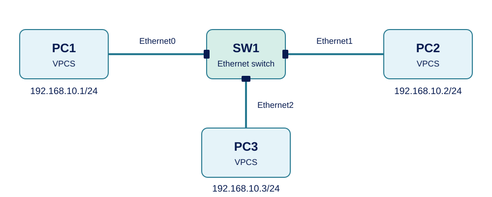
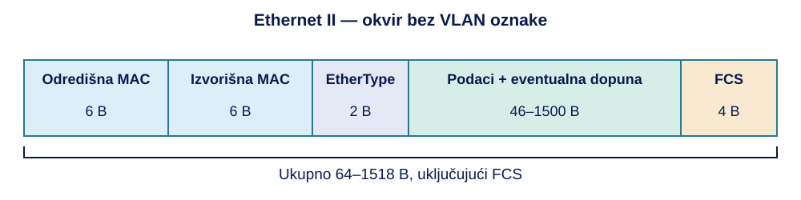
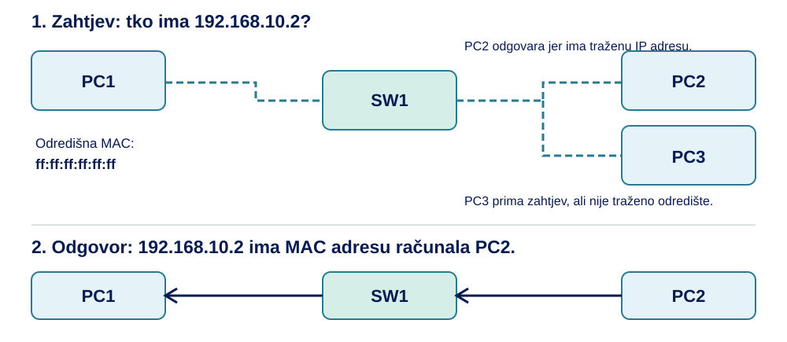
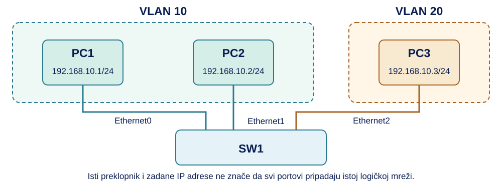

<style>
.quarto-title-block { display: none; }
.cover-page {
  width: min(1100px, 100%);
  min-height: min(1120px, calc(100vh - 3rem));
  margin: 0 auto 4rem;
  overflow: hidden;
  display: flex;
  flex-direction: column;
  background: #fff;
}
.cover-banner { display: block; width: 100%; height: auto; }
.cover-content {
  flex: 1;
  display: flex;
  flex-direction: column;
  align-items: center;
  padding: clamp(2rem, 6vw, 4.5rem);
  text-align: center;
}
.cover-logo { width: min(520px, 85%); height: auto; margin-bottom: auto; }
.cover-title { margin: 3rem 0 .5rem; color: #071b50; font-size: clamp(3rem, 8vw, 5rem); font-weight: 700; line-height: 1; }
.cover-subtitle { margin: 0; color: #287a91; font-size: clamp(1.5rem, 4vw, 2.25rem); font-weight: 600; line-height: 1.25; }
.cover-people {
  width: min(560px, 100%);
  margin-top: auto;
  padding-top: 2rem;
  border-top: 2px solid #66c7ee;
  text-align: left;
}
.cover-people p { margin: .35rem 0; }
#TOC a { color: inherit; text-decoration: none; }
#TOC > ul > li > a { font-weight: 600; }
#TOC li { margin-bottom: .3rem; }
#TOC a:hover { text-decoration: underline; }
body { line-height: 1.65; }
h1 { margin-top: 2.5rem; }
figure { margin: 1.5rem 0; }
details { margin: 1rem 0 1.5rem; padding: .6rem .9rem; border: 1px solid #d8dfe5; border-radius: .3rem; }
summary { cursor: pointer; font-weight: 600; }
details[open] > summary { margin-bottom: .75rem; }
summary:focus-visible { outline: 2px solid #287a91; outline-offset: 4px; }
@media screen and (min-width: 768px) {
  #quarto-content.page-layout-full #quarto-document-content {
    grid-column: screen-start / screen-end !important;
    width: min(1100px, calc(100vw - 3rem)) !important;
    max-width: 1100px !important;
    margin-inline: auto !important;
  }
}
@media print {
  @page { size: A4; margin: 18mm; }
  body { font-size: 10.5pt; line-height: 1.45; }
  #quarto-content { display: block !important; }
  main { width: 100% !important; max-width: none !important; }
  .cover-page {
    width: 100%;
    max-width: none;
    height: 245mm;
    min-height: 0;
    margin: 0;
    break-inside: avoid;
    page-break-inside: avoid;
    break-after: page;
    page-break-after: always;
  }
  .cover-content { padding: 14mm 12mm 10mm; }
  .cover-logo { width: 125mm; }
  .cover-title { break-before: auto !important; margin-top: 18mm; font-size: 34pt; }
  .cover-subtitle { font-size: 20pt; }
  h1 { break-before: page; margin-top: 0; }
  h2, h3 { break-after: avoid; }
  pre, figure, tr, .callout { break-inside: avoid; }
  p { orphans: 3; widows: 3; }
  .code-copy-button, .anchorjs-link { display: none !important; }
  a { color: inherit; text-decoration: none; }
}
</style>

<div class="cover-page">

<div class="cover-content">

<div class="cover-title">Vježba 1</div>
<div class="cover-subtitle">Ethernet, preklapanje
i lokalne mreže</div>
<div class="cover-people">
<p><strong>Predavanja:</strong> doc. dr. sc. Sandi Baressi Šegota</p>
<p><strong>Vježbe:</strong> Elvis Starić mag. inf.</p>
</div>
</div>
</div>

<script>
document.addEventListener("DOMContentLoaded", () => {
  const naslovnica = document.querySelector(".cover-page");
  const sadrzaj = document.getElementById("TOC");
  if (naslovnica && sadrzaj) sadrzaj.before(naslovnica);
});
</script>

U uvodnoj vježbi povezali smo računala preklopnikom, zadali im IP adrese i provjerili komunikaciju naredbom `ping`. Vidjeli smo rezultat provjere, ali još nismo pratili kako računalo priprema poruku za slanje i kako preklopnik odlučuje na koju je vezu treba proslijediti. Kada su na isti preklopnik povezana tri računala, poruka poslana jednom računalu ne mora završiti na vezama prema svim ostalima.

U ovoj ćemo vježbi tu razliku provjeriti u GNS3-u. Očitat ćemo MAC adrese mrežnih sučelja, promatrati kako računalo pronalazi MAC adresu odredišta i usporediti poruke pri prvom i ponovljenom pingu. Zatim ćemo promijeniti povezanost i pripadnost portova logičkim mrežama te objasniti zašto komunikacija uspijeva ili izostaje. Pritom ćemo razlikovati ono što računalo pamti o drugim računalima od onoga što preklopnik pamti o svojim portovima.

Koristimo **VPCS i ugrađeni Ethernet switch**, na lokalnom GNS3 poslužitelju postavljenom u uvodnoj vježbi. Mrežne poruke prikazivat ćemo izravno u VPCS konzolama.

# Ethernet i MAC adrese

## Lokalni prijenos podataka

U lokalnoj mreži računala se mogu povezati preko preklopnika. Kada jedno računalo šalje poruku drugome, podaci prvo prelaze vezu od računala do preklopnika, a zatim vezu od preklopnika do odredišnog računala. Preklopnik prima podatke na jednom portu i odlučuje na koje ih portove treba proslijediti. **Port preklopnika** ovdje je njegov mrežni priključak, primjerice `Ethernet0`.

Na tim vezama koristimo **Ethernet**, skup pravila za prijenos podataka u žičnim lokalnim mrežama. Ethernet određuje kako su organizirane jedinice prijenosa, kako se označavaju pošiljatelj i primatelj te kako se mogu otkriti pogreške u primljenim podacima. Jedinica koju Ethernet prenosi naziva se **okvir**. IP paket, koji sadrži podatke za mrežni sloj, može se smjestiti unutar takvog okvira.

::: {.callout-tip title="Ethernet"}
**Ethernet** je skup mrežnih tehnologija za prijenos okvira u žičnim lokalnim mrežama. Obuhvaća pravila fizičkog prijenosa i sloja podatkovne veze, uključujući oblik okvira i uporabu MAC adresa.
:::

U praktičnom dijelu pripremit ćemo takvu mrežu s tri računala i jednim preklopnikom. Računalima ćemo zadati IPv4 adrese i masku `/24` za komunikaciju unutar iste IP podmreže (izračune mrežnih adresa i maski detaljno ćemo raditi u sljedećoj vježbi). Ne povezujemo se s Internetom i ne trebamo usmjernik ni zadani pristupnik.

## MAC adresa mrežnog sučelja

U naredbi `ping 192.168.10.2` zadajemo **IP adresu** odredišta. Ethernet okvir na lokalnoj vezi ima drugi podatak za označavanje odredišta: **MAC adresu** mrežnog sučelja. Zato će se tijekom iste komunikacije pojavljivati obje vrste adresa. IP adresa pripada mrežnom sloju, a MAC adresa koristi se pri prijenosu okvira u lokalnoj mreži.

MAC adresa najčešće se zapisuje kao šest parova heksadekadskih znamenaka, primjerice `02:00:00:00:00:11`. Svaki par predstavlja jedan bajt. Šest bajtova daje ukupno **48 bitova**. Heksadekadski zapis koristi znamenke `0–9` i slova `a–f`. Za ovu vježbu dovoljno je prepoznati zapis i usporediti adrese. Velika i mala slova označavaju istu vrijednost, pa su završetci `AB` i `ab` jednaki.

MAC adresa označava **sučelje**, a ne cijelo računalo sa svim njegovim vezama. Računalo s Ethernet i Wi-Fi sučeljem u pravilu ima zasebnu MAC adresu za svako od njih. Fizičkim sučeljima proizvođač često dodjeljuje početnu adresu, ali ona se može zadati i programski. Virtualni uređaji također imaju MAC adrese. Zato MAC adresu ne treba shvatiti kao nepromjenjivi serijski broj računala.

::: {.callout-tip title="MAC adresa"}
**MAC adresa** je adresa mrežnog sučelja koju tehnologije poput Etherneta koriste za označavanje izvora i odredišta okvira u lokalnoj mreži. Ethernet MAC adresa ima 48 bitova i uobičajeno se zapisuje kao šest heksadekadskih parova.
:::

Ako na VPCS-u promijenimo IP adresu, njegovo mrežno sučelje i MAC adresa ostaju isti. Promijenjena IP postavka ne znači da smo zamijenili uređaj ili njegov mrežni priključak. Tu ćemo razliku kasnije provjeriti praktično.

## Priprema mreže u GNS3-u

Prije povezivanja treba objasniti jednu postavku preklopnika koju ćemo koristiti. Portovi istog preklopnika mogu se podijeliti u odvojene skupine. Primjerice, portovi za računala jedne učionice mogu pripadati jednoj skupini, a portovi za drugu učionicu drugoj. Uređaji su fizički spojeni na isti preklopnik, ali se okviri između tih skupina ne prosljeđuju običnim preklapanjem. Takva logička lokalna mreža naziva se **VLAN** (*Virtual Local Area Network*).

::: {.callout-tip title="VLAN"}
**VLAN** je logička lokalna mreža oblikovana dodjeljivanjem portova preklopnika određenoj skupini. Portovi u istom VLAN-u mogu međusobno razmjenjivati Ethernet okvire, dok komunikacija između različitih VLAN-ova zahtijeva usmjeravanje.
:::

VLAN-ovi se označavaju brojevima, primjerice 1, 10 ili 20. U početnoj mreži sve korištene portove postavit ćemo u **VLAN 1**, pa će sva tri računala pripadati istoj lokalnoj skupini. Broj VLAN-a nije IP ni MAC adresa. Razdvajanje računala u više VLAN-ova praktično ćemo provjeriti u poglavlju 5.

Kada se u nastavku spominje **VLAN oznaka u okviru**, riječ je o dodatnom podatku koji označava kojem VLAN-u okvir pripada. Ona se koristi, primjerice, na vezi između preklopnika koja prenosi promet više VLAN-ova. U našoj početnoj mreži računala šalju okvire bez te oznake; SW1 njihovu pripadnost VLAN-u određuje prema portu na kojem ih prima.

Otvorite završni projekt iz uvodne vježbe, `MS_V0_Mreza`. Na svim VPCS uređajima izvršite `save`, zaustavite ih pa odaberite **File → Save project as…** i napravite kopiju pod nazivom **`MS_V1_Ethernet`**. Daljnje promjene izvodite u toj kopiji.

Ako nemate prethodni projekt, napravite novi projekt `MS_V1_Ethernet`, dodajte tri **VPCS** čvora i jedan ugrađeni **Ethernet switch** te ih nazovite PC1, PC2, PC3 i SW1. Ako je PC3 već dodan u uvodnoj vježbi, koristite postojeći čvor.

{fig-alt="Tri VPCS računala spojena su na različite portove ugrađenog preklopnika SW1."}

1. Povežite PC1 s portom **Ethernet0** na SW1, PC2 s **Ethernet1**, a PC3 s **Ethernet2**. Na VPCS-u odaberite njegovo sučelje `Ethernet0`. Ako prethodni projekt koristi druge portove SW1, zabilježite stvarne portove i koristite ih u kasnijim postupcima.
2. Desnom tipkom kliknite **SW1 → Configure**. U postavkama portova provjerite da korišteni portovi imaju **Type: access** i **VLAN: 1**. Ako treba promijeniti redak, dvaput ga kliknite, postavite broj porta, tip i VLAN, kliknite **Add** pa provjerite izmijenjeni redak i potvrdite **OK**. Gumb `Add` ažurira postojeći port kada je zadan njegov postojeći broj.
3. Ako ste projekt preuzeli iz zadatka s kašnjenjem ili gubicima, u postavkama **Packet filters** svih korištenih veza uklonite aktivne filtre odnosno vratite njihove vrijednosti na nulu.
4. Pokrenite sva tri VPCS-a i otvorite njihove konzole.
5. Provjerite postavke naredbom `show ip`. Ako adrese nisu kao u tablici, unesite odgovarajuću naredbu `ip`.

::: {.callout-caution title="Postavke početne mreže"}
| Uređaj | IP adresa i maska | Naredba u njegovoj konzoli | Port SW1 prema skici |
|---|---|---|---|
| PC1 | `192.168.10.1/24` | `ip 192.168.10.1/24` | Ethernet0 |
| PC2 | `192.168.10.2/24` | `ip 192.168.10.2/24` | Ethernet1 |
| PC3 | `192.168.10.3/24` | `ip 192.168.10.3/24` | Ethernet2 |
:::

Pri postavljanju adrese VPCS može nekoliko sekundi ispisivati `Checking for duplicate address...`. Pričekajte da se ponovno pojavi oznaka za unos naredbe. Tek tada unesite sljedeću naredbu.

Iz PC1 provjerite `ping` na druga računala:

```bash
ping 192.168.10.2 -c 3
```
```bash
ping 192.168.10.3 -c 3
```

Ako provjere ne uspijevaju, prije nastavka provjerite pokretanje čvorova, veze, IP postavke, filtre i pripadnost korištenih portova VLAN-u 1. U ispravnoj početnoj mreži oba odredišta odgovaraju.

## Očitavanje MAC adresa

U konzoli svakog računala izvršite:

```bash
show ip
```

Uz IP adresu pronađite redak **MAC**. U bilješke zapišite MAC adresu svakog računala i port SW1 na koji je to računalo spojeno. Primjer stvarnog zapisa VPCS adrese jest `00:50:79:66:68:01`, ali završetci na vašim čvorovima mogu biti drukčiji. U narednim primjerima vlastite uređaje prepoznajte prema **svojim očitanim adresama**.

**Primjer:** ako je PC2 prije promjene imao IP adresu `192.168.10.2` i MAC adresu `00:50:79:66:68:02`, nakon naredbe `ip 192.168.10.22/24` mijenja se IP podatak. Redak MAC i dalje treba prikazivati istu adresu jer radimo na istom VPCS sučelju.

## Zadaci

::: {.callout-note title="Zadatak"}
Na PC3 očitajte MAC adresu. Zatim mu dodijelite `192.168.10.33/24` i ponovno izvršite `show ip`.

1. Koji se podatak promijenio, a koji je ostao isti?
2. Iz PC1 provjerite staru i novu IP adresu PC3.
3. Vratite PC3 na `192.168.10.3/24`, provjerite komunikaciju i izvršite `save` na sva tri računala.
:::

<details>
<summary>Prikaži rješenje</summary>

Promijenila se IP adresa PC3. MAC adresa njegova sučelja ostala je ista. Iz PC1 provjeravamo `ping 192.168.10.3 -c 3` i `ping 192.168.10.33 -c 3`. Dok PC3 koristi novu adresu, stara nema uređaj koji bi na njoj odgovorio, a nova treba odgovarati. U početnoj mreži na staroj adresi ne smije ostati drugi čvor.

Na PC3 vraćamo `ip 192.168.10.3/24`. Iz PC1 ponovno provjeravamo `ping 192.168.10.3 -c 3`. Naredbu `save` izvršavamo zasebno u konzolama PC1, PC2 i PC3.

</details>

::: {.callout-note title="Zadatak"}
Na skici su PC1 i PC2 spojeni na portove Ethernet0 i Ethernet1 preklopnika, a svaki VPCS ima vlastito sučelje Ethernet0. Objasnite zašto se oznaka Ethernet0 pojavljuje na više uređaja. Može li se samo iz te oznake zaključiti da dva sučelja imaju istu MAC adresu?
:::

<details>
<summary>Prikaži rješenje</summary>

Naziv je lokalna oznaka sučelja na pojedinom uređaju. Ethernet0 na PC1 i Ethernet0 na PC2 pripadaju različitim uređajima. Naziv ne određuje MAC adresu, adrese treba očitati na uređajima. Broj porta SW1 označava mjesto priključivanja veze na preklopnik.

</details>

# Ethernet okvir

## Što se prenosi preko veze?

PC1 mora uz podatke navesti kojem sučelju okvir šalje i s kojeg ih sučelja šalje. Ti se podaci nalaze u **zaglavlju Ethernet okvira**. Iza zaglavlja dolazi sadržaj koji se prenosi, a na kraju kontrolni podatak za otkrivanje pogrešaka. Primatelj tako može prepoznati odredište i vrstu sadržaja prije njegove daljnje obrade.

Kod pinga sadržaj uključuje **IP paket**, a u njemu **ICMP poruku**. ICMP je protokol kojim se, među ostalim, izvode zahtjev i odgovor provjere `ping`. Ethernet pritom prenosi paket preko lokalne veze. Kada promatramo istu razmjenu na različitim slojevima, ne promatramo tri nepovezane poruke: ICMP poruka nalazi se u IP paketu, a IP paket u Ethernet okviru.

::: {.callout-tip title="Ethernet okvir"}
**Ethernet okvir** je jedinica prijenosa na Ethernet vezi. Sadrži zaglavlje s odredišnom i izvorišnom MAC adresom te podatkom o sadržaju, prostor za podatke i završno kontrolno polje FCS za otkrivanje pogrešaka.
:::

{fig-alt="Polja Ethernet II okvira i njihove duljine u bajtovima."}

::: {.callout-caution title="Polja Ethernet II okvira bez VLAN oznake"}
| Polje | Duljina | Namjena |
|---|---:|---|
| Odredišna MAC adresa | 6 B | Određuje primatelja ili skup primatelja okvira |
| Izvorišna MAC adresa | 6 B | Označava sučelje pošiljatelja |
| EtherType | 2 B | Označava vrstu sadržaja, primjerice IPv4 (`0x0800`) ili ARP (`0x0806`) |
| Podaci i eventualna dopuna | 46–1500 B | Prenose sadržaj, dopuna se dodaje ako je sadržaj prekratak |
| FCS (*Frame Check Sequence*) | 4 B | Omogućuje provjeru pogrešaka pomoću CRC-a |
:::

Za ovaj oblik okvira zaglavlje ima `6 + 6 + 2 = 14 B`. Kada prenosi 100 B sadržaja, ukupna duljina s FCS-om jest `14 + 100 + 4 = 118 B`. Kada prenosi samo 28 B sadržaja, dodaje se 18 B dopune do najmanje 46 B podatkovnog polja. Tada okvir ima `14 + 46 + 4 = 64 B`.

Prije okvira na fizičkoj Ethernet vezi šalju se **preambula** i **SFD**, ukupno 8 B, koji služe prepoznavanju početka prijenosa. Njih ne uključujemo u ovdje navedenu duljinu okvira od 64 do 1518 B. Ni vremenski razmak između okvira ne računamo kao podatkovno polje.

## Jedno odredište i sva odredišta

Ako PC1 zna MAC adresu PC2, u polje odredišta može upisati upravo tu adresu. Takav okvir upućen je jednom sučelju i naziva se **unicast** okvir. Ako određenu poruku trebaju primiti svi uređaji u istoj lokalnoj broadcast domeni, koristi se posebna adresa `ff:ff:ff:ff:ff:ff`. To je **broadcast** odredište.

Broadcast ne znači slanje svim računalima na Internetu. Preklopnik ga prosljeđuje drugim portovima unutar istog VLAN-a. U početnoj mreži sva tri računala pripadaju VLAN-u 1, pa broadcast koji pošalje PC1 može stići do PC2 i PC3. Kasnije ćemo tu skupinu razdvojiti.

::: {.callout-tip title="Unicast i broadcast"}
**Unicast** označava slanje okvira jednom odredišnom mrežnom sučelju.

**Broadcast** označava slanje okvira svim sučeljima unutar iste broadcast domene. Ethernet broadcast odredišna adresa jest `ff:ff:ff:ff:ff:ff`.
:::

Postoji i **multicast**, namijenjen određenoj skupini primatelja. U ovoj vježbi razlikujemo unicast i broadcast, multicast ne konfiguriramo.

## Prikaz poruka u VPCS konzoli

VPCS može uz uobičajen rezultat pinga ispisivati podatke o okvirima koje šalje i prima. To uključujemo naredbom `set dump`. Riječ *dump* u ovoj naredbi znači prikaz podataka o prometu, a ne brisanje konfiguracije.

Na PC1 i PC2 izvršite:

```bash
set dump all detail mac
```
```bash
show dump
```

Opcija `all` uključuje i primljene poruke, `detail` daje podatke o protokolu, a `mac` prikazuje MAC adrese. `show dump` treba prikazati uključene oznake `mac detail all`. Njihov redoslijed nije važan. Nakon toga na PC1 unesite:

```bash
ping 192.168.10.2 -c 1
```

U ispisu pronađite dio s MAC adresama i dio s IP adresama. Primjer skraćenog ispisa za zahtjev pinga jest:

```text
00:50:79:66:68:01 -> 00:50:79:66:68:02
IPv4, ...
Address: 192.168.10.1 -> 192.168.10.2
Proto: icmp, type: 8, code: 0
Desc: Echo
```

Prva linija prikazuje **izvorišnu → odredišnu MAC adresu**. Linija `Address` prikazuje **izvorišnu → odredišnu IP adresu**. Oznaka `Echo` označava zahtjev pinga, a `Echo reply` odgovor. Za ovu vježbu ne treba tumačiti ostala IP polja koja se mogu pojaviti u punom ispisu.

U odgovoru su zamijenjene uloge izvora i odredišta: pošiljatelj je PC2, a primatelj PC1. Ako se prije IP poruka pojavi ARP, to je očekivano, u sljedećem poglavlju objasnit ćemo zašto.

Na kraju na oba računala isključite dodatni ispis:

```bash
set dump off
```

::: {.callout-note title="Prikaz virtualnog prometa"}
Ispis u VPCS-u nije prikaz svih fizičkih dijelova Ethernet prijenosa. Preambulu i FCS ne morate vidjeti u virtualnom okviru. Njihovu ulogu i standardne duljine učimo iz strukture okvira. Izostanak u ispisu nije dokaz pogreške u mreži.
:::

## Zadaci

::: {.callout-note title="Zadatak"}
Uključite `set dump all detail mac` na PC2 i PC3. Iz PC2 pošaljite jedan ping na PC3.

1. Prepoznajte zahtjev i odgovor prema oznakama `Echo` i `Echo reply`.
2. Navedite izvorišnu i odredišnu MAC adresu zahtjeva, a zatim odgovora. Usporedite ih s očitanjima `show ip`.
3. Jesu li odredišta tih dvaju ICMP okvira unicast ili broadcast?
4. Isključite dodatni ispis na oba računala.
:::

<details>
<summary>Prikaži rješenje</summary>

Na PC2 koristimo `ping 192.168.10.3 -c 1`. Zahtjev `Echo` ima MAC adresu PC2 kao izvor i MAC adresu PC3 kao odredište. Odgovor `Echo reply` ima suprotan smjer. Oba su odredišta **unicast**.

Na PC2 i PC3 izvršavamo `set dump off`.

</details>

::: {.callout-note title="Zadatak"}
Izračunajte ukupnu duljinu Ethernet II okvira bez VLAN oznake koji prenosi:

1. 300 B sadržaja;
2. 30 B sadržaja.

Uključite FCS, a isključite preambulu i SFD. U drugom slučaju odredite i potrebnu dopunu.
:::

<details>
<summary>Prikaži rješenje</summary>

1. `14 + 300 + 4 = 318 B`.
2. Dopuna je `46 − 30 = 16 B`. Ukupno je `14 + 30 + 16 + 4 = 64 B`.

</details>

::: {.callout-note title="Zadatak"}
Za jedan zahtjev pinga zapisano je:

```text
02:00:00:00:00:11 -> 02:00:00:00:00:22
Address: 192.168.10.1 -> 192.168.10.2
Desc: Echo
```

Zapišite odgovarajuće MAC i IP adrese za odgovor. Objasnite zašto se u prikazu pojavljuju dvije vrste adresa.
:::

<details>
<summary>Prikaži rješenje</summary>

```text
02:00:00:00:00:22 -> 02:00:00:00:00:11
Address: 192.168.10.2 -> 192.168.10.1
Desc: Echo reply
```

MAC adrese pripadaju Ethernet okviru za lokalni prijenos, a IP adrese IP paketu koji se nalazi unutar okvira. U prikazanom odgovoru oba para imaju suprotan smjer od zahtjeva.

</details>

# ARP i pronalaženje lokalnog odredišta

## Od IP adrese do MAC adrese

PC1 u naredbi pinga dobiva IP adresu `192.168.10.2`, ali za Ethernet okvir treba MAC adresu odredišnog sučelja. Ako tu povezanost već zna, može odmah pripremiti unicast okvir. Ako je ne zna, najprije mora otkriti koje sučelje koristi zadanu IP adresu.

Za IPv4 komunikaciju u lokalnoj mreži taj postupak obavlja **ARP** (*Address Resolution Protocol*). PC1 šalje pitanje „Tko ima 192.168.10.2?” kao broadcast. PC2 prepoznaje vlastitu IP adresu i šalje odgovor s vlastitom MAC adresom. PC1 zatim tu povezanost privremeno pamti u **ARP tablici**, odnosno predmemoriji, kako isti postupak ne bi morao ponavljati prije svake poruke.

::: {.callout-tip title="ARP i ARP tablica"}
**ARP** je protokol kojim se za zadanu IPv4 adresu pronalazi pripadajuća MAC adresa na lokalnoj vezi.

**ARP tablica** je predmemorija uređaja koja povezuje IPv4 adrese s MAC adresama. Dinamički zapisi imaju ograničeno trajanje i po potrebi se ponovno stvaraju.
:::

Ovdje su PC1 i PC2 u istoj IP podmreži i istom VLAN-u, pa PC1 traži MAC adresu **PC2**. Za odredište u drugoj IP podmreži obično bi tražio MAC adresu svojeg sljedećeg mrežnog koraka, primjerice zadanog pristupnika. Taj slučaj obradit ćemo kada uvedemo usmjernik.

{fig-alt="PC1 pita tko ima adresu PC2, SW1 prosljeđuje zahtjev PC2 i PC3, a PC2 odgovara PC1."}

## Prvi ping nakon brisanja ARP zapisa

Prije nego započnemo sa zadatkom sva tri računala moraju imati početne adrese, veze i portove u VLAN-u 1. Na **PC1 i PC2** izvršite:

```bash
set dump all detail mac
```
```bash
clear arp
```
```bash
show arp
```

`clear arp` briše ARP zapise na **tom računalu**. Ne briše njegovu IP adresu, ne mijenja MAC adresu i ne briše tablicu preklopnika. Ako nema zapisa, `show arp` prikazuje `arp table is empty`.

Na PC1 pokrenite:

```bash
ping 192.168.10.2 -c 1
```

U konzoli PC1 pronađite sljedeći slijed. MAC adrese u ovom skraćenom primjeru zamijenite svojim očitanim adresama pri usporedbi:

```text
00:50:79:66:68:01 -> ff:ff:ff:ff:ff:ff
ARP, OpCode: 1 (Request)
Who has 192.168.10.2? Tell 192.168.10.1

00:50:79:66:68:02 -> 00:50:79:66:68:01
ARP, OpCode: 2 (Reply)
192.168.10.2 is at 00:50:79:66:68:02

00:50:79:66:68:01 -> 00:50:79:66:68:02
Address: 192.168.10.1 -> 192.168.10.2
Desc: Echo

00:50:79:66:68:02 -> 00:50:79:66:68:01
Address: 192.168.10.2 -> 192.168.10.1
Desc: Echo reply
```

::: {.callout-caution title="Čitanje razmjene"}
| Poruka | Odredišna MAC adresa | Što njome saznajemo ili provjeravamo? |
|---|---|---|
| ARP Request | `ff:ff:ff:ff:ff:ff` | Tko na lokalnoj vezi ima traženu IP adresu? |
| ARP Reply | MAC adresa PC1 | PC2 navodi MAC adresu svojeg sučelja |
| ICMP Echo | MAC adresa PC2 | PC1 traži odgovor na ping |
| ICMP Echo reply | MAC adresa PC1 | PC2 odgovara na ping |
:::

ARP zahtjev nosi **traženu IP adresu**, iako je odredište Ethernet okvira broadcast. To omogućuje svim lokalnim uređajima da prime pitanje, a samo vlasniku zadane IP adrese da u ovom pokusu odgovori. ARP poruka nije IP paket: oba su zasebni mogući sadržaji Ethernet okvira.

## Ponovljeni ping i predmemorija

Odmah nakon uspješne razmjene na PC1 izvršite:

```bash
show arp
```
```bash
ping 192.168.10.2 -c 1
```

U ARP tablici pronađite povezanost adrese `192.168.10.2` s MAC adresom PC2. Ako se prikazuje `expires in ... seconds`, taj podatak govori koliko je vremena preostalo do isteka zapisa.

Pri ponovljenom pingu, dok je zapis valjan i postavke nisu promijenjene, očekujemo ICMP zahtjev i odgovor **bez novog ARP pitanja za PC2**. Ako ponovno izvršite `clear arp` na PC1, sljedeći ping opet treba pronaći MAC adresu. Zato se prvi i ponovljeni pokušaj mogu razlikovati po porukama koje im prethode, iako je rezultat pinga u oba slučaja uspješan.

Nakon usporedbe na PC1 i PC2 isključite dodatni ispis naredbom `set dump off`.

## Adresa koja ne pripada nijednom uređaju

Promotrimo sada što se događa kada PC1 traži `192.168.10.99`. Ta je adresa u istom zadanom adresnom prostoru, ali u našem projektu ne pripada nijednom računalu. PC1 će pokušati pronaći MAC adresu broadcast ARP zahtjevom. Nijedan od triju uređaja neće dati traženi odgovor.

Na PC1 unesite:

```bash
set dump all detail mac
```
```bash
clear arp
```
```bash
ping 192.168.10.99 -c 1
```
```bash
show arp
```
```bash
set dump off
```

Može se pojaviti više ARP zahtjeva prije poruke poput `host (192.168.10.99) not reachable`. `-c 1` zadaje broj ICMP provjera, ne jamči da će se poslati samo jedan ARP zahtjev. U ovom slučaju nema uspješnog razrješenja adrese pa nema ni uobičajenog unicast ICMP zahtjeva prema tom odredištu.

Izostanak ARP odgovora sam po sebi ne dokazuje da je kabel prekinut. Razlog može biti nepostojeća ili pogrešna IP adresa, zaustavljen čvor, prekid veze ili odvojen VLAN. Uz poruke treba provjeriti i postavke mreže.

## Zadaci

::: {.callout-note title="Zadatak"}
Iz PC3 istražite komunikaciju prema PC1:

1. Uključite ispis MAC i protokolskih podataka te obrišite ARP tablicu na PC3.
2. Pošaljite jedan ping na PC1 i prepoznajte redoslijed poruka.
3. Odmah ponovite ping bez brisanja tablice. Što sada izostaje i zašto?
4. U ARP tablici PC3 pronađite MAC adresu PC1 i provjerite je na PC1 naredbom `show ip`.
5. Isključite dodatni ispis.
:::

<details>
<summary>Prikaži rješenje</summary>

Na PC3 unosimo `set dump all detail mac`, `clear arp` i `ping 192.168.10.1 -c 1`. Očekujemo ARP Request za `192.168.10.1`, ARP Reply od PC1 te ICMP zahtjev i odgovor. U neposrednom ponavljanju izostaje novo ARP pitanje ako je zapis još valjan. `show arp` na PC3 treba povezivati `192.168.10.1` s MAC adresom očitanom na PC1. Na PC3 završavamo naredbom `set dump off`.

</details>

::: {.callout-note title="Zadatak"}
Na PC2 privremeno postavite `192.168.10.22/24`. Pričekajte završetak postavljanja adrese. Na PC1 uključite dodatni ispis i obrišite ARP tablicu.

1. Provjerite staru adresu PC2, a zatim novu.
2. Usporedite tražene IP adrese u ARP zahtjevima i dobivene odgovore.
3. Je li se MAC adresa PC2 morala promijeniti da bi nova IP adresa radila?
4. Vratite početnu adresu PC2, obrišite ARP tablicu PC1, provjerite vezu i isključite dodatni ispis.
:::

<details>
<summary>Prikaži rješenje</summary>

Nakon `ip 192.168.10.22/24` na PC2, iz PC1 provjeravamo `ping 192.168.10.2 -c 1` i `ping 192.168.10.22 -c 1`. Za staru adresu nema odgovora jer je nijedan čvor više ne koristi. Za novu PC2 odgovara svojom postojećom MAC adresom, ona se ne mijenja zbog promjene IP postavke.

Na PC2 vraćamo `ip 192.168.10.2/24`. Na PC1 izvršavamo `clear arp` i `ping 192.168.10.2 -c 1`, zatim `set dump off`. Na PC2 spremamo vraćenu konfiguraciju naredbom `save`.

</details>

::: {.callout-note title="Zadatak"}
U ARP tablici PC1 postoji zapis za PC2. PC2 je zatim zaustavljen u GNS3-u, ali zapis na PC1 još nije istekao. Treba li `show arp` odmah postati prazan? Dokazuje li postojeći zapis da će sljedeći ping uspjeti? Prije zaustavljanja PC2 izvršite `save`, provjerite opisani slučaj pa ponovno pokrenite PC2.
:::

<details>
<summary>Prikaži rješenje</summary>

Zapis može ostati do isteka ili ručnog brisanja. ARP tablica pamti ranije naučenu povezanost adresa, a ne trenutačno stanje svakog uređaja. Ping prema zaustavljenom PC2 ne dobiva ICMP odgovor, iako zapis postoji. Nakon ponovnog pokretanja provjeravamo `show ip` na PC2, po potrebi vraćamo adresu te ponovno provjeravamo ping. Prije zaustavljanja PC2 konfiguracija mora biti spremljena.

</details>

# Preklapanje i dijagnostika lokalne mreže

## Kako preklopnik uči?

Preklopnik na početku ne mora znati na kojem se portu nalazi pojedino sučelje. Kada okvir stigne na Ethernet0, iz **izvorišne MAC adrese** zaključuje da je pošiljatelj dostupan preko tog porta. Tu povezanost sprema u **MAC tablicu**. Isto radi za sljedeće primljene okvire, pa tablica nastaje promatranjem stvarnog prometa.

Nakon učenja izvora preklopnik provjerava **odredišnu MAC adresu**. Ako je poznata i vodi na drugi port, okvir prosljeđuje samo tamo. Ako odredište nije poznato, okvir šalje drugim portovima u istom VLAN-u, osim ulaznog. To se naziva **flooding**. Broadcast također šalje drugim portovima istog VLAN-a. Ako poznato odredište vodi na isti port na kojem je okvir primljen, ne prosljeđuje ga natrag na taj port.

::: {.callout-tip title="MAC tablica i flooding"}
**MAC tablica preklopnika** povezuje naučene izvorišne MAC adrese s portovima preko kojih su te adrese dostupne, unutar pripadajućih VLAN-ova.

**Flooding** je prosljeđivanje okvira na ostale odgovarajuće portove istog VLAN-a kada je odredište broadcast ili kada unicast odredište još nije poznato preklopniku. Ulazni port ne uključuje se u to prosljeđivanje.
:::

**Primjer učenja:** na Ethernet0 stigne okvir s izvorom `02:00:00:00:00:11` i nepoznatim odredištem `02:00:00:00:00:22`. SW1 nauči da je prva adresa dostupna na Ethernet0 i šalje okvir na Ethernet1 i Ethernet2. Kada odgovor s druge adrese stigne na Ethernet1, nauči i nju. Za sljedeći okvir prema drugoj adresi dovoljan je samo Ethernet1.

::: {.callout-caution title="Dvije različite tablice"}
| Tablica | Gdje se koristi u zadatku? | Povezuje | Odgovara na pitanje |
|---|---|---|---|
| ARP tablica | Na PC1, PC2 ili PC3 | IPv4 adresu i MAC adresu | Koju MAC adresu upisati za lokalno IP odredište? |
| MAC tablica | Na SW1 | MAC adresu i port u VLAN-u | Preko kojeg porta proslijediti okvir? |
:::

Ugrađeni **Ethernet switch** ne nudi uobičajenu upravljačku konzolu s naredbama poput `show mac address-table`. U ovoj vježbi njegovo ponašanje provjeravamo preko VPCS ispisa, a promjene MAC tablice rekonstruiramo iz zadanog slijeda okvira. Tablica u računskom primjeru nije ispis naredbe sa SW1.

## Tko prima ARP zahtjev, a tko ping?

Sva tri računala moraju biti pokrenuta i pripadati VLAN-u 1. U konzoli **PC3** uključite:

```bash
set dump all detail mac
```

Na **PC1** izvršite:

```bash
clear arp
```
```bash
ping 192.168.10.2 -c 1
```

Vratite se konzoli PC3. Treba se pojaviti ARP pitanje za `192.168.10.2`, iako ping nije upućen PC3. Odredišna MAC adresa zahtjeva jest broadcast, pa ga preklopnik prosljeđuje i prema PC3. PC3 ne odgovara jer ne koristi traženu IP adresu.

ARP odgovor PC2 daje preklopniku priliku da nauči MAC adresu PC2 na njegovu portu. ICMP zahtjev koji zatim ide prema PC2 može proslijediti samo na taj port. Zato PC3 u ovom zadatku treba vidjeti ARP broadcast, a ne ICMP razmjenu između PC1 i PC2. Na PC1 odmah ponovite isti ping, dok vrijedi ARP zapis, PC3 ne treba vidjeti novi ARP zahtjev za PC2.

Sada obrišite ARP tablicu PC1 i pošaljite jedan ping **na PC3**:

```bash
clear arp
```
```bash
ping 192.168.10.3 -c 1
```

PC3 ovaj put ima traženu IP adresu. U njegovoj konzoli trebaju se pojaviti ARP razmjena te ICMP zahtjev i odgovor. Razlika nije u tome što je PC3 ranije bio isključen, nego u odredištu poruka i odluci preklopnika. Nakon pokusa na PC3 izvršite `set dump off`.

Ako se pojave druge poruke, uspoređujte njihove adrese s ovom konkretnom razmjenom. Sam ispis neke poruke na PC3 ne znači da je ona odgovor na ping između PC1 i PC2.

## Prekinuta veza i postupak provjere

Prije promjene provjerite da PC1 uspješno pinga PC2 i PC3. Zatim u GNS3-u desnom tipkom kliknite **vezu SW1–PC2**, odaberite **Delete** i potvrdite brisanje veze. Ne brišite čvor PC2. Ako uklanjanje veze traži zaustavljanje čvora, najprije na njemu izvršite `save`, zaustavite ga, uklonite vezu i ponovno pokrenite čvor.

Iz PC1 provjerite:

```bash
ping 192.168.10.2 -c 1
```
```bash
ping 192.168.10.3 -c 1
```

PC2 sada ne treba odgovarati, a PC3 treba i dalje odgovarati. Drugi rezultat pokazuje da PC1 još ima radnu vezu prema SW1 i da preklopnik prosljeđuje promet prema PC3. Time sužavamo mjesto problema na put prema PC2, umjesto da nasumično mijenjamo sve postavke.

Na PC1 uključite dodatni ispis, izvršite `clear arp` pa opet provjerite PC2. PC1 šalje ARP pitanja, ali PC2 ih bez veze ne može primiti. Nakon promatranja isključite ispis. Ponovno povežite sučelje Ethernet0 na PC2 s njegovim prethodnim portom SW1 i provjerite komunikaciju. Ako ste čvor zaustavljali, provjerite i njegov `show ip`.

::: {.callout-caution title="Provjera lokalne komunikacije"}
| Što provjeravamo? | Kako? | Zašto? |
|---|---|---|
| Radi li čvor? | Stanje čvora i njegova konzola | Zaustavljen čvor ne obrađuje zahtjeve |
| Postoji li ispravna veza? | Topologija i odabrani portovi | Bez veze nema puta do preklopnika |
| Koristi li odredište očekivanu IP adresu? | `show ip` na odredištu | Naredba ping može tražiti pogrešan uređaj |
| Pripadaju li portovi istom VLAN-u? | `SW1 → Configure` | Fizička povezanost nije dovoljna za lokalnu razmjenu |
| Je li ARP razmjena uspjela? | `clear arp`, dodatni ispis i `show arp` | Otkrivamo je li pronađena MAC adresa odredišta |
| Radi li drugi put iz istog izvora? | Ping prema drugom dostupnom čvoru | Pomaže suziti mjesto pogreške |
:::

## Dijeljeni medij i kolizije

Kod starijih Ethernet mreža s koncentratorom (**hubom**) više uređaja dijelilo je isti prijenosni medij. Dva su uređaja mogla gotovo istodobno početi slati jer signal prvog još nije stigao do drugog. Njihovi prijenosi tada bi se sudarili, odnosno nastala bi **kolizija**. Skup uređaja koji se mogu na taj način ometati čini kolizijsku domenu.

Za takav poludupleksni Ethernet koristi se **CSMA/CD**: uređaj prije slanja osluškuje medij, tijekom slanja otkriva koliziju, a nakon kolizije prekida pokušaj i čeka nasumično odabrano vrijeme prije ponavljanja. Nasumično čekanje smanjuje mogućnost da isti uređaji ponovno krenu slati u istom trenutku.

Na suvremenoj vezi između računala i preklopnika u **punom dupleksu** oba kraja mogu istodobno slati i primati. Takva veza nema opisano nadmetanje za zajednički poludupleksni medij i ne koristi CSMA/CD. Različita računala imaju zasebne veze prema portovima preklopnika.

::: {.callout-tip title="Kolizija i kolizijska domena"}
**Kolizija** je preklapanje istodobnih prijenosa na dijeljenom mediju zbog kojeg podaci ne mogu biti ispravno primljeni.

**Kolizijska domena** je dio mreže u kojem uređaji pri uporabi dijeljenog poludupleksnog medija mogu međusobno izazvati kolizije. Puni dupleks na vezi računalo–preklopnik uklanja takve kolizije na toj vezi.
:::

## Zadaci

::: {.callout-note title="Zadatak"}
Uključite dodatni ispis na PC1. Na PC2 obrišite ARP tablicu pa pošaljite jedan ping prema PC3.

1. Predvidite koju poruku te razmjene treba vidjeti PC1.
2. Provjerite vidi li PC1 ICMP zahtjev prema PC3 i obrazložite rezultat.
3. Isključite dodatni ispis.
:::

<details>
<summary>Prikaži rješenje</summary>

PC1 treba vidjeti broadcast ARP zahtjev „Who has 192.168.10.3? Tell 192.168.10.2”. Nakon odgovora PC3 preklopnik poznaje port PC3, a iz zahtjeva zna port PC2. ICMP razmjenu između ta dva računala prosljeđuje njihovim portovima, pa je PC1 u ovom pokusu ne treba vidjeti.

</details>

::: {.callout-note title="Zadatak"}
SW1 ima tri povezana porta u istom VLAN-u i početno praznu MAC tablicu. Adrese skraćeno označavamo A, B i C. Okviri stižu ovim redom:

1. Ethernet2: izvor C, odredište A.
2. Ethernet0: izvor A, odredište C.
3. Ethernet1: izvor B, odredište A.
4. Ethernet0: izvor A, odredište broadcast.

Za svaki korak napišite naučeni zapis i izlazne portove. Navedite završnu MAC tablicu. Ne pretpostavljajte dodatne okvire između navedenih koraka.
:::

<details>
<summary>Prikaži rješenje</summary>

::: {.callout-caution title="Prosljeđivanje zadanih okvira"}
| Korak | Naučeni ili osvježeni zapis | Izlazni portovi | Razlog |
|---|---|---|---|
| 1 | C → Ethernet2 | Ethernet0 i Ethernet1 | A još nije poznat |
| 2 | A → Ethernet0 | Ethernet2 | C je poznat |
| 3 | B → Ethernet1 | Ethernet0 | A je poznat |
| 4 | A → Ethernet0 | Ethernet1 i Ethernet2 | Broadcast |
:::

Završna tablica sadrži A → Ethernet0, B → Ethernet1 i C → Ethernet2. Odredište A u prvom koraku nije dovoljno da se nauči port A; za učenje koristimo **izvor primljenog okvira**.

</details>

::: {.callout-note title="Zadatak"}
PC3 ne odgovara na ping iz PC1, ali PC2 odgovara. U topologiji nedostaje samo veza SW1–PC3, a IP postavke su početne.

1. Objasnite što uspješna provjera PC2 govori o radu PC1.
2. Dodajte nedostajuću vezu na Ethernet2 i provjerite PC3.
3. Ako PC3 ima spremljenu staru IP adresu, kojom ćete naredbom to otkriti prije daljnjih promjena?
:::

<details>
<summary>Prikaži rješenje</summary>

Uspješna provjera PC2 pokazuje da PC1 može slati i primati preko svoje veze prema SW1. Ne potvrđuje postojanje zasebne veze prema PC3. Povezujemo Ethernet0 na PC3 s Ethernet2 na SW1, provjeravamo pokretanje i `show ip` na PC3 te iz PC1 šaljemo `ping 192.168.10.3 -c 3`. Ako treba, na PC3 vraćamo `ip 192.168.10.3/24` i spremamo `save`.

</details>

::: {.callout-note title="Zadatak"}
U prvom slučaju više računala koristi zajednički poludupleksni medij preko huba. U drugom svako računalo ima zasebnu vezu prema preklopniku u punom dupleksu. U kojem slučaju ima smisla objašnjavati ponavljanje prijenosa pravilima CSMA/CD? Može li se svaki neuspješan ping u drugom slučaju pripisati Ethernet koliziji?
:::

<details>
<summary>Prikaži rješenje</summary>

CSMA/CD pripada prvom slučaju. Na vezama u punom dupleksu ne nastaju opisane kolizije zajedničkog medija. Neuspješan ping treba povezati s konkretnim postavkama i dostupnošću puta, a ne automatski proglasiti kolizijom.

</details>

# VLAN i logičko razdvajanje mreže

## Jedan preklopnik, više lokalnih skupina

Pretpostavimo da na istom preklopniku rade računala dviju skupina koje ne trebaju međusobno primati lokalne broadcast poruke. Nije nužno kupiti zaseban preklopnik za svaku skupinu. Portove možemo rasporediti u **VLAN-ove** (*Virtual Local Area Network*), odnosno zasebne logičke lokalne mreže.

PC1 i PC2 stavit ćemo u VLAN 10, a PC3 u VLAN 20. I dalje postoje iste fizičke veze i isti SW1, ali se mijenja opseg lokalnog prosljeđivanja. Broadcast koji stigne s PC1 u VLAN 10 prosljeđuje se prema PC2, a ne prema PC3 u VLAN-u 20. Takva skupina u kojoj se broadcast razmjenjuje naziva se **broadcast domena**.

::: {.callout-tip title="VLAN i broadcast domena"}
**VLAN** je logička lokalna mreža koja razdvaja Ethernet promet na preklopniku. Portovi dodijeljeni različitim VLAN-ovima ne razmjenjuju okvire običnim preklapanjem između tih VLAN-ova.

**Broadcast domena** je skup sučelja do kojih može stići lokalni broadcast okvir. Svaki VLAN čini zasebnu broadcast domenu.
:::

U ovom zadatku koristimo **access portove**: svaki pripada jednom VLAN-u i na njega je spojeno krajnje računalo. Računalo šalje obične neoznačene okvire, a preklopnik njihovu pripadnost VLAN-u određuje prema ulaznom portu. Ne unosimo broj VLAN-a u naredbu `ip` na VPCS-u.

::: {.callout-tip title="Access port"}
**Access port** je port preklopnika dodijeljen jednom VLAN-u, namijenjen povezivanju uređaja koji za taj promet ne mora dodavati VLAN oznake u svoje Ethernet okvire.
:::

{fig-alt="Tri računala fizički su na SW1, ali port PC3 pripada drugom VLAN-u."}

## Postavljanje VLAN-ova na SW1

Prije promjene provjerite da sva tri računala imaju početne adrese i da PC1 može pingati PC2 i PC3. IP adrese u ovom pokusu **ostaju iste** kako bismo promatrali učinak promjene VLAN-a.

1. Desnom tipkom kliknite čvor **SW1 → Configure** i otvorite dio **Ports**.
2. Dvaput kliknite redak porta **0**. Provjerite da u polju **Port** piše `0`, postavite **Type: access** i **VLAN: 10**, pa kliknite **Add**. U tablici port 0 sada treba imati VLAN 10.
3. Ponovite postupak za port **1**, također s VLAN-om **10**.
4. Za port **2** postavite **Type: access**, **VLAN: 20** i kliknite **Add**.
5. Provjerite sve tri vrijednosti u popisu portova i potvrdite **OK**. Ako su vaša računala na drugim portovima, postavite VLAN-ove na njihovim stvarnim portovima.

::: {.callout-caution title="Postavke za VLAN pokus"}
| Port SW1 | Spojeni uređaj | Type | VLAN |
|---|---|---|---:|
| Ethernet0 | PC1 | access | 10 |
| Ethernet1 | PC2 | access | 10 |
| Ethernet2 | PC3 | access | 20 |
:::


## Provjera komunikacije i broadcasta

Na svim VPCS računalima izvršite `clear arp`. Na PC1 i PC3 uključite `set dump all detail mac`. Zatim na PC1 unesite:

```bash
ping 192.168.10.2 -c 1
```
```bash
ping 192.168.10.3 -c 1
```

PC2 treba odgovarati jer njegova veza i veza PC1 pripadaju VLAN-u 10. PC3 ne treba odgovarati jer je u VLAN-u 20. U konzoli PC1 trebaju se pojaviti ARP pitanja za `192.168.10.3`, ali u konzoli PC3 **ne trebaju se pojaviti ta pitanja poslana iz PC1**. SW1 ih ne prosljeđuje iz VLAN-a 10 u VLAN 20.

Za dodatnu provjeru na PC3 izvršite `clear arp` i `ping 192.168.10.1 -c 1`. Sada PC3 traži PC1 u svojoj lokalnoj broadcast domeni, ali ARP pitanje ne stiže do PC1 u VLAN-u 10. Ni taj smjer ne treba uspjeti.

Nakon promatranja na PC1 i PC3 izvršite `set dump off`. Postojeći ARP zapis prije promjene VLAN-a mogao bi prikriti dio postupka traženja adrese, zato smo za ovaj pokus tablice izričito obrisali.

::: {.callout-warning title="IP adresa ne određuje pripadnost VLAN-u"}
Jednake zadane maske i adrese oblika `192.168.10.x` ne mogu nadomjestiti razdvojene VLAN-ove. VLAN pripadnost određena je postavkom porta SW1. U ovom zadatku uređaji s istim početnim IP postavkama ipak ne mogu izravno komunicirati jer pripadaju različitim broadcast domenama.

U stvarnoj se mreži različitim VLAN-ovima uobičajeno dodjeljuju različite IP podmreže. Ovdje iste IP postavke privremeno zadržavamo radi usporedbe jedne promjene. Komunikacija među VLAN-ovima zahtijeva odgovarajuće usmjeravanje, koje ćemo obrađivati u kasnijoj vježbi.
:::

## Promjena skupine i vraćanje početnog stanja

U konfiguraciji SW1 promijenite samo port PC3 iz VLAN-a **20** u VLAN **10**. Provjerite izmijenjeni redak i potvrdite konfiguraciju. Na PC1 izvršite `clear arp` i `ping 192.168.10.3 -c 1`. PC3 sada treba odgovoriti, iako nismo promijenili njegovu IP adresu ni fizičku vezu.

Nakon završetka pokusa vratite **sva tri korištena porta na access VLAN 1**, obrišite ARP tablice i provjerite komunikaciju svih parova. Time ostavljate projekt spreman za sljedeću vježbu.

Za vezu između preklopnika kojom se prenosi više VLAN-ova koristi se **trunk**, na kojem se okviri mogu označavati oznakom **IEEE 802.1Q**. Takva oznaka govori kojem VLAN-u okvir pripada. U ovoj vježbi ne gradimo trunk: imamo jedan preklopnik i access veze prema računalima, pa na VPCS ispisu ne očekujemo VLAN oznaku samo zato što je port dodijeljen VLAN-u 10.

## Zadaci

::: {.callout-note title="Zadatak"}
Rasporedite **PC1 i PC3 u VLAN 30**, a **PC2 u VLAN 40**. IP postavke ostavite početnima.

1. Prije izvedbe predvidite rezultat pinga za svaki par računala.
2. Promijenite portove SW1, obrišite ARP tablice i provjerite sva tri para.
3. Na PC2 uključite dodatni ispis i provjerite prima li ARP pitanje koje PC1 šalje pri traženju PC3.
4. Vratite sve portove na VLAN 1, isključite dodatni ispis i provjerite početnu mrežu.
:::

<details>
<summary>Prikaži rješenje</summary>

Za veze prema skici postavljamo Ethernet0 → VLAN 30, Ethernet1 → VLAN 40 i Ethernet2 → VLAN 30, sve u tipu `access`. PC1 i PC3 trebaju komunicirati. Parovi PC1–PC2 i PC2–PC3 ne trebaju komunicirati bez usmjeravanja.

PC2 ne treba primiti ARP pitanje iz VLAN-a 30. Za ponavljanje tog dijela na PC1 koristimo `clear arp` pa `ping 192.168.10.3 -c 1`, dok na PC2 radi `set dump all detail mac`. Nakon vraćanja svih portova na VLAN 1 sva tri para trebaju ponovno komunicirati.

</details>

::: {.callout-note title="Zadatak"}
PC1 i PC2 povezani su na SW1, oba rade i imaju ispravne početne IP adrese. PC1 je na access portu u VLAN-u 10, a PC2 na access portu u VLAN-u 11.

1. Zašto PC1 nakon `clear arp` ne dobiva ARP odgovor od PC2?
2. Koju jednu postavku možete promijeniti da bi ponovno bili u istoj lokalnoj skupini?
3. Treba li za tu promjenu dodjeljivati novu MAC adresu PC2?
:::

<details>
<summary>Prikaži rješenje</summary>

Broadcast ARP zahtjev PC1 ostaje u VLAN-u 10 i ne dolazi do PC2 u VLAN-u 11. Primjer rješenja jest prebaciti port PC2 u VLAN 10, potvrditi promjenu, obrisati ARP zapis PC1 i ponovno provjeriti ping. MAC adresa PC2 ostaje ista.

</details>

::: {.callout-note title="Zadatak"}
Na SW1 četiri računala koriste access portove: PC1 i PC2 su u VLAN-u 10, a PC3 i PC4 u VLAN-u 20. Koliko je broadcast domena prikazano? Do kojih računala treba stići ARP broadcast koji pošalje PC3? Treba li za postavljanje broja VLAN-a na PC3 mijenjati naredbu `ip`?
:::

<details>
<summary>Prikaži rješenje</summary>

Prikazane su dvije broadcast domene. Zahtjev PC3 prosljeđuje se prema PC4, a ne prema PC1 ili PC2. Na access vezi VLAN pripadnost postavljamo na portu preklopnika. Ne dodajemo broj VLAN-a u naredbu `ip` na PC3.

</details>

# Dodatni primjeri: pogreške i petlje

## Otkrivanje pogrešaka: paritet i CRC

Tijekom fizičkog prijenosa primljeni bit može biti različit od poslanog. Kako bi primatelj mogao uočiti promjenu, uz podatke se šalje i kontrolni podatak izračunat iz njih. Jednostavan primjer jest **paritetni bit**. Kod parnog pariteta odabire se tako da ukupan broj jedinica u podacima i paritetnom bitu bude paran.

**Primjer:** podaci `1011001` imaju četiri jedinice, pa im za parni paritet dodajemo `0`. Ako primatelj dobije `1010001` uz isti kontrolni bit `0`, ukupno su tri jedinice. Provjera otkriva da je došlo do pogreške, ali ne govori koji je bit promijenjen. Ako se promijene dva bita, broj jedinica može ostati paran i pogreška može proći neotkriveno.

::: {.callout-tip title="Paritetni bit"}
**Paritetni bit** je dodatni bit kojim se broj jedinica u zaštićenom nizu dopunjuje do parnog ili neparnog broja. Jednostavan paritet otkriva promjenu neparnog broja bitova, ali ne otkriva svaku moguću pogrešku i ne određuje njezino mjesto.
:::

Ethernet za polje FCS koristi **CRC** (*Cyclic Redundancy Check*), složeniju provjeru temeljenu na računanju kontrolne vrijednosti iz bitova okvira. Pošiljatelj izračuna vrijednost, a primatelj provjeri slaže li se primljeni okvir s njom. Okvir koji ne zadovoljava provjeru odbacuje se. CRC služi **otkrivanju**, a ne automatskom ispravljanju oštećenog sadržaja. 

::: {.callout-tip title="CRC"}
**CRC** je postupak izračuna kontrolne vrijednosti za otkrivanje pogrešaka u prenesenim podacima. Ethernet tom provjerom oblikuje i provjerava polje FCS. Uspješna provjera smanjuje mogućnost neotkrivene pogreške, ali nije dokaz da se ne može dogoditi nijedna neotkrivena promjena.
:::

## Petlja među preklopnicima

Zamislimo tri preklopnika spojena u trokut: SW1–SW2, SW2–SW3 i SW3–SW1. Postoji više putova, ali broadcast okvir može se vraćati prethodnim preklopnicima i ponovno prosljeđivati. Ethernet okvir nema vlastito polje koje bi u takvom krugu ograničilo broj obilazaka. Umnažanje okvira može zauzeti veze, a učenje istog izvora preko različitih portova može poremetiti MAC tablice.

Mreže s redundantnim vezama zato trebaju mehanizam za uklanjanje aktivnih petlji. **STP** (*Spanning Tree Protocol*) odabire skup aktivnih veza bez petlje, dok neke redundantne portove zadržava izvan prosljeđivanja. Fizička veza i dalje postoji, ali se ne koristi za obični podatkovni promet dok nije potrebna i dopuštena promjenom topologije.

::: {.callout-tip title="STP"}
**STP** je protokol kojim preklopnici održavaju topologiju prosljeđivanja bez petlji tako da odabrane redundantne portove ne koriste za prosljeđivanje podataka.
:::

::: {.callout-warning title="Petlje u ugrađenoj topologiji"}
Ugrađeni GNS3 Ethernet switch ne pruža STP zaštitu za ovaj laboratorij. **Nemojte spajati preklopnike u zatvoreni krug niti povezivati dva porta istog preklopnika međusobno.** Primjer petlje rješavamo na opisanoj shemi, bez njezina pokretanja.
:::

## Zadaci

::: {.callout-note title="Zadatak"}
Za podatke `1100101` odredite bit parnog pariteta. Ako se prvi bit promijeni iz `1` u `0`, a paritetni bit ostane isti, hoće li provjera otkriti promjenu? Hoće li jednostavan paritet sigurno otkriti svaku promjenu dvaju bitova?
:::

<details>
<summary>Prikaži rješenje</summary>

Podaci imaju četiri jedinice, pa je paritetni bit `0`. Promjena prvog bita daje `0100101`, s tri jedinice, pa provjera otkriva promjenu. Promjena dvaju bitova ne mora narušiti paritet i takva pogreška nije pouzdano otkrivena.

</details>

::: {.callout-note title="Zadatak"}
Primatelj utvrdi da FCS Ethernet okvira ne prolazi CRC provjeru. Treba li taj okvir prihvatiti zato što se IP adresa u njemu čini ispravnom? Može li pomoću FCS-a jednostavno odrediti ispravni sadržaj svih oštećenih bitova?
:::

<details>
<summary>Prikaži rješenje</summary>

Okvir se odbacuje; prividno ispravna IP adresa ne poništava neuspjelu provjeru. FCS nije postupak općeg ispravljanja svih oštećenih bitova. Eventualni ponovni prijenos može ovisiti o višim protokolima, koje ćemo detaljnije obrađivati kod transporta.

</details>

::: {.callout-note title="Zadatak"}
Tri preklopnika na papiru povezana su u trokut. Odaberite jednu vezu koju se može isključiti iz podatkovnog prosljeđivanja tako da sva tri preklopnika i dalje budu povezana, a nema zatvorenog kruga. Objasnite zašto dodatna veza bez zaštite od petlji nije uvijek poboljšanje mreže. Ne gradite petlju u GNS3-u.
:::

<details>
<summary>Prikaži rješenje</summary>

Primjer je izuzeti vezu SW1–SW3 i zadržati SW1–SW2–SW3. Sva tri preklopnika ostaju povezana jednim aktivnim putem. Bez zaštite zatvoreni krug omogućuje ponavljanje i umnažanje broadcast okvira, što može otežati ili onemogućiti koristan promet.

</details>

# Pregled naredbi i spremanje projekta

::: {.callout-caution title="Naredbe za ovu vježbu"}
| Naredba ili radnja | Gdje se izvodi? | Namjena |
|---|---|---|
| `show ip` | VPCS konzola | Prikaz IP postavki i MAC adrese vlastitog sučelja |
| `ip 192.168.10.2/24` | Konzola PC2 u početnoj mreži | Postavljanje zadane IP adrese i maske |
| `ping 192.168.10.2 -c 1` | VPCS konzola drugog računala | Jedna ICMP provjera PC2 |
| `show arp` | VPCS konzola | Prikaz povezanosti IPv4 i MAC adresa |
| `clear arp` | VPCS konzola | Brisanje ARP predmemorije tog računala |
| `set dump all detail mac` | VPCS konzola | Prikaz protokola i MAC adresa poslanih i primljenih poruka |
| `show dump` | VPCS konzola | Provjera uključenih oznaka dodatnog ispisa |
| `set dump off` | VPCS konzola | Isključivanje dodatnog ispisa |
| `save` | Konzola svakog VPCS-a | Spremanje trenutačne konfiguracije u `startup.vpc` |
| `SW1 → Configure` | Grafičko sučelje GNS3-a | Postavljanje tipa i VLAN-a porta preklopnika |
| `File → Export portable project` | Grafičko sučelje GNS3-a | Izvoz prenosivog projekta za predaju |
:::

Prije spremanja početne mreže provjerite:

1. PC1, PC2 i PC3 imaju redom `192.168.10.1/24`, `192.168.10.2/24` i `192.168.10.3/24`.
2. Sve tri veze postoje, nemaju aktivne filtre, a korišteni portovi SW1 pripadaju **access VLAN-u 1**.
3. Iz PC1 provjera PC2 i PC3 uspijeva, a iz PC2 provjera PC3 uspijeva.
4. Na sva tri VPCS-a izvršeni su `set dump off` i **`save`**.

Postavke ugrađenog SW1 unosimo u grafičkom sučelju i one su dio GNS3 projekta. Na tom preklopniku ne izvršavamo VPCS naredbu `save`. ARP i naučena MAC tablica privremena su stanja, pa nakon ponovnog pokretanja ne očekujemo nužno iste zapise kao na kraju pokusa.

Ako projekt treba predati, nakon spremanja konfiguracija zaustavite uređaje i odaberite **File → Export portable project**. Pošaljite dobivenu datoteku **`.gns3project`**. Pokusi s izmijenjenim VLAN-ovima mogu se izvesti u zasebnoj kopiji projekta ako se želi zadržati i to stanje.

::: {.callout-important title="Predaja projekta"}
**Nemojte ručno ZIP-irati cijelu mapu projekta.** Predaje se datoteka nastala izvozom kroz GNS3. Prije izvoza spremite konfiguraciju na svakom VPCS-u naredbom `save`; izvoz projekta ne zamjenjuje tu naredbu.
:::

# Zadaci za samostalnu vježbu

Ovi zadaci služe **isključivo dodatnoj vježbi**. **Nisu obvezni i ne boduju se.** Primjenjuju pojmove i postupke iz skripte na izmijenjene slučajeve. Za GNS3 zadatke koristite kopiju početnog projekta, a nakon pokusa vratite promijenjene postavke. Zadaci s nizovima okvira, adresama i kratkim ispisima mogu se riješiti na papiru.

## Zadatak 1

Računalo ima Ethernet sučelje s MAC adresom `02:10:20:30:40:50` i Wi-Fi sučelje s adresom `02:10:20:30:40:51`. Koristi samo Ethernet vezu. Koju će izvorišnu MAC adresu imati okvir poslan tom vezom? Koliko bajtova i bitova ima ta adresa? Mijenja li uključivanje Wi-Fi veze samo po sebi MAC adresu Ethernet sučelja?

## Zadatak 2

U kopiji projekta promijenite IP adresu PC1 u `192.168.10.11/24`. Na PC2 uključite dodatni ispis, obrišite njegovu ARP tablicu i provjerite novu adresu PC1. Koja se povezanost treba pojaviti u ARP tablici PC2? Usporedite MAC adresu PC1 prije i nakon promjene. Vratite početno stanje.

## Zadatak 3

Ethernet II okvir bez VLAN oznake prenosi 750 B sadržaja. Izračunajte duljinu zaglavlja i ukupnu duljinu okvira s FCS-om, bez preambule i SFD-a. Odredite koliko bajtova u okviru ne pripada prenesenom sadržaju.

## Zadatak 4

U podatkovno polje okvira treba smjestiti 40 B sadržaja. Odredite dopunu i ukupnu duljinu okvira s FCS-om. Bi li okvir sa 60 B sadržaja trebao dopunu? Izračunajte njegovu duljinu pod istim uvjetima.

## Zadatak 5

Za PC1 vrijedi MAC `02:00:00:00:00:11`, a za PC2 MAC `02:00:00:00:00:22`. PC2 šalje ARP zahtjev za IP adresu PC1. Navedite izvorišnu i odredišnu MAC adresu tog zahtjeva i odgovora PC1. Koju IP adresu PC2 traži, a koju povezanost uči iz odgovora?

## Zadatak 6

PC3 ima IP adresu `192.168.10.3`. U njegovoj konzoli pojavi se:

```text
ARP, OpCode: 1 (Request)
Who has 192.168.10.2? Tell 192.168.10.1
```

Treba li PC3 odgovoriti? Zašto je uopće primio pitanje koje traži PC2? Dokazuje li taj ispis da će PC3 primiti i svaku kasniju ICMP poruku upućenu PC2?

## Zadatak 7

PC1 neposredno prije pinga ima valjan ARP zapis za PC3. Prvi ping uspije. Zatim se izvrši `clear arp` i odmah pošalje drugi ping, bez drugih promjena mreže. Koji ping treba prethodno poslati ARP zahtjev za PC3? Hoće li brisanje ARP tablice obrisati vlastitu IP ili MAC adresu PC1?

## Zadatak 8

Na PC1 uključite dodatni ispis i nakon `clear arp` provjerite `192.168.10.88`, koju ne koristi nijedan uređaj projekta. Zatim, bez promjene veza, provjerite stvarnu adresu PC3. Usporedite ARP odgovore i objasnite zašto prvi neuspjeh nije dovoljan dokaz kvara kabela PC1. Isključite dodatni ispis.

## Zadatak 9

SW1 ima četiri povezana porta u istom VLAN-u i praznu MAC tablicu. Primio je samo jedan okvir: na Ethernet3, s izvorišnom adresom D i odredišnom adresom B. Navedite zapis koji može naučiti i izlazne portove. Može li već sada znati na kojem je portu B?

## Zadatak 10

Na SW1 vrijedi tablica A → Ethernet0, B → Ethernet1, C → Ethernet2. Okvir s izvorom B i odredištem C dolazi na Ethernet1. Na koje ga portove treba proslijediti? Što se mijenja ako je odredište nepoznata adresa D, a nema drugih povezanih portova?

## Zadatak 11

SW1 početno zna A → Ethernet0 i B → Ethernet1. Uređaj s adresom A premješten je na Ethernet2 i odande šalje okvir prema B. Koji se zapis ažurira i kamo se okvir prosljeđuje? Koju adresu preklopnik koristi za učenje, a koju za odabir izlaza?

## Zadatak 12

SW1 ima četiri porta. Ethernet0 i Ethernet2 pripadaju VLAN-u 50, a Ethernet1 i Ethernet3 VLAN-u 60. Broadcast dolazi na Ethernet2. Navedite izlazne portove. Bi li isti popis vrijedio da su sva četiri porta u VLAN-u 50?

## Zadatak 13

U kopiji projekta postavite PC1 u VLAN 70, a PC2 i PC3 u VLAN 80. Zadržite početne IP adrese. Praktično provjerite sva tri para, zatim omogućite komunikaciju sva tri računala promjenom samo **jednog** korištenog porta, bez promjene IP adresa. Vratite početno stanje.

## Zadatak 14

PC1 i PC2 priključeni su na isti preklopnik, ali u različitim VLAN-ovima. Student na PC2 promijeni IP adresu iz `192.168.10.2` u `192.168.10.22` i očekuje da će time popraviti lokalnu komunikaciju s PC1. Objasnite zašto ta promjena ne uklanja opisano razdvajanje i gdje treba provjeriti VLAN postavku.

## Zadatak 15

Nakon prethodno uspješne provjere PC3, njegova je veza sa SW1 uklonjena. Na PC1 ostao je ARP zapis za PC3. Predvidite rezultate `show arp` i novog pinga prije isteka zapisa. Koju provjeru prema PC2 možete upotrijebiti da suzite mjesto problema? Ponovno povežite PC3 i provjerite početnu mrežu.

## Zadatak 16

PC2 nakon ponovnog pokretanja nema očekivanu IP adresu. Student je prije izvoza projekta spremio samo GNS3 topologiju, a nije izvršio `save` na PC2. Koju naredbu treba upotrijebiti za provjeru trenutnih postavki i kojim postupkom osigurati da se postavljena adresa učita pri sljedećem pokretanju? Koji format projekta treba predati?

## Zadatak 17

Za podatke `1010110` odredite bit parnog pariteta. Primatelj dobije `0010110` uz izvorni paritetni bit. Prolazi li provjera? Ako bi dobio `0010111` uz isti bit, što bi provjera zaključila i zašto taj rezultat nije jamstvo da su podaci nepromijenjeni?

## Zadatak 18

U punom dupleksu računalo i preklopnik istodobno šalju podatke jedno drugome. Student kaže da moraju nastati kolizije jer se „šalje u oba smjera”. Objasnite pogrešku. U kojem ranije opisanom tipu mreže CSMA/CD ima svoju ulogu?

## Zadatak 19

Na SW1 PC1 i PC2 koriste access portove u VLAN-u 25. Student u VPCS ispisu ne vidi oznaku 802.1Q i zaključi da VLAN ne radi. Je li zaključak opravdan? Kako pomoću trećeg računala u VLAN-u 26 i ARP pokusa možete provjeriti logičko razdvajanje?

## Zadatak 20

Četiri preklopnika na papiru povezana su u krug: SW1–SW2–SW3–SW4–SW1. Predložite jednu vezu koju se može izuzeti iz prosljeđivanja da svi preklopnici ostanu povezani bez petlje. Objasnite ulogu STP-a i zašto tu petlju ne treba pokrenuti s ugrađenim GNS3 preklopnicima iz ove vježbe.

# Rješenja samostalnih zadataka

## Rješenje zadatka 1

<details>
<summary>Prikaži rješenje</summary>

Izvorišna MAC adresa jest `02:10:20:30:40:50`, jer se koristi Ethernet sučelje. Adresa ima **6 B = 48 bitova**. Uključivanje drugog sučelja ne mijenja samo po sebi adresu Ethernet sučelja; Wi-Fi za svoju vezu koristi svoju adresu.

</details>

## Rješenje zadatka 2

<details>
<summary>Prikaži rješenje</summary>

Na PC1 prvo očitamo `show ip`, zatim unesemo `ip 192.168.10.11/24` i ponovno očitamo MAC adresu. Ona treba ostati ista. Na PC2 unesemo:

```text
set dump all detail mac
clear arp
ping 192.168.10.11 -c 1
show arp
set dump off
```

Zapis povezuje **192.168.10.11 → očitana MAC adresa PC1**. Nakon pokusa na PC1 vratimo `ip 192.168.10.1/24`, pričekamo završetak, na PC2 obrišemo ARP tablicu i provjerimo novu, vraćenu adresu PC1. Na PC1 izvršimo `save`.

</details>

## Rješenje zadatka 3

<details>
<summary>Prikaži rješenje</summary>

Zaglavlje ima `6 + 6 + 2 = 14 B`. Okvir ima `14 + 750 + 4 = 768 B`. Izvan prenesenog sadržaja nalaze se zaglavlje i FCS, ukupno **18 B**. Dopuna nije potrebna.

</details>

## Rješenje zadatka 4

<details>
<summary>Prikaži rješenje</summary>

Za 40 B sadržaja dodaje se `46 − 40 = 6 B` dopune, pa je okvir `14 + 40 + 6 + 4 = 64 B`. Za 60 B sadržaja nema dopune, a ukupna je duljina `14 + 60 + 4 = 78 B`.

</details>

## Rješenje zadatka 5

<details>
<summary>Prikaži rješenje</summary>

Zahtjev: izvor `02:00:00:00:00:22`, odredište `ff:ff:ff:ff:ff:ff`. Odgovor: izvor `02:00:00:00:00:11`, odredište `02:00:00:00:00:22`. PC2 traži IP adresu PC1, **192.168.10.1**, i iz odgovora uči povezanost `192.168.10.1 → 02:00:00:00:00:11`.

</details>

## Rješenje zadatka 6

<details>
<summary>Prikaži rješenje</summary>

PC3 ne odgovara jer se traži `192.168.10.2`, a on koristi `192.168.10.3`. Pitanje prima jer je broadcast u zajedničkom VLAN-u. Iz toga ne slijedi da prima poznati unicast prema PC2: nakon učenja preklopnik takav okvir prosljeđuje prema portu PC2.

</details>

## Rješenje zadatka 7

<details>
<summary>Prikaži rješenje</summary>

Prvom pingu, uz valjan zapis, ne treba novo ARP pitanje za PC3. Drugom treba jer je zapis obrisan. `clear arp` briše samo ARP predmemoriju tog računala; vlastita IP adresa i MAC adresa ostaju iste.

</details>

## Rješenje zadatka 8

<details>
<summary>Prikaži rješenje</summary>

Za `192.168.10.88` nema vlasnika adrese, pa nema ARP odgovora i provjera ne uspijeva. Za `192.168.10.3` PC3 šalje ARP odgovor, a zatim odgovara na ICMP provjeru. Uspješna druga razmjena koristi istu vezu PC1–SW1, pa pokazuje da prvi neuspjeh ne nastaje samo zato što je ta veza neupotrebljiva.

Na PC1 koristimo `set dump all detail mac`, `clear arp`, `ping 192.168.10.88 -c 1` i `ping 192.168.10.3 -c 1`, zatim `set dump off`.

</details>

## Rješenje zadatka 9

<details>
<summary>Prikaži rješenje</summary>

Uči **D → Ethernet3**. B još nije poznat, pa okvir prosljeđuje na **Ethernet0, Ethernet1 i Ethernet2**. Iz odredišnog polja ne može saznati na kojem je portu B. Za to mu treba okvir kojem je B izvor.

</details>

## Rješenje zadatka 10

<details>
<summary>Prikaži rješenje</summary>

Za poznato odredište C koristi samo **Ethernet2**. Za nepoznato D koristi flooding na **Ethernet0 i Ethernet2**, koji su ostali povezani portovi istog VLAN-a. Ulazni Ethernet1 ne uključuje.

</details>

## Rješenje zadatka 11

<details>
<summary>Prikaži rješenje</summary>

Zapis za A ažurira se na **A → Ethernet2**. Okvir prema poznatom B prosljeđuje se na **Ethernet1**. Učenje koristi izvorišnu MAC adresu A i ulazni port, a odabir izlaza odredišnu MAC adresu B i postojeću tablicu.

</details>

## Rješenje zadatka 12

<details>
<summary>Prikaži rješenje</summary>

U početnom rasporedu koristi samo **Ethernet0**, drugi port VLAN-a 50. Ako su sva četiri porta u VLAN-u 50, koristi **Ethernet0, Ethernet1 i Ethernet3**. Ethernet2 je ulazni port i ne uključuje se u flooding istog primljenog okvira.

</details>

## Rješenje zadatka 13

<details>
<summary>Prikaži rješenje</summary>

Prema početnoj skici postavljamo Ethernet0 → VLAN 70, Ethernet1 → VLAN 80 i Ethernet2 → VLAN 80. Nakon `clear arp` na računalima provjera PC2–PC3 uspijeva, a PC1–PC2 i PC1–PC3 ne uspijevaju.

Za povezivanje svih triju promjenom jednog porta dovoljno je **port PC1 prebaciti iz VLAN-a 70 u VLAN 80**. Nakon potvrde i brisanja ARP tablica sva tri para trebaju komunicirati. Po završetku vraćamo sve portove na access VLAN 1, početne IP adrese ostaju iste, isključujemo eventualni dodatni ispis i spremamo konfiguracije.

</details>

## Rješenje zadatka 14

<details>
<summary>Prikaži rješenje</summary>

Promjena IP adrese ne mijenja VLAN pripadnost porta. ARP broadcast PC1 i dalje ne dolazi do porta PC2 u drugom VLAN-u. VLAN provjeravamo kroz **SW1 → Configure**, na portu na koji je PC2 stvarno povezan. Za ovu lokalnu razmjenu portove treba uskladiti u istom VLAN-u i koristiti odgovarajuće IP postavke.

</details>

## Rješenje zadatka 15

<details>
<summary>Prikaži rješenje</summary>

`show arp` može još prikazivati stari zapis PC3. Ping ne dobiva odgovor jer PC3 nema vezu preko koje bi primio zahtjev i vratio odgovor. Iz PC1 provjeravamo `ping 192.168.10.2 -c 1`: ako uspije, put PC1–SW1–PC2 radi, a problem tražimo na zasebnom putu prema PC3.

Ponovno povezujemo PC3 na njegov port SW1, provjeravamo `show ip` na PC3 te iz PC1 nakon `clear arp` šaljemo `ping 192.168.10.3 -c 3`. Sva tri početna porta moraju biti u VLAN-u 1.

</details>

## Rješenje zadatka 16

<details>
<summary>Prikaži rješenje</summary>

Na PC2 koristimo `show ip`, po potrebi postavljamo `ip 192.168.10.2/24`, pričekamo dovršetak i izvršimo **`save`**. Za provjeru možemo zaustaviti i ponovno pokrenuti PC2 pa ponoviti `show ip`. Prije predaje konfiguracije spremamo na svakom VPCS-u, zaustavljamo uređaje i izvozimo projekt kroz **File → Export portable project**. Predajemo **`.gns3project`**.

</details>

## Rješenje zadatka 17

<details>
<summary>Prikaži rješenje</summary>

`1010110` ima četiri jedinice, pa je paritetni bit **0**. Niz `0010110` ima tri jedinice i uz taj bit ne prolazi parni paritet. Niz `0010111` ima četiri jedinice i prolazi provjeru, iako se od izvornog razlikuje u dva bita. Paritet zato nije jamstvo da su podaci potpuno nepromijenjeni.

</details>

## Rješenje zadatka 18

<details>
<summary>Prikaži rješenje</summary>

Puni dupleks omogućuje istodobni prijenos u oba smjera bez kolizija opisanih za zajednički poludupleksni medij. CSMA/CD ima ulogu u takvom dijeljenom Ethernetu, primjerice pri radu preko huba. Samo istodobno slanje i primanje na vezi u punom dupleksu nije kolizija.

</details>

## Rješenje zadatka 19

<details>
<summary>Prikaži rješenje</summary>

Zaključak nije opravdan. Na access vezama prema VPCS-u okviri mogu biti neoznačeni, dok SW1 VLAN pripadnost određuje prema portu. Oznaka 802.1Q nije nužna u tom VPCS ispisu.

PC3 stavimo u VLAN 26. Na njemu uključimo `set dump all detail mac`, a na PC1 izvršimo `clear arp` i `ping 192.168.10.2 -c 1`. PC2 treba odgovoriti, a PC3 ne treba primiti ARP pitanje PC1 za PC2. Zatim na PC1 pokušamo ping PC3: bez usmjeravanja ta provjera ne uspijeva. Nakon pokusa isključimo ispis i vratimo sve portove na VLAN 1.

</details>

## Rješenje zadatka 20

<details>
<summary>Prikaži rješenje</summary>

Primjer je izuzeti vezu **SW4–SW1**, čime ostaje lanac SW1–SW2–SW3–SW4. Sva četiri preklopnika i dalje su povezana, a aktivni krug više ne postoji. STP automatski oblikuje topologiju bez petlji zadržavanjem određenih redundantnih portova izvan prosljeđivanja. Ugrađeni preklopnici ovog laboratorija ne pružaju takvu zaštitu, pa krug ne pokrećemo.

</details>

<script>
window.addEventListener("beforeprint", function () {
  document.querySelectorAll("details").forEach(function (element) {
    element.open = true;
  });
});
</script>
